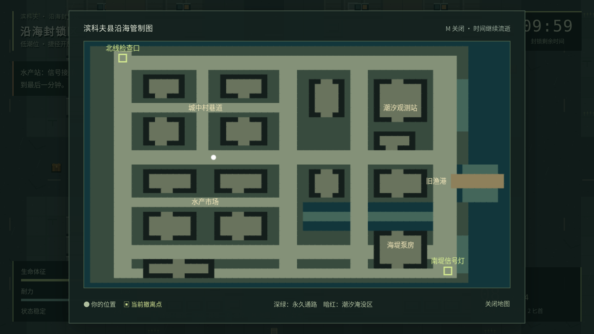
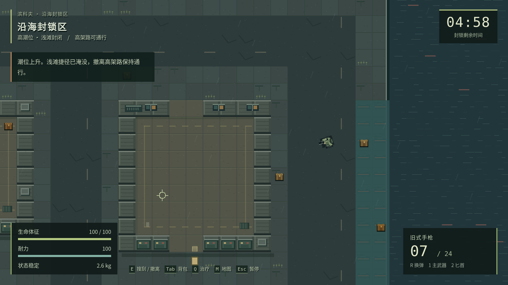

<div align="center">

# 🌊 逃离滨科夫

**E S C A P E  B I N C O V**

**台风过后，海没有退去。带上最后一匣子弹，活着回到水产站。**

[](https://github.com/xuys2025/escape-bincov/actions/workflows/ci-pages.yml)


### [▶️ 在线试玩](https://xuys2025.github.io/escape-bincov/) · [📦 下载离线版](https://github.com/xuys2025/escape-bincov/raw/refs/heads/main/release/Escape-Bincov-portable.zip) · [🤖 Agent 开发入口](AGENTS.md)

<a href="https://xuys2025.github.io/escape-bincov/">
  
</a>

<sub>真实游戏画面 · 桌面键鼠 · 单人撤离生存 · 无账号 · 可离线运行</sub>

</div>

---

## 🎒 回来，才算带走

超强台风与异常赤潮封锁了虚构的滨科夫县。你从废弃水产站出发，穿过城中村、水产市场与旧渔港，在 **10 分钟**的封锁窗口关闭前，把搜到的物资带回来。

这是一款 **2D 俯视角像素撤离生存原型**：整备装备、探索搜刮、管理负重、判断潮汐、寻找撤离机会，再用带回的物资推进藏身处任务。当前提供一张手工地图与完整的单人循环，仍处于早期开发阶段。

| 🔫 搜刮与交战 | 🌊 会改变路线的潮汐 | 🏚️ 持续发展的水产站 |
| :--- | :--- | :--- |
| 枪械、弹药、匕首与医疗物资；枪声会吸引附近敌人。 | 第 4 分 30 秒预警，第 5 分钟潮位翻转；涉水积累污染。 | 商人交易、3 项任务、仓库扩建，以及本地进度保存。 |
| 背包空间与 24 kg 负重上限，需要做取舍。 | 浅滩捷径与部分物资随潮位变化，永久通路始终保留。 | 成功撤离保留战利品；失败失去背包与主武器，安全箱保留。 |

## 📸 封锁区现场


<table>
  <tr>
    <td width="50%"><br><b>整备与取舍</b> · 格子背包、装备、交易与安全箱</td>
    <td width="50%"><br><b>路线与撤离</b> · 每局启用两个撤离点</td>
  </tr>
  <tr>
    <td width="50%"><br><b>潮汐与风险</b> · 留意电台预警和污染积累</td>
    <td width="50%"><br><b>带着进度继续</b> · 本地保存与 JSON 备份迁移</td>
  </tr>
</table>

<sub>截图来自 0.1.1 界面精修后的实际运行与自动验收场景。查看 [界面精修记录与前后对照](docs/UI-POLISH.md)。</sub>

## ▶️ 开始你的第一局

**在线：** 用电脑端 Chrome 或 Edge 打开 **[GitHub Pages 试玩](https://xuys2025.github.io/escape-bincov/)**。无需注册账号；网页首次加载需要网络，游戏资源已全部内联。

**离线：** 下载 [便携 ZIP](https://github.com/xuys2025/escape-bincov/raw/refs/heads/main/release/Escape-Bincov-portable.zip)，解压到固定目录，双击 `start the game.html`。游玩无需 Node.js、服务器或联网。

1. **整备**：进入水产站，检查主武器，把备用弹药和药品放进背包。购买物资会先进入仓库。
2. **探索**：点击「出击」，按 `M` 查看绿色撤离点，靠近物资按 `E` 拾取。
3. **取舍**：按 `Tab` 整理背包；重要小件可放进安全箱。打开背包和地图时，行动继续。
4. **撤离**：到达本局启用的绿色撤离区，停稳并按住 `E` 满 **3 秒**，带着物资回家。

> 💾 **存档在你的浏览器里。** 刷新或关闭未结算行动，下次进入会按撤离失败处理。换浏览器、文件路径或网站前，在「水产站」页导出存档，再在新入口导入；这不是云存档。

<details>
<summary><b>⌨️ 查看完整操作表</b></summary>

| 输入 | 动作 |
| --- | --- |
| `W A S D` | 移动 |
| 鼠标 / 左键 / 右键 | 瞄准 / 攻击 / 精瞄 |
| `Shift` / `R` | 冲刺 / 换弹 |
| `1` / `2` | 主武器 / 基础匕首 |
| `E` | 拾取、阅读；撤离区内按住 3 秒撤离 |
| `Q` | 快捷治疗 |
| `Tab` / `M` | 背包 / 地图，均不暂停 |
| `Esc` | 关闭面板或暂停 |

推荐窗口：1280×720 或 1920×1080。当前没有触控和手柄适配，手机不适合操作。

</details>

大陆网络下 GitHub Pages 的访问体验需以实际网络为准；遇到加载问题可使用离线版。备用静态托管方案与存档迁移说明见 [大陆在线游玩指南](docs/ONLINE-CHINA.md)。

## 🛠️ 本地开发

需要 **Node.js 24** 与 **pnpm 11.19.0**。请从这个仓库的最新 `main` 开始，不要以旧 ZIP 或聊天记录覆盖现有代码。

```bash
git clone https://github.com/xuys2025/escape-bincov.git
cd escape-bincov
npm install --global pnpm@11.19.0
pnpm install --frozen-lockfile
pnpm dev
```

打开 `http://127.0.0.1:4173`。修改源码后刷新页面会重新构建。

| 命令 | 用途 |
| --- | --- |
| `pnpm test` | 领域规则、地图、存档异常与备份测试 |
| `pnpm build` | 严格类型检查，生成两个独立 HTML 入口 |
| `pnpm package` | 构建游戏，生成离线包、网页包与制品清单 |
| `pnpm test:browser` | 两种分辨率的浏览器回归 |
| `pnpm test:ui` | 界面布局检查与双分辨率截图 |
| `pnpm test:save-browser` | 保存失败、导入导出、任务和升级回归 |
| `pnpm test:portable` | 实际解压 ZIP，验证离线启动与操作 |
| `pnpm test:play` | 约 10 分钟真实计时自动玩家，适用于玩法改动 |

浏览器测试前执行 `pnpm exec playwright install chromium`；Linux CI 使用 `--with-deps`。已有 Chrome 可通过 `BINCOV_CHROME` 指定路径。Linux/macOS 的便携包检查还需要 Python 3；更多说明见 [开发手册](docs/AGENT-HANDBOOK.md)。

## 🤖 与其他 agents 协作

**本仓库是项目唯一权威来源，`main` 是已接受版本。所有后续改动通过 PR 交付。**

先读 [AGENTS.md](AGENTS.md)，再读 [Agent 开发与交接手册](docs/AGENT-HANDBOOK.md) 和 [贡献指南](CONTRIBUTING.md)。它们说明源码结构、存档不可破坏的规则、分支命名、验证要求、PR 写法及后续方向。

PR 会运行 **CI & Pages / Build and test**；合并至 `main` 并验证通过后，自动将 `dist/` 发布到 GitHub Pages。PR 本身不会覆盖正式试玩。首次公开建仓为初始化导入，后续开发遵循上述流程。

可以把这句话直接交给另一个 agent：

> 请以 https://github.com/xuys2025/escape-bincov 的最新 main 为唯一基线，先阅读 AGENTS.md 和 docs/AGENT-HANDBOOK.md，按我的需求在独立分支完成开发与验证并提交 PR，不直接推送或自行合并 main，最后汇报 PR 链接、测试结果及剩余问题。

## ✅ 当前进度与下一步

**0.1.1 已具备完整单人循环**：整备 → 出击 → 搜刮/交战 → 撤离或失败 → 结算 → 持续成长。此版本修复了结算保存失败、库存操作回滚与暂停 HUD，并增加备份导入导出。

| 验证 | 已记录结果 |
| --- | --- |
| 代码测试 | 47 项通过 |
| 双分辨率浏览器回归 | 24 步通过 |
| 存档专项 / 离线便携检查 | 7 项 / 6 项通过 |
| 真实计时自动流程 | 约 10 分 19 秒，两次成功撤离 |

上表保留 0.1.1 的完整循环验收记录；本轮界面改动的复测见 [界面精修记录](docs/UI-POLISH.md)，新提交状态以顶部 CI 标识为准。自动玩家可读取场景状态进行寻路和瞄准，不能替代真人手感与平衡性评价。完整方法及边界见 [验收记录](docs/ACCEPTANCE.md)。

下一轮优先关注真人试玩反馈、战斗反馈、局内后半段的目标与威胁，以及存档兼容性。**多人联机、云存档、触控和手柄尚未实现**，也不属于当前在线托管的能力。

## 📚 文档导航

| 想了解什么 | 从这里开始 |
| --- | --- |
| 游戏规则、任务、物品与旧存档迁移 | [完整游玩手册](docs/PLAYING.md) |
| Agent 必须遵守的规则 | [AGENTS.md](AGENTS.md) |
| 架构、开发流程、验证与交接 | [Agent 开发手册](docs/AGENT-HANDBOOK.md) |
| 如何贡献、提交 PR | [CONTRIBUTING.md](CONTRIBUTING.md) |
| GitHub Pages 发布、更新与回退 | [部署手册](docs/DEPLOYMENT.md) |
| 大陆网络下的托管选择 | [大陆在线游玩指南](docs/ONLINE-CHINA.md) |
| 界面设计、前后对照与本轮验证 | [界面精修记录](docs/UI-POLISH.md) |
| 手机目标、触控方案、实施阶段与验收门槛 | [2026 移动端适配计划（尚未实现）](docs/MOBILE-ADAPTATION-PLAN.md) |
| 上一轮实现、验证与遗留事项 | [handoff.md](handoff.md) |
| 离线分享及验收证据 | [便携包说明](docs/PORTABLE.md) · [验收记录](docs/ACCEPTANCE.md) |

## 🎨 素材与许可

人物、建筑、物品与环境由项目代码绘制，声音通过 Web Audio 合成；游戏运行不依赖外部素材或 CDN。地名、组织、商人与叙事均为虚构。

Phaser 与 EventEmitter3 的 MIT 声明见 [THIRD_PARTY_NOTICES.md](THIRD_PARTY_NOTICES.md)，也已内联到游戏 HTML。**公开仓库不等于已授予开源许可证**；原创源码目前未另行附加许可证，贡献者不要擅自更改许可或引入来源不明的素材。

<div align="center">

**带走你需要的，留下归来的位置。**

[🌊 进入滨科夫](https://xuys2025.github.io/escape-bincov/) · [🐛 反馈问题](https://github.com/xuys2025/escape-bincov/issues) · [🔧 提交 PR](https://github.com/xuys2025/escape-bincov/pulls)

</div>
