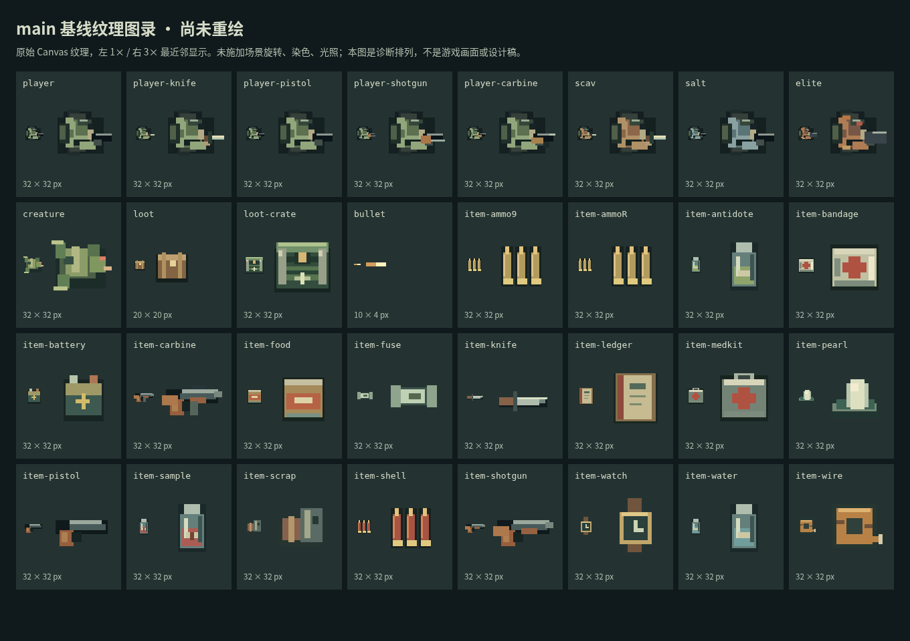

# 滨科夫美术重绘计划

2026-10-05 · 基线为最新 main [`a34c7a1`](https://github.com/xuys2025/escape-bincov/commit/a34c7a1ba810919fc33d4fce158aba0a028a0f78) · 继续使用独立分支 `docs/art-direction-research`、[PR #11](https://github.com/xuys2025/escape-bincov/pull/11)。

**本轮交付深入调研与制作计划，重绘尚未实施。** 本文取代[初轮计划](ART-RESEARCH-PLAN.md)中“字体/UI 先行、世界后置”的实施顺序。新的主线是：先建立能够贯穿角色、物品与建筑的造型语言，用游戏内的一段街区验证，再逐类重绘，最后统一界面和字体。目标是玩家不看标题，也能认出这是台风与赤潮封锁后的滨科夫。维护者进一步明确当前核心问题是**图标能见度差、意义不明确**：第一验收目标据此定为“看得见 → 认得出类别 → 知道具体物品与用途”，风格、材质和磨损都服从这条顺序。

## 1. 先把实际资产说清楚

用户所说的“SVG 字符画”对应数种不同实现。当前没有独立 `.svg` 素材文件；不能只改 SVG 图标就声称完成游戏美术重绘。

| 实际资产 | 基线位置与数量 | 本次重绘范围 |
| --- | --- | --- |
| 主菜单 SVG | [title-screen.ts](../src/title-screen.ts)：24×24、1.5 描边的书本、风、箭头、罗盘，共 4 个定义 | 重新设计图形、光学重量和像素网格，保留文字标签及按钮语义 |
| 物品图标 | [art.ts](../src/art.ts) 的 `itemIcon`：20 张 32×32；[domain.ts](../src/domain.ts) 提供名称与设定 | 逐件改轮廓与材质；原生 24px 小图及 32px 标准图，共 40 张明确设计的图稿；图形、名称、数量的实际排布一同验收 |
| 角色 | `human` / `createTextures`：玩家基础及 4 种持械纹理、4 类敌人，共 9 张 32×32 | 玩家与 4 类敌人各自造型；玩家持械变体；死亡图与少帧动作另列，不能算作换色变体 |
| 散落物、容器、弹道 | `createTextures`：20×20 小箱、32×32 搜刮箱、10×4 子弹，共 3 张 | 重绘地面包裹与搜刮箱，设计容器状态；弹道及枪口效果保持短促清楚 |
| 地形、建筑与道具 | `groundTile` / `drawWorld`；[world.ts](../src/world.ts)：7 种 tile 值、15 栋建筑、5 个命名区域，另含水产站 | 地面、墙体、岸线的模块库；每区域地标与道具；保持当前通行图 |
| 场景符号 | [game.ts](../src/game.ts)：5 处便笺的 `▤`、撤离圈、准星、天气与状态图形 | 便笺用自绘图标；撤离、阅读、容器、危险采用一致符号规则 |
| 地图 / 触控 / DOM | [ui.ts](../src/ui.ts)、[mobile.ts](../src/mobile.ts)、[style.css](../src/style.css)：Canvas 地图、文字按钮、`Ⅱ` 等字形 | 地图符号与场景同义；触控仍保留可读名称，不能全部改成无标签图标 |
| 夜港与站内背景 | [title-art.ts](../src/title-art.ts) 新夜港；`art.ts` 的旧 `drawBackdrop` 用于整备与结算 | 保留夜港叙事构图，统一站房、船只、道具和光色；站内/结算补足联系 |

已从未经修改的 main HTML 读取上述 **32 张运行纹理**（20 物品 + 9 角色 + 3 其他），在独立诊断页排列为原尺寸 / 3 倍最近邻图录。图录不是游戏截图，也不是重绘效果图；没有更改纹理，未套用游戏中的旋转、染色或天气。

[原始尺寸与哈希](art-research/textures.json) · [复现脚本](art-research/inspect-textures.mjs)。结合[实际战斗基线](art-research/1280x720-hud.png)，目前最需要处理的不是增加纹理密度，而是以下问题：

- **同模换色压过身份。** 玩家、拾荒者、盐枭、守潮人主要共用人形；其中 9 毫米弹与卡宾枪弹甚至是完全相同的 PNG（已核对哈希），霰弹也主要通过颜色区别；绷带/急救包、药剂/净水/样本分别共用主体。
- **部分画形与文字设定错位。** 防水怀表画有上下表带，像腕表；泵机零件像泛用废铁；陶瓷保险管的内窗像玻璃管。双管霰弹枪的“双管”在图标中也不突出。
- **场景重复缺少生活来源。** 规律窗格、墙面条纹与箱子使不同建筑趋同；噪点多，但缺少“这里原来做什么、台风破坏了哪里、谁修过它”的线索。
- **不同距离的设计尚未统一。** 菜单夜港、俯视场景、商店物品、SVG 控件各自有基础，但材质、轮廓和标记缺少共同规范。32px 图标被缩成 24/28px，部分细节又丢失。

### 1.1 先修“看不见”和“不知道是什么”

这两类问题分别验收，不能把“画得更大/更亮”当作语义已经清楚：

| 当前证据 | 根因与直接改法 | 首批验收 |
| --- | --- | --- |
| `item-ammo9` 与 `item-ammoR` 的 PNG SHA-256 完全相同 | 弹药没有独立视觉身份；分别画短圆头、宽平筒、长尖头缩颈三种轮廓 | 去色后区分 3 类，短名明确“9mm / 霰弹 / 卡宾弹”，不能只换包装色 |
| 3 种瓶子原图有效边界都是 14×24px；放入 24px 框后理论宽度仅 10.5px | 大透明边与小尺寸吞掉瓶肩、封口；小图重新画，净水高窄瓶、药剂矮宽瓶、样本封条罐 | 实际 24px 同屏，不放大也能看出三种器形；确切用途仍由清楚名称/详情说明 |
| 匕首有效边界 24×10px、保险管 23×11px，缩入 24px 框后高度约 7.5 / 8.25px | 长条图形有效厚度不足；调整陈列角度/厚度与留白，关键结构保留至少 2px 色块；避免一条细线承载全部信息 | 浅/暗槽位和选中态下完整轮廓可见，不靠鼠标移上去才知道有物品 |
| 现有默认槽底 `#29382a`，多处图形也为暗绿/灰绿；地面物还叠加整图 `setTint` | 主体、描边、底板一起变暗；重排明度层次，必要处加克制的亮边或稳定素底。世界包裹重点检查乘色后结果 | 按实际合成背景测关键边界，不把原色板亮度当作最终能见度；不统一套外发光 |
| 格子 36px、图标 24px、短名 9px、数量位于右上角；触控格子虽更大，图标规则仍为 24px | 图形、名称、数量争抢空间；R1 同步做 48px 桌面格子样板，移动布局先检查现有 52px，再按结果修订 | 图标独立区域、16px 短名、数量独立角位；仓库容量/占格不改，长名在固定详情中完整呈现 |

有效边界由纹理非透明像素计算，包含描边，不代表主体都达到可读对比度；缩放后数字是 0.75 倍的理论几何值，实际浏览器像素取整与合成仍需截图验证。原始测量见[纹理报告](art-research/textures.json)。本轮没有测出“全部图标对比度不合格”这一结论。

**信息分三层，图标不承担所有说明：** 轮廓先表达枪、弹药、绷带、瓶罐、零件等大类；常显短名区分确切物品；选中详情说明“止血/恢复生命”“降低污染”“维修材料”等真实作用。任务样本不能仅靠画一滴红液体让玩家猜，除藻剂也不能靠颜色推断作用。文字按钮保留动词，装饰图标不替代“使用/装备/出售”等操作名称。

R1 优先做混淆组：三类弹药、绷带/急救包、净水/药剂/样本，共 8 件；再加手枪/双管、泵机零件/怀表，共 12 件。第一批就检查完整问题组，不能只挑差异显著的物品做展示。48px 格子布局同时检查 10 列仓库、背包、安全箱和详情；用独立滚动/固定详情及状态栏解决空间问题，不缩小图标回避。若在 720p 下仍不成立，先修排版，暂停材质精修和批量绘制。

## 2. 定下有地方感的美术方向

**台风后的沿海县城：冷湿的公共空间，仍有人维护的水产站。** 延续虚构中国沿海县城、旧渔业设施、停业市场、观测站与异常赤潮的现有设定。年代感来自器物和维护方式，不凭空给故事指定真实地域、年代或新增阵营历史。

采用克制的俯视像素绘画：大块面先清楚，少量关键像素交代材料；保留普通生活痕迹，让异常只占一小部分。可辨识的共同母题限定为三组：

| 母题 | 在资产上的具体落点 | 使用限度 |
| --- | --- | --- |
| 盐、水、潮位 | 金属折边的浅盐垢；墙脚同一高度的旧潮线；受潮纸张下缘；码头木板靠水侧更深 | 潮痕跟随地势和材料，不给每件装备撒白点；赤潮只在现有污染/水域语义中突出 |
| 修补与继续使用 | 雨衣左肩补片、工具柄缠带、冷库外墙补板、绝缘线尾端胶布 | 每件主物最多 1–2 处识别用修补；损伤不随机左右复制，不破坏器物功能 |
| 值守与归来 | 水产站暖窗、接应灯、维修单上的真实文字、站内工具架 | 暖色集中在有人维护的位置；危险色、选中态和稀有物不得共用“发光”表达 |

制作参考板应覆盖雨衣、保温鱼箱、台秤、搪瓷牌、绞盘、盐蚀钢件、陶瓷熔断器、怀表等真实结构。R1 收集约 12–18 个可靠参考，记录来源、日期、用途及许可；本轮还未完成该外部参考板。参考用于理解结构与磨损，交付仍为原创逐项造型，不把网上图片直接加工塞进游戏。

### 将“没有 AI 味”落实为检查项

这里不把“AI 味”当作可由检测器证明的属性，也不把辅助制作冒称纯手工。以可审阅的设计取舍和完成质量判断：

1. **器物说得通。** 每张图有“用途 → 主轮廓 → 结构 → 材质 → 使用痕迹”的说明；怀表有提环，双管有两支枪管，密封绷带保留包装，潮痕有位置原因。
2. **每件图单独修整。** 同类共用色板和材料，不批量套一个盒子换颜色；提交原尺寸前后图和修改记录。不能只交缩小后显得精细的大图。
3. **细节有主次。** 原尺寸先读出类别，再读出关键构造；装饰退居背景。禁止全屏颗粒、满身划痕、无意义电路、假字和装饰性警戒线堆砌。
4. **不规则有原因。** 补丁、歪招牌、卷边随受力/雨水/修理而变化；刻意歪斜所有元素同样会形成模板感。
5. **跨资产能追溯。** 主菜单、水产站、维修零件、人物衣物采用同一套色阶、补修方法和标记；新旧素材混用必须登记，避免只重绘最容易展示的几个大图。

## 3. 制作规范：统一到像素、材质与尺寸

下表是待 R1 样板验证的制作约束，不是当前已通过的结果。

| 项目 | 规则 |
| --- | --- |
| 像素尺寸 | 世界保持 32px tile，角色先维持 32×32 画幅；物品做独立 24×24 与 32×32 两档，小图删细节并重排轮廓，不自动缩放交差。现有 28px 槽改用居中的 24px 或扩至 32px，由样板确定 |
| 轮廓 | 每物先画实心剪影，关键开口至少留出可见像素间隔；外轮廓深色约 1px，受光侧允许断线。避免每块内部结构再套一圈黑框 |
| 透视 | 局内采用当前俯视关系；地标贴现有墙面，室内保持可视。物品采用接近正侧面的简化陈列视角，少量顶部厚度一致；不逐件换透视角度 |
| 光 | 静态物件采用左上受光、右下接触阴影。旋转角色不能把固定世界光向的强高光烘焙进去：身体以体积明暗为主，投影独立且不随瞄准旋转；样板在 8 个角度检查 |
| 色阶 | 单件通常 5–8 个不透明色（含描边，允许有说明的例外），单种材料先用暗/中/亮 3 阶；世界低饱和，人物及交互物用明度组织。透明阴影另计，不以限色数替代审美判断 |
| 材质 | 金属：短硬亮边与接缝锈；雨布：大色块、折痕和少量补片；纸：平面、折边、局部水渍；玻璃：一条受控亮线与可见内容物；陶瓷：不透明浅面与端帽；木：顺纹损伤，避免全物同样的横条 |
| 描线与曲面 | 斜线用稳定阶梯，圆物以像素块概括体积；减少孤立亮点与毛边。主物轮廓人工检查 1×/2×，3×图仅供诊断 |
| 色板起点 | 深墨 `#111b1d`、暗海 `#24383c`、湿石 `#46524e`、盐灰 `#82958e`、纸白 `#d7d5ba`、旧布绿 `#788b59`、暖灯 `#c8b67b`、锈 `#89513d`、危险红 `#bd5c4d`。取自现有资产，R1 样板可调整；材质色与 UI 状态色分开命名 |
| 文字 | 界面主字体候选为[寒蝉点阵体 16px Regular](FONT-RESEARCH.md)，正文原生 16px、主要标题优先 32px；重排空间，不压缩回 9–11px。招牌少量专门修字但保持真实可读；不把说明文字画成乱码 |

SVG 控件采用单独的 **24×24 网格、2px 光学主笔画、方端与克制阶梯转角**，统一内容边距。路径应对齐实际显示像素；不能把现有 1.5 描边机械改粗就视为完成。DOM 在 1×、2×、125%/150% 缩放及触控尺寸检查；必要时为小规格单独修形。SVG 适合控件，Canvas 像素图适合游戏内角色与器物，不为统一格式把所有美术改成 SVG。

## 4. 二十件物品逐项重绘任务

名称、用途、库存占格与数量规则均以 `domain.ts` 为准；下面是拟采用的美术造型，不新增装备或效果。统一查看 24px、32px、灰度剪影、库存/商店实际背景。武器长度以画面辨识为先，不声称图标是工程比例图。

| ID / 物品 | 主轮廓与关键结构 | 材质与有依据的细节 / 防混淆 |
| --- | --- | --- |
| `knife` 水手匕首 | 短宽刀身、清楚刀尖、护手与缠柄；刀柄偏短 | 刀背亮边，旧柄一处缠带；与枪械的握把、枪管方向区别明显 |
| `pistol` 旧式手枪 | 紧凑 L 形、短滑套、倾斜握把，扳机护圈留负形 | 暗钢与棕色握把；不再拉成长枪共同主体 |
| `shotgun` 双管霰弹枪 | 长木托、两根平行短粗枪管、明显折开式机匣分界 | 枪管中间暗缝在小图仍在；不借战术瞄具或弹匣表达威力 |
| `carbine` 半自动卡宾枪 | 较细长枪管、独立护木、突出短弹匣 | 金属/木件分区明确；靠弹匣与枪管比例区分双管 |
| `ammo9` 9 毫米弹 | 短胖圆头弹，错位排列，单发长宽比低 | 黄铜 3 阶；不依赖包装数量推断真实剩余发数 |
| `shell` 霰弹 | 宽直筒、平封口、明显金属底缘 | 暗红纸/塑料壳与黄铜底分开；轮廓高度居中 |
| `ammoR` 卡宾枪弹 | 长尖头、缩颈弹壳，减少排列密度保留颈部 | 与 9mm 在去色后仍靠长短、尖圆、缩颈区分 |
| `bandage` 密封绷带 | 扁软独立封装，锯齿封边；包装上用卷状绷带简图识别 | 米白包装、折角；保持“密封”设定，不画裸露拖尾绷带，也不再画手提箱 |
| `medkit` 急救包 | 横向厚布包、短提带、翻盖/拉链一道 | 褪色布料与浅色急救标记；靠包形和把手区别绷带 |
| `antidote` 除藻药剂 | 矮宽药瓶、粗螺盖、窄竖标签 | 深色瓶身，标签药剂标记；不画成针剂或新增注射动作 |
| `water` 净水瓶 | 高瓶、窄颈、肩线与两段瓶筋 | 透明冷灰，清晰水位；一小块素标签，不靠蓝色液体与样本区别 |
| `food` 鱼松罐头 | 矮圆罐、椭圆罐沿、拉环或卷封线 | 印一条简化鱼形，边缘局部磨漆；区别电池的方壳与端子 |
| `scrap` 泵机零件 | 带圆孔的泵壳法兰、偏置短管口 | 孔保持负形，法兰边缘盐垢、螺孔局部锈；弃用无法说明用途的铁片堆 |
| `wire` 绝缘线圈 | 盘绕的包胶线、清楚中心孔、一个伸出的线头 | 深色绝缘皮，端头露少量铜；不画成裸铜绳团 |
| `fuse` 陶瓷保险管 | 横置不透明陶瓷筒、两端金属帽 | 中段米白实面，一条短规格线；去掉玻璃窗感，与弹药尖头区分 |
| `battery` 观测仪电池 | 竖长硬壳、顶部一高一低接线柱 | 接缝、搬运磨损与正负符号，旧标签不挤入无法读的小字 |
| `watch` 防水怀表 | 圆表壳、顶部表冠/提环、一段短链 | 保留暗表盘和停在 03:17 的设定；小图概括指针，完整时间由详情保证，去除腕带 |
| `pearl` 雾色海珠 | 单颗圆珠、短接触影、偏心高光 | 以冷白/灰绿块面画“雾”，只有有限边缘微亮；不画成发光水晶或绿色平台 |
| `sample` 赤潮封存样本 | 矮宽厚壁取样罐、锁封瓶盖、跨盖封条 | 暗红液体与沉积分层；标签保持静态设定，不生成额外任务状态；与净水高瓶区分 |
| `ledger` 港口船册 | 横向硬封册、布脊、厚纸页边与书签 | 角部水渍、封面船形/短标题；可读的内容只在详情，不塞密集假字 |

地面散落物先维持“统一可拾取包裹”的信息粒度，重画成扎带包与醒目扣口。若改为展示具体物品剪影，会增加远处识别信息，需另列玩法评估；本轮核心重绘不默认引入。搜刮箱则为带搬运把手、金属护角的维修运输箱，宽轮廓明显区别小包裹。装饰鱼箱不使用同样扣口/交互标识，避免玩家误认所有箱子都可搜。

容器准备未空/已空两种视觉状态，以现有“已搜空”语义驱动搭扣或小标记，同时保留文字；打开双栏不必新增世界实体状态。箱内物品数量、掉落、转移和存档均保持现有规则。

## 5. 角色不是换四套衣服

| 对象 | 剪影设计 | 识别细节与动作要求 |
| --- | --- | --- |
| 玩家 | 中等肩宽、短雨披、方形贴身背包，持械侧清楚 | 左肩一块浅补片作为自身定位；旧绿为基色。四种武器单独修握持关系，枪口朝向必须与真实瞄准一致 |
| 拾荒者 `scav` | 瘦身、前倾、单侧鼓起的旧袋、短兜帽 | 刀持低位，杂色布不超过两大块；体积与站姿区别玩家，不能只变棕色 |
| 盐枭 `salt` | 短外套、较平的肩线、前沿帽形、紧凑持枪姿态 | 胸前斜带与浅盐边；没有玩家背包。帽沿/枪姿在灰度下可识别 |
| 守潮人 `elite` | 宽肩厚防雨衣、方形头罩、完整大躯干 | 重量感来自衣体和持械姿态；局部旧警戒布条，避免满身装甲、霓虹红眼或王冠式“Boss”符号 |
| 潮蚀生物 `creature` | 低伏、前肢长短有节奏、非人肩胯关系、向前探出的头部 | 壳样硬边和湿软腹部两种材料；赤色只在裂隙/口部少量出现。轮廓不能像又一名穿绿衣的人 |

核心阶段先把这 5 类静态剪影与玩家 4 种持械修好，沿用连续旋转的瞄准语义；逐一检查 0°/45°/90° 等 8 个方向，避免像素旋转后头手融在一起。身体不以大块固定方向高光表现，接触影独立。若该方案在 720p 仍无法辨识，R1 即改为“8 向身体 + 连续瞄准武器层”的专门呈现方案并重估制作量，不能用吸附瞄准方向掩饰画面问题。

少帧步行放在静态造型通过以后：每类先做 4 帧循环，停下立即回到站姿；步态服从实际速度。射击、换弹动画只读取现有状态，不增加前摇、不延后开火、不改变射程/枪口碰撞。所有动画相位均为呈现信息；读档、武器切换、暂停恢复不得要求新存档字段。

4 类敌人分别准备可辨的倒伏姿态；尸体保留衣物/壳体线索与搜刮标识，已空状态仍清楚。当前“整张活人图转 90° 再染暗”的表现应替换，死亡恢复时也必须选择同一尸体图，不能恢复成站立角色。碰撞和死亡判定继续以现有逻辑为准。

## 6. 五个区域逐区重绘，水产站贯穿全流程

场景先做 **7 类地表的基础/边缘/转角/少量变体**，再做区域器物；用相邻 tile 和固定坐标选图，不调用行动随机数生成器。门、道路与可达性以 `world.ts` 为边界：装饰贴现有阻挡墙格，平面杂物不得长得像实体障碍。没有碰撞的立体大物不得摆在路中央。视野中的主要通路保持低噪声。

| 区域与现有建筑 | 地标、材料与局部故事 | 必查视角 |
| --- | --- | --- |
| 城中村巷道：居民楼、船工宿舍、海声修理铺、杂货铺 | 修补铁门、不同门楣、窄雨棚、挂在墙面的线缆与工具轮廓；修理铺一块真实店名牌，宿舍墙脚统一潮痕 | 南北门洞、巷道转角、近身敌人在暗墙前；雨棚不得覆盖门口 |
| 水产市场：南湾冰鲜、滨禾水产、空置冷库、旧交易厅 | 冷柜压缩机、保温鱼箱、台秤、墙边水管、排水沟；两商铺不同遮棚补丁，冷库厚门套、交易厅台面区别于摊铺 | 横向主通道、冷库门、拾取物与装饰箱同屏；停业告示对应现有阅读点，不凭空增加交互 |
| 潮汐观测站与封存样本室 | 刻度水尺、仪器接线箱、哑白瓷面、封条与样本架；维护过的清洁区和盐蚀墙脚并存 | 样本物品的暖红与危险红语义不混；窗/架贴墙，入口留白；室内敌人剪影不能被仪表淹没 |
| 旧渔港与船务所 | 绞盘、缆桩、粗绳、旧轮胎护舷、补过的木板与船务门牌；海上三条船画出不同船艏/舱盖，仍在不可达水域 | 木栈道与浅滩边界、高低潮两态、船册所在建筑入口；船与绳不暗示新通路 |
| 海堤泵房及配电/值班建筑 | 贴墙的大管径接头、阀轮、配电柜、铆接钢门、可读水位标尺；泵壳图形呼应任务零件 | 永久海堤路与淹水盆地、南堤接应点、红水边缘；阀轮不能被误认成可操作任务机关 |
| 滨科夫水产站（区域之外的归来锚点） | 同一补板站房、暖窗、工具板、维修单和接应灯，贯穿菜单远景、局内建筑和整备背景 | 从主菜单到整备、出击再回站连续查看；材料和灯位能认出同一地点，不要求不同镜头透视完全相同 |

制作量按“模块 + 有名字的建筑”登记：7 类地表，每类先 3 个内区变体并补必要的邻接边/角；5 个区域各约 4–6 件有用途的特色道具；15 栋建筑逐栋指定门楣、墙面、设备及损伤位置。边缘数量在 R1 检查所有邻接情况后确定，不将“画 5 张场景大图”当作地图资产完成。

岸线补足四向边缘和内外角；浅滩低潮用湿泥/浅沟，高潮用连续水面与可辨危险边界；永久高地保持清晰的干燥顶边。涨潮图层不能盖掉撤离、人物、掉落及搜刮信息。先静态完成，不用大量漂浮粒子、全屏滤镜或动态水波遮掩重复的地面结构。

## 7. SVG、界面和字体融入同一个世界

菜单四图重绘为：行动指南用带折页的值班册；动态景物用简化风向带；进入箭头用硬边指向；位置罗盘保留方位语义并简化内部线。外链 `↗`、便笺 `▤`、暂停 `Ⅱ` 改用受控自绘图形，保留名称/读屏标签；正文里的数学符号、数量、按键字母仍是文字。

采用两层界面语言：战斗 HUD 是克制的值守仪表，整备/任务/结算是水产站的物资单据。共同采用同一色板、硬边、间距和图标笔画，装饰只占页眉、边缘等非阅读区：

- 库存：槽位、数量、选中边框明确；救济/任务/不能放入各有符号与文字。24px 图标留独立区域，数量不盖关键轮廓。
- HUD：生命、弹药、时间先读到；流血、污染、空弹匣沿用现有状态，区别图形而非全靠变色。装饰锈迹不得出现在读数后面。
- 地图：位置、可用撤离点、被淹区域与场景同义；区域名有稳定底衬。保留地图现有信息权限，不增加敌人或未发现物品标记。
- 交易：老栓以工作围裙、略塌帽沿和工具侧影辨识；许医生以束袖工作服、简洁发形与笔夹辨识。先画 48×48 静态头像并检查 1×，身份细节是美术提案，不擅自扩展人物背景。头像不能挤掉价格和商品说明。
- 结算：物资清单、入库/损失分区，成功/失败有克制的印记。先成功保存再显示成功，估值与余额明确区别；存档错误页不画庆祝印章。
- 字体：沿用已实测的寒蝉 16px 推荐，先在重绘样板试排。正式子集、许可与动态文字覆盖按字体专项落实；字体和图标均内联，离线可用。

界面要完整展示默认、悬停、按下、键盘焦点、选中、禁用、危险及保存失败状态。磨损纹理和盖章不能破坏点击边界或字形；短屏出口与风险信息问题同 [PR #10](https://github.com/xuys2025/escape-bincov/pull/10) 协调，以实施时最新 main 为准。

## 8. 先交什么样板，怎样推广

**首批必须在同一处游戏画面相遇。** 不能只做一张大尺寸概念海报后直接批量出图。

R1 的固定样板包：玩家持手枪 + 盐枭；9mm/霰弹/卡宾弹/绷带/急救包/净水/药剂/样本/手枪/双管霰弹枪/泵机零件/怀表 12 件物品的 24px 与 32px 图；一个散落包、一个搜刮箱及空状态；南湾冰鲜门口约 12×10 tile 的地面、墙面、遮棚、排水沟、台秤；便笺与 4 个菜单 SVG；一张实际库存详情及对应 HUD。所有器物同时展示剪影、平涂、材质完成三个步骤，图稿与真实接入截图分开标注。先提交原尺寸图标与 48px 格子试排；能见度、类别和名称读清后，再让角色/街区样板验证共同风格。

| 阶段 / 建议 PR | 具体交付 | 粗估人日 / 完成条件 |
| --- | --- | --- |
| R0 深入调研（本轮） | 32 纹理原样图录、逐件/逐区任务、制作规范与验收方法 | 已完成计划；游戏资产未重绘 |
| R1 `art/style-sample` | 上述完整样板包、真实参考板、色板/尺寸规范、资产登记表；真实 720p/1080p 截图 | 4–6；先过图标能见度/语义与真实格子排布，再过角色旋转、材质和场景同屏，冻结规范和后续工时 |
| R2 `art/items-actors` | 补齐全部 20 件双规格物品、5 类人物/生物、4 类尸体、玩家武器变体、包裹与箱状态；少帧动作单独提交 | 8–12；库存/商店/地图内实际展示及死亡恢复一致，敌人灰度剪影可区分 |
| R3 `art/coastal-world` | 7 类地表及边角、5 区域道具、15 栋建筑逐栋处理、水产站、岸线与潮汐两态；每区域可拆小 PR | 10–15；所有入口和永久通路无误导，每区有具体地标，低/高潮与战斗读图通过 |
| R4 `art/interface-station` | 共用 SVG/场景符号、HUD/地图、库存/交易/任务/报告、两头像、站内背景与主菜单衔接，正式字体接入 | 5–8；完整流程风格一致，文字/焦点/危险可读，许可与单文件离线验证通过 |
| R5 `art/visual-review` | 逐资产返修、整局录像/截图、跨尺寸与手机验证、性能与包体对照、已知缺口清单 | 3–5；自动回归 + 视觉审查 + 实际设备证据分别记录，未完成项明确列出 |

核心粗估 **30–46 人日**，是单人精绘、接入和返修量级，不是日历交付承诺；不含等待审阅/物理设备排期。若 R1 决定制作完整 8 向身体及更多动画，应另外估算，不能塞入这份预算。初轮 11–19 人日只覆盖轻量优化，不能用于这次全量重绘。

每个实现 PR 以当时最新 main 为基线，不跨越尚未接受的前置资产规范自行推广；可以在同一工作分支完成关联的样板与修订，等待维护者审阅后再组织后续 PR。资产制作按用户后续实施指令推进，本轮只提交可审阅计划。

## 9. 验收不是“看起来更精致”

| 检查 | 方法与返工条件 |
| --- | --- |
| 语义正确 | 20 个物品逐项对照 `domain.ts`，5 类角色对照敌人行为；出现腕表冒充怀表、换色瓶冒充不同物品、双管不可辨等问题即返工 |
| 原尺寸可读 | 桌面 720p 实际 1× 为首要视图；24/32px 各放浅/暗地面、灰度和剪影中检查。三弹药、三瓶、两医疗包逐对对比，不能只在放大图看出区别 |
| 外部辨识 | R1 邀请约 3–5 名不熟悉图稿的人，先无标签说出物品大类/预期用途，再给名称随机配对；在真实界面寻找指定物品并识别 5 类角色。记录错认与耗时，同一混淆对被 2 人错认就返工。未知设定的具体作用依靠可读文字，不要求凭图猜数值；小样本用于改图，不当统计结论。目前未做 |
| 有作者取舍 | 每件主资产可解释一个结构选择和一处使用痕迹；删除仅为填空的颗粒/符号。全图看哪些地方刻意留白，不能只数细节数量 |
| 场景可玩 | 同种子/位置/朝向的前后截图，5 区 + 水产站、15 个建筑入口、高低潮；敌人、掉落、容器、便笺和撤离同屏检查，不移动对象回避问题 |
| 方向与动作 | 角色 8 个角度、移动/静止/持械/死亡/读档；画面朝向与射击一致，开火无视觉延迟，尸体不复活，轮廓不随缩放消失 |
| UI 易读 | 1280×720 / 1920×1080 必须真实截图，另测 1366×768、1600×900、844×390、740×300 和竖屏；125%/150% 缩放、长文本、键盘焦点、动态关闭与回退字体 |
| 色彩与状态 | 普通文字以 4.5:1、必要图形/状态以 3:1 为检查目标，按合成背景实测；选中、危险、可落格等都有颜色以外线索。不是声称整游戏已通过无障碍认证 |
| 运行成本 | 同设备/种子/镜头记录首屏耗时、帧间隔 p50/p95、纹理数量与内存趋势，前后重复 3 次；以无持续退化为目标，明显回退（例如 p95 超过基线 10%）需定位原因，不以单次均值掩盖卡顿 |
| 离线与发布 | 字体/图形全部内联，记录 HTML/ZIP 字节差、冷启动耗时、无外部请求；实际解压启动和断网测试。生成物由 `pnpm package` 更新 |

代码实现执行 `pnpm test`、`pnpm package` 和所涉浏览器/输入/存档/搜刮/移动/便携检查；角色、世界及动态效果阶段追加 `pnpm test:play` 与持续负载检查。详细命令沿用[验证矩阵](ART-RESEARCH-PLAN.md#6-后续验证矩阵)。自动检查不能判断美术完成度；真人辨识、逐像素审查、真机阅读需各自证据。

源码组织优先保留现有程序绘图，按物品/角色/地表/符号拆清绘制职责，共用色板与尺寸定义；只在实际接入时做必要拆分。若引入像素编辑源文件，应同步保留可编辑原稿及确定性导出过程，运行时仍用内联资源。禁止为了新美术改变存档 ID、库存占格、敌人速度/伤害、掉落或碰撞图。

资产登记表至少包含：ID、游戏名称、源函数/文件、出现界面、原生尺寸、色板、剪影特征、参考来源/许可、状态变体、制作状态、审阅意见、前后图和验证提交。每一阶段结束列出未替换旧素材，防止局部新旧风格长期混杂。

## 10. 本轮证据和边界

本轮重新 fetch 后 main 仍为 `a34c7a1`，PR #11 开放且未合并。已重新阅读规范及现有美术/世界/物品/角色/菜单源码，复核 20 物品、4 敌人、15 建筑、5 区域与 4 个 SVG 定义，并浏览实际基线图和原样纹理图录。

新增图录诊断在 Linux / Chromium 151.0.7922.173、DPR 1 上运行，通过 main HTML SHA-256 守卫读取 32 张纹理；无页面异常、无外部 HTTP 请求。复现方式：按[初轮基线诊断说明](ART-RESEARCH-PLAN.md#7-本轮实际验证与剩余问题)服务已提交 `dist`，执行 `BINCOV_CHROME=/usr/bin/chromium node docs/art-research/inspect-textures.mjs`（其他环境使用其浏览器路径）。输出在忽略的 `test-results/art-textures/`，本轮已审阅的 PNG/JSON 归档在 `docs/art-research/`。

本轮只改文档、诊断脚本及证据，不新增游戏素材，不重复运行无关领域测试或打包。此前 `109/109` 单元和字体试排属于 PR 较早提交的实际验证，最新提交 CI 另看 [PR 检查页](https://github.com/xuys2025/escape-bincov/pull/11/checks)。新增非透明边界测量与同图哈希比对，支持图标能见度/意义优先的修订；文档链接、数量、脚本语法、图录哈希与差异检查按本轮交接记录。

**待完成：** 参考板、R1 重绘样板及后续全部实现；真人辨识、完整跨界面字体接入、性能对照和手机真机验收。本文件的色板、风格与规格都是制作提案，不能作为“已完成重绘”“纯手绘证明”或性能承诺；本 PR 不合并 main、不更新正式试玩。
