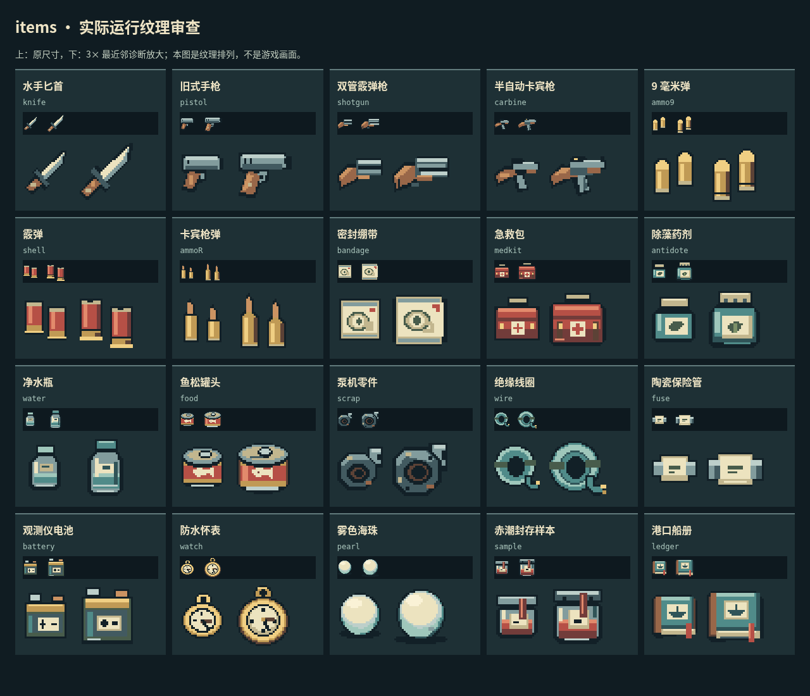
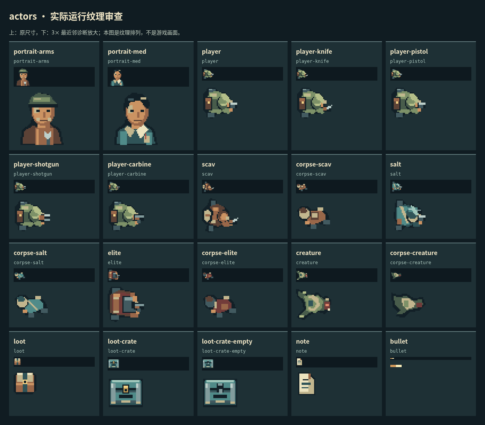

# 滨科夫美术重绘实现与逐图审查

日期：2026-10-05。基线：`a34c7a1ba810919fc33d4fce158aba0a028a0f78`，独立分支 `docs/art-direction-research`，[PR #11](https://github.com/xuys2025/escape-bincov/pull/11)。这是此前[重绘计划](ART-REDRAW-PLAN.md)的实施记录；计划中的人体动画、真人盲测和真机验收不应被理解为已完成。

本轮首先解决两件具体问题：小图标不够醒目，同类物资不能仅凭形状区分。重新绘制全部 20 件物品的 24px / 32px 两套像素图，重绘角色、遗体、容器、告示和世界材质，统一六个 SVG 符号；集成寒蝉点阵体的离线子集，调整实际库存格子、文字和详情布局。

## 风格及判断依据

方向是台风过后的沿海县城：冷蓝灰路面与海水、褪色青漆、黄铜扣件、旧木柄、纸标签，水产站保留暖窗。共用墨色轮廓与材料色阶，单件先看轮廓、用途结构，再看磨损。泵壳锈迹放在下缘、纸册磨损放在书脊、海盐停留在墙脚；不把随机划痕和发光描边当作精细度。

器物采用可识别的通用结构，没有使用外部图片描摹或生成后贴图。代码逐件指定整像素形状，24px 小图单独简化，未将 32px 图缩小冒充小尺寸版本。不能据此宣称“人工创作”或保证任何人都认为没有 AI 感；审美和辨识最终仍需要真人反馈。

## 全部物品的逐件检查

以下 20 项均查看了原尺寸、3× 最近邻放大及灰度图；同时查看商店、格子和详情中的真实显示。检查的是结构、边缘、重心、材质和混淆组，不等同于真人盲测正确率。

| 物品 / 稳定 ID | 重绘后的识别结构 | 逐图修整重点 |
| --- | --- | --- |
| 水手匕首 `knife` | 斜向宽刀刃、护手、铆钉木柄 | 刀刃在小图中有面积，避免旧版近乎一条横线 |
| 旧式手枪 `pistol` | L 形握把、枪套、扳机护圈 | 保留握把下方负空间，枪口方向明确 |
| 双管霰弹枪 `shotgun` | 平行双管与木托 | 两管之间留暗缝，与卡宾枪分开 |
| 半自动卡宾枪 `carbine` | 长枪身、独立下伸弹匣 | 用弹匣改变轮廓，避免与双管枪同形 |
| 9 毫米弹 `ammo9` | 短圆头、直弹壳 | 修正 24px 下方弹底被边界裁切 |
| 霰弹 `shell` | 宽平封口、红纸壳、黄铜底 | 灰度下仍有平头和宽体 |
| 卡宾枪弹 `ammoR` | 尖弹头、缩颈、长壳 | 消除基线与 9mm 纹理完全相同的问题 |
| 密封绷带 `bandage` | 薄封袋、上下封条、卷带标志 | 奶白主体，不画成另一只药箱 |
| 急救包 `medkit` | 提手、软包、双扣及医用标记 | 比绷带厚，提手在 24px 中保留 |
| 除藻药剂 `antidote` | 矮宽药罐、大瓶盖、叶片标签 | 与细水瓶、封存样本区分 |
| 净水瓶 `water` | 细高瓶肩、窄盖、水位 | 不再与另外两瓶共用瓶体 |
| 鱼松罐头 `food` | 椭圆盖、拉环、鱼形纸标 | 顶面与侧面分开；鱼标有头尾 |
| 泵机零件 `scrap` | 法兰孔、偏心出水口、螺栓 | 保留中心孔，锈迹不吞没轮廓 |
| 绝缘线圈 `wire` | 中空线环、束带、露铜线头 | 环孔及线头在小图中保留 |
| 陶瓷保险管 `fuse` | 不透明瓷体、两端金属帽 | 去掉玻璃管质感，扩大白瓷主体 |
| 观测仪电池 `battery` | 双端子、上盖、正负标签 | 端子轮廓有高差，不当作普通箱子 |
| 防水怀表 `watch` | 顶部吊环、圆壳、指针 | 去掉旧图的腕带语义 |
| 雾色海珠 `pearl` | 实心球体、高光、冷色下缘 | 与有孔线圈和有指针怀表分开 |
| 赤潮封存样本 `sample` | 宽口罐、封条、红色液体 | 竖封条跨盖，与药瓶标签区分 |
| 港口船册 `ledger` | 书脊、页边、船形封签、书签 | 从普通纸盒变为可读作书册的形状 |

[基线图录](art-research/baseline-textures.png)保留旧图原样。下面是游戏实际生成的纹理排列，**不是游戏界面截图**；每卡上排为 24px / 32px 原尺寸，下排为 3× 诊断放大。

[查看全部物品灰度图](art-redraw/items-gray.png)。灰度检查仅帮助识别对颜色的依赖，不代替色觉障碍用户测试。

## 角色、物资与符号

| 资产 | 审查及落地结果 |
| --- | --- |
| 玩家、四种武器姿态 | 背包、浅色肩部和持枪手共同确定朝向；保留原有连续瞄准旋转 |
| 拾荒者 | 短外衣、侧袋、收窄肩线，与玩家分开 |
| 盐枭 | 长雨披、兜帽、斜挎带，形成三角外轮廓 |
| 守潮人 | 方形护甲、宽肩、重背包，体块更宽 |
| 潮蚀生物 | 扁平侧肢、长尾和口部，避免像换色人类 |
| 四类遗体 | 独立低矮图形；死亡及恢复检查点都显示遗体，不再将站姿整体染黑 |
| 地面包裹 | 加亮布盖、带扣和木色底；20 种物资仅改变小标签，取消全身乘色变暗 |
| 满箱 / 空箱 | 统一青漆箱体；空箱有明显开扣和暗缝，回填物品后重新显示满箱 |
| 告示 | 纸页、折角、横线；代替不同平台形态不一的 `▤` 字符 |
| 两位商人 | 48px 工帽/围裙与白领/胸袋肖像，接入实际商店标题 |
| 弹道 | 10×4 明亮短线，仍服从原有敌我染色与命中规则 |
| 六个 SVG | 指南、风向袋、进入箭头、罗盘、外链、暂停；24px 画框、2px 线宽，保留文字或读屏名称 |

[灰度角色图](art-redraw/actors-gray.png)、[八方向实际 Phaser 旋转排列](art-redraw/actor-headings.png)、[全部地面包裹](art-redraw/ground-supplies.png)。旋转排列是明确布置的诊断场景；不声称制作了八方向独立帧或行走动画。

## 世界逐栋检查

七类地表、海岸四边、木码头和三艘近岸小船重新绘制；海水用克制的横向纹理，道路保持低干扰，墙体有明暗边界。完整[世界静态纹理](art-redraw/world.png)用于逐栋核对。下表覆盖地图全部 15 栋建筑。

| 建筑 | 可见用途与局部设计 |
| --- | --- |
| 褪色居民楼 | 短招牌、冷色窗格、墙脚盐线 |
| 船工宿舍 | 同一住宅材料，较长连排窗与船工招牌 |
| 海声修理铺 | 挂壁工具板、木色扳手底板 |
| 停业杂货铺 | 两层货架与停业冷窗 |
| 南湾冰鲜 | 赭色雨棚、鱼箱、保温箱 |
| 滨禾水产 | 青色雨棚、鱼箱、保温箱 |
| 空置冷库 | 工业立筋、圆形制冷机、保温箱 |
| 旧交易厅 | 延续市场雨棚与鱼箱，门口两侧留空 |
| 废弃配电所 | 配电箱和警示标记 |
| 潮汐观测站 | 成对仪表、配电箱、平面标尺 |
| 封存样本室 | 成对样本架和封存红液 |
| 泵站值班室 | 配电设施、竖向墙板 |
| 旧渔港船务所 | 缆绳盘、工具板 |
| 海堤泵房 | 管道阀轮、电机、平面标尺 |
| 滨科夫水产站 | 暖黄窗、工具板，与主界面值守灯光呼应 |

凸起设备和招牌裁切在已有墙格中；地面只增加齐平排水口与门槛漆线。`world.ts`、碰撞、视线、出生点、撤离点、掉落配置及 RNG 顺序没有修改。没有新增看起来可通行但不能进入的门洞，也没有通过装饰制造新的掩体。

| 低潮实际画面 | 其他区域 / 高潮 |
| --- | --- |
| [城中村 1280×720](art-redraw/1280x720-village.png) | [观测站 1920×1080](art-redraw/1920x1080-observatory.png) |
| [水产市场 1280×720](art-redraw/1280x720-market.png) | [泵房 1280×720](art-redraw/1280x720-pump.png) |
| [旧渔港 1280×720](art-redraw/1280x720-harbor.png) | [高潮 1920×1080](art-redraw/1920x1080-high-tide.png) |
| [水产站 1280×720](art-redraw/1280x720-station.png) | [世界纹理全图](art-redraw/world.png) |

以上区域截图使用新存档、种子 42、显式暂停模拟并设置玩家/镜头位置；渲染保持活动，未编辑截图。主菜单原有夜港全景逐层审查后保留，整备和结算现在复用同一港景；没有把已有全景记作本次新画。

## 字体与界面

采用[字体调研](FONT-RESEARCH.md)选定的寒蝉点阵体 16px Regular。按 SIL OFL 1.1 子集化并更名为 **Bincov Text**，738 字符、30,576 字节 WOFF2。上游固定版本、源哈希、版权与保留字体名见 [assets/fonts](../assets/fonts/README.md)。完整许可随独立 HTML 分发；游玩不请求字体 CDN。

格子短名由旧 9px 改为 16px，普通格由 48px 改为 54px。1×1 物品使用独立 24px 图，其他物品和商店用原生 32px 图，数量位于右上角。深色文字底与图标区域分开；选中边框与物品类别用不同层次表示。完整名称、描述、用途和操作仍以文字说明。

桌面整备使用视口空间，上限 1440×960；仓库、背包、安全箱并列，详情放在上方，保存原有库存行列数和所有已存位置。战斗继续采用 960×540 逻辑画布和整数倍缩放。小地图桌面标签增大并描深边，移动端按可见尺寸计算系统字体。小号计时、价格、状态与辅助文字保留系统字，避免把 16px 点阵硬缩成 9–12px。

| 改前 | 改后 |
| --- | --- |
| [医疗商店 1280×720](art-research/1280x720-med.png) | [医疗商店 1280×720](art-redraw/1280x720-med.png) |
| [物品详情 1280×720](art-research/1280x720-item.png) | [物品详情 1280×720](art-redraw/1280x720-item.png) |
| 原场景见[基线 HUD](art-research/1280x720-hud.png) | [整备 1280×720](art-redraw/1280x720-gear.png) · [整备 1920×1080](art-redraw/1920x1080-gear.png) |

两侧均为相应版本真实运行；整备画框尺寸随本次设计改变，不把它们当成相同几何条件下的字体单变量实验。

## 验证及边界

Linux、Node 24.19.0、pnpm 11.19.0、Playwright Chromium 153.0.8010.12，实际运行离线 `file://` HTML。最初系统 Chromium 的本地文件策略问题通过安装项目 Playwright 浏览器解决，没有修改安全策略或跳过离线验证。

| 命令 / 检查 | 实际结果 |
| --- | --- |
| `pnpm test` | 通过；同一测试集展开明细 109/109 |
| `pnpm package` | 类型检查、离线 HTML、两种 ZIP、清单通过 |
| `pnpm test:browser` | 24/24；720p / 1080p 完整循环和恢复 |
| `pnpm test:desktop-input` | 10/10 |
| `pnpm test:ui` | 38/38；库存扩建、末行操作、详情、地图、结算 |
| `pnpm test:title` | 16/16；12 尺寸、减少动态效果、5 次往返及资源稳定 |
| `pnpm test:save-browser` | 9/9；写入失败、重试、真实跨窗口保护 |
| `pnpm test:loot` | 44/44；桌面 40 + 触控 4；可选历史 HTML 迁移用例未运行 |
| `pnpm test:mobile` | 10/10 |
| `pnpm test:mobile-ux` | 11/11；可选 v0.2.0 历史 HTML 用例未运行 |
| `pnpm test:portable` | 6/6；真实解压和离线启动 |
| `pnpm test:art` | 80 张纹理、6 组检查、0 页面异常 / 外部请求 |
| `pnpm test:play` | 实际连续运行约 10 分钟，14 局结算（8 撤离 / 6 死亡），46 个容器、56 次转移；0 页面异常 / 外部请求 |
| 新旧渲染对比 | 同机按 ABBA 顺序、每尺寸各 4 次；720p 基线 57.8–59.0 / 新版 57.4–59.0 FPS，1080p 基线 52.4–58.1 / 新版 55.7–56.3 FPS |

连续试玩通过键鼠操作，脚本读取地图与敌人状态辅助操作；不是真人平衡性评价。渲染对比在其他浏览器套件完成后单独执行，记录热身 120 帧及采样 180 帧；原始报告见 [performance.json](art-redraw/performance.json)。此小样本未见明显系统性退化，也不能保证所有设备达到 60 FPS。并发回归中的 32–34 FPS 另保留于原报告，没有替换或隐去。

重现性能对比：先从记录的 main SHA 导出独立 HTML，再执行 `node scripts/art-performance.mjs /path/to/baseline.html`。脚本记录两份 HTML 的 SHA-256，启动相同种子，只读游戏状态，不移动计时或修改敌人。

新增 `pnpm test:art` 并接入 CI：检查 80 张非空整像素纹理、40 个物品版本、三组混淆物品、五类角色、四类遗体、满空箱状态；通过浏览器字体平台接口确认可见汉字确实使用嵌入字体；检查死亡/恢复、空箱恢复及有效检查点写入。纹理唯一性只用于防止重用错误，不能证明图形好看或容易识别。

报告及截图哈希见 [evidence.json](art-redraw/evidence.json)，纹理大小和占用范围见 [art-report.json](art-redraw/art-report.json)。最初审查脚本的非法敌人计时夹具已修正，之后为隔离机器负载改为显式暂停模拟；场景必须没有遮挡弹窗才允许截图。完整浏览器检查保留战斗画布断言，另按新版设计检查整备视口尺寸和真实拖放。

剩余事项：没有真人无标签辨识实验、色觉障碍用户测试、手机真机或长期主观审美评审；角色仍使用静态姿态连续旋转，没有独立步行动画。场景增加了用途识别与材质，但地图仍沿用原有矩形房间布局。地面包裹的具体内容需靠近查看文字，远距离表示可拾取物资；不能宣称在远处能区分全部 20 件物品。标题全景、命中特效、潮水覆盖和撤离环检查后复用，未全部重画。后续可根据真实试玩反馈继续修整这些方面。

PR 等待维护者审阅，不直接推送或合并 main，不更新正式 Pages。
