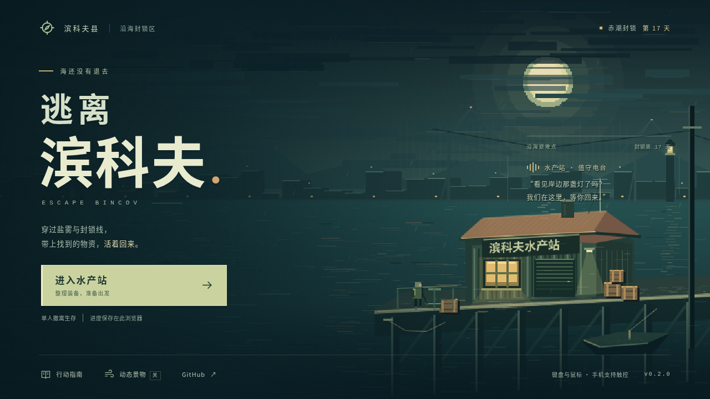
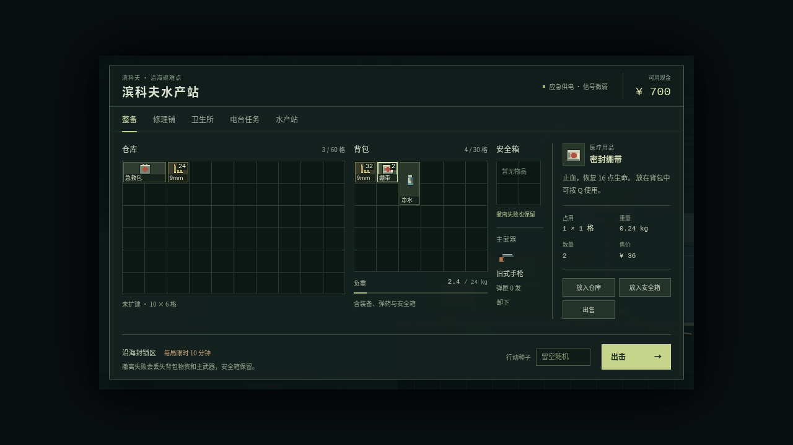
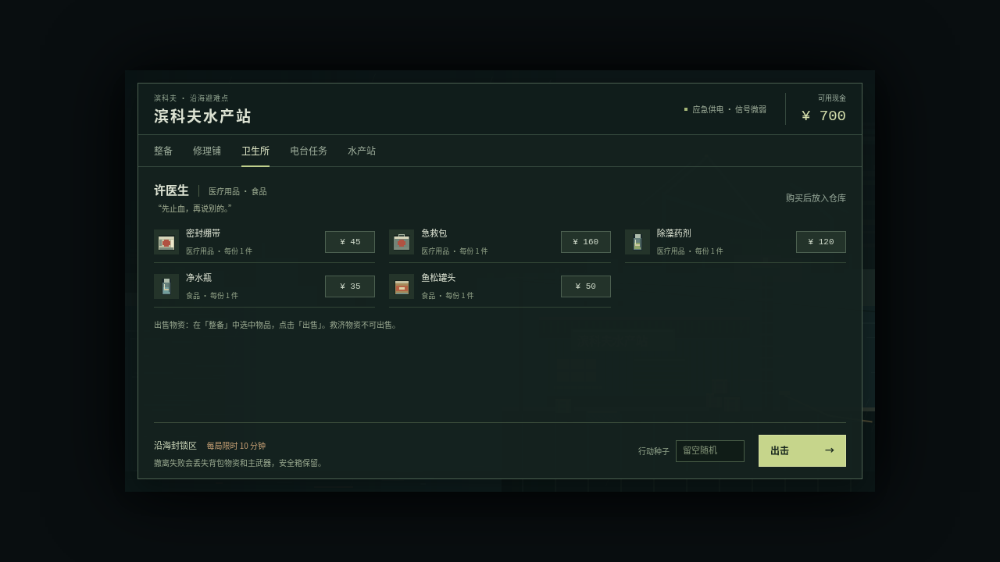
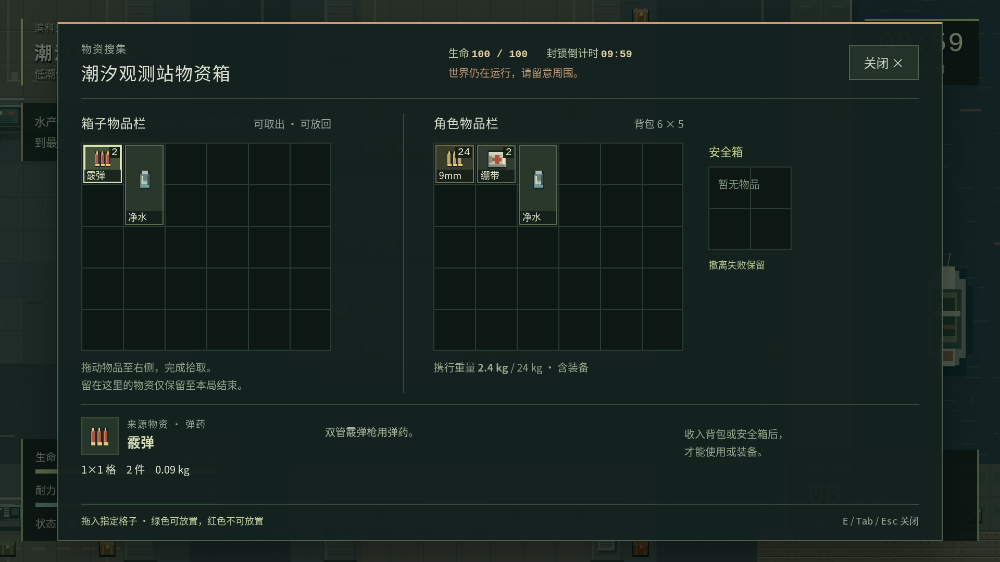
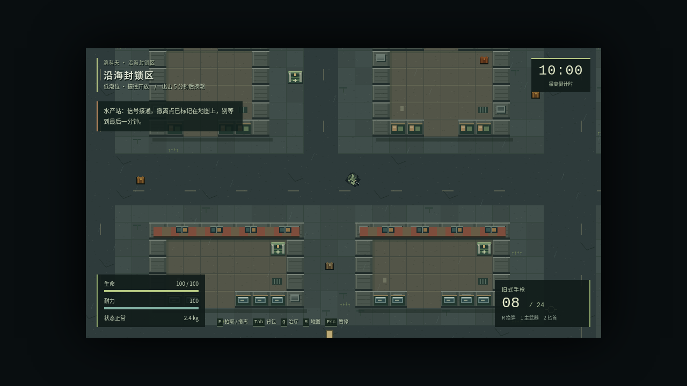
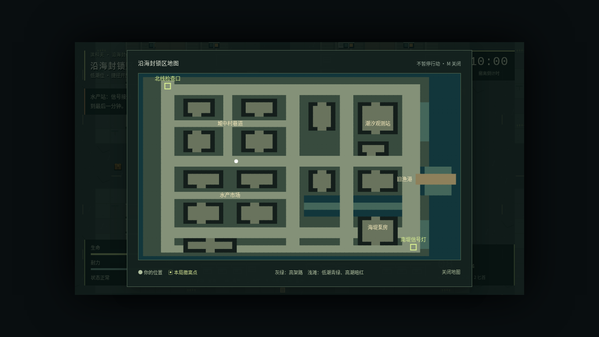
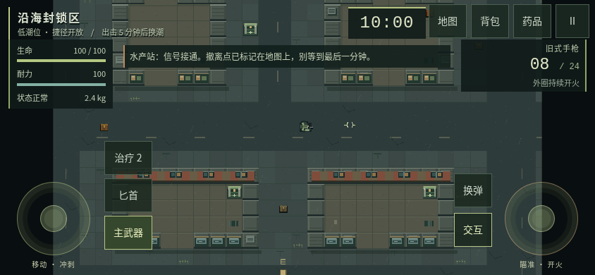
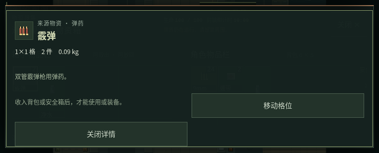

# 美术专项调研与实施计划

2026-10-05 · 唯一源码基线：[`a34c7a1ba810919fc33d4fce158aba0a028a0f78`](https://github.com/xuys2025/escape-bincov/commit/a34c7a1ba810919fc33d4fce158aba0a028a0f78) · 分支：`docs/art-direction-research`。

**本轮完成调研、基线取证和计划，尚未实施任何游戏美术改动。** 推荐保留「台风后暗绿海港、旧水产站、暖色信号灯」的像素方向，先改善文字与物品辨识，再统一界面和场景表现。当前最有收益的工作是排版、图标实际显示尺寸、状态信息层级；主菜单已有较完整构图，可后置微调。

## 1. 调研范围与证据

已按顺序阅读根规范、开发手册、README 和交接；检查 `style.css`、`title.css`、`ui.ts`、`main.ts`、`art.ts`、`title-art.ts`、`game.ts`、打包脚本及相关 UI/搜刮测试，并查阅字体项目与可访问性官方资料。未以旧截图或待审 PR 代替 main。

实际运行未修改的 main HTML，SHA-256 为 `2984e201d2b33c0f242e2c290f01425652463ef20b25df47b528471b4be5e731`，1,702,024 字节。通过本地 HTTP 采集 26 个画面：桌面 1280×720、1920×1080 各 9 个，触控模拟 844×390、740×300 各 4 个；人工查看并归档其中 8 张。本次不是全平台视觉验收，未做真人辨识测试。后续按维护者补充要求，已完成独立字体样张及界面试排，见[字体专项结论](FONT-RESEARCH.md)；试排没有写入游戏源码。

- [测量原始记录与截图哈希](art-research/observations.json)：字体声明、CSS 字号、缩放后字号、元素位置、实际字体抽样、浏览器错误和请求。
- [可重复诊断脚本](art-research/inspect-baseline.mjs)：只记录基线，不把当前缺陷写成未来验收标准。
- 所有截图来自浏览器直接截取，无修图。新存档、种子 42；主菜单使用系统减少动态效果，局内通过 `?test=1` 调整角色位置与敌人就绪状态，以便稳定查看。未使用真实玩家存档、未更换物品图形、未修改 CSS。截图不能代表自然战斗难度。

待审的 [QOL 调研 PR #10](https://github.com/xuys2025/escape-bincov/pull/10) 同样基于此 main。其搜刮危险信息/出口、购买前详情等事项与本计划有交集，实施前应划分职责；本轮没有合入该分支。已有界面和主菜单成果见 [UI 精修](UI-POLISH.md)、[夜港主界面](TITLE-SCREEN.md)，历史验收不当作本轮测试结果。

## 2. 现状与改进机会

下表「事实」来自源码或本轮测量；「建议」是尚未实现的设计选择。优先级表示建议实施顺序，不表示所有候选已获实施授权。

| 编号 / 优先级 | 现状事实与证据 | 建议改进 | 验收重点 |
| --- | --- | --- | --- |
| A01 / P1 字体与版式 | 1280×720 整备画框仍为 960×540、1 倍；1920×1080 为 2 倍。物品标签实际 9/18px，任务正文 10/20px，搜刮说明 10/20px。[缩放代码](https://github.com/xuys2025/escape-bincov/blob/a34c7a1ba810919fc33d4fce158aba0a028a0f78/src/main.ts#L31)、[文字与图标样式](https://github.com/xuys2025/escape-bincov/blob/a34c7a1ba810919fc33d4fce158aba0a028a0f78/src/style.css#L72) | 建立标题/正文/辅助/数值四类字号，先做 720p 原型；字号增大须同步重排详情栏与格子标签 | 两尺寸文字不截断，数量与名称不重叠；补充 1366×768、1600×900，避免只在 1080p 好看 |
| A02 / P1 字体来源一致性 | DOM 有雅黑/苹方/Noto 回退；撤离文字仅声明雅黑，地图 Canvas 同样仅声明雅黑；背景招牌各有另一套声明。[地图](https://github.com/xuys2025/escape-bincov/blob/a34c7a1ba810919fc33d4fce158aba0a028a0f78/src/ui.ts#L614)、[撤离标签](https://github.com/xuys2025/escape-bincov/blob/a34c7a1ba810919fc33d4fce158aba0a028a0f78/src/game.ts#L141) | 共用中文正文与数字字体策略；统一 DOM/Canvas 回退及字重，是否内嵌字体另做体积对照 | 检查中文、数字、标点与单位，不出现缺字、基线错位或首帧旧字体缓存 |
| A03 / P1 物品图标 | 20 种图标都是 32×32 程序绘图；格子显示 24×24，常规显示 28×28。三类弹药共用排列，绷带/急救包共用主体，水/药剂/样本共用瓶形。[图标定义](https://github.com/xuys2025/escape-bincov/blob/a34c7a1ba810919fc33d4fce158aba0a028a0f78/src/art.ts#L62) | 为实际显示尺寸设计像素轮廓；区分弹药长短/盒形、绷带卷/医疗包、瓶盖/封存标签，补齐统一光向和描边 | 20 种物品在格子、详情、商店、移动列表中逐一检查；小尺寸与灰度下仍有轮廓差异 |
| A04 / P1 UI 组件与语义色 | 已有基础色变量，但按钮、面板、卡片、HUD 各有大量独立字面量；仓库、任务和商店已有清楚结构，部分正文偏小。[样式基线](https://github.com/xuys2025/escape-bincov/blob/a34c7a1ba810919fc33d4fce158aba0a028a0f78/src/style.css#L2) | 建立底色、正文、辅助、选中、安全、警告、危险的语义色及间距规则；补齐默认/悬停/按下/焦点/禁用/选中状态表 | 焦点不能被裁掉；状态以文字/形状辅助颜色；新旧组件同屏不割裂；不把交易逻辑写入样式 |
| A05 / P1 HUD 与搜刮 | 生命/耐力/状态主要为小字；搜刮已有生命和倒计时，但 740×300 详情覆盖头部。拖放可/不可主要靠绿/红色区分。[搜刮头部](https://github.com/xuys2025/escape-bincov/blob/a34c7a1ba810919fc33d4fce158aba0a028a0f78/src/ui.ts#L150)、[落格样式](https://github.com/xuys2025/escape-bincov/blob/a34c7a1ba810919fc33d4fce158aba0a028a0f78/src/style.css#L259) | 固定危险信息视觉层级；落格加允许/拒绝的符号或纹理；改善流血、空弹匣、换弹与撤离读条表现 | 不遮挡瞄准区/按钮；详情打开仍能辨认生命、倒计时、退出；本项出口/遮挡实现与 QOL-02 合并安排，避免重复修复 |
| A06 / P2 地图与导航图形 | 地图已有当前位置圆点、撤离方框和图例；区域名直接画在不同明度的地块上，桌面画布字号 11px。[地图绘制](https://github.com/xuys2025/escape-bincov/blob/a34c7a1ba810919fc33d4fce158aba0a028a0f78/src/ui.ts#L603) | 标签加稳定底衬；统一玩家/撤离/潮汐符号与线宽，低潮和高潮采用可辨纹理 | 标签不压在边缘或互盖；地图与场景标识含义一致；不新增自动寻路或泄露敌人位置 |
| A07 / P2 角色与战斗反馈 | 玩家、拾荒者、盐衣和精英共用 `human` 结构，以衣色、武器及局部饰条区分；异变生物已有独立轮廓。已有命中闪白、枪口火光、镜头震动和受击红幕。[角色](https://github.com/xuys2025/escape-bincov/blob/a34c7a1ba810919fc33d4fce158aba0a028a0f78/src/art.ts#L121)、[战斗效果](https://github.com/xuys2025/escape-bincov/blob/a34c7a1ba810919fc33d4fce158aba0a028a0f78/src/game.ts#L356) | 先区分背包/帽形/肩宽和朝向，再做少帧步行、换弹/命中反馈；提供减弱震动/红幕方案 | 固定伤害、射速、碰撞和命中范围；不能用装饰动画延迟输入；不同背景/朝向辨识与持续负载需另测 |
| A08 / P2 场景层次 | 地图已有市场遮棚、工业设施、潮痕、纸片、码头和船只，使用一次绘制的静态纹理；区域仍大量共用地面与墙体模块。[世界绘制](https://github.com/xuys2025/escape-bincov/blob/a34c7a1ba810919fc33d4fce158aba0a028a0f78/src/art.ts#L196) | 城中村/市场/观测站/泵房/渔港各增加少量地标、材质与标牌；强调门口、陆水边缘和可通行路线 | 装饰不暗示不存在的障碍/掩体；涨退潮两态都清楚；保留纹理缓存，不引入全屏模糊/昂贵灯光 |
| A09 / P2 结算与站内叙事 | 结算已有成功/失败标题和三组统计；商人主要靠名字与一句对白，整备/结算仍用旧背景。新夜港只在主菜单使用。[结算与商店](https://github.com/xuys2025/escape-bincov/blob/a34c7a1ba810919fc33d4fce158aba0a028a0f78/src/ui.ts#L191)、[场景入口](https://github.com/xuys2025/escape-bincov/blob/a34c7a1ba810919fc33d4fce158aba0a028a0f78/src/game.ts#L16) | 行动报告增加克制的纸张/盖章语言；两个商人试用小幅像素头像或工具标识；统一主菜单到站内的视觉关系 | 仍先成功保存再显示成功；失败损失与安全箱保留清楚；「物资估值」不能被装饰误读成现金奖励 |
| A10 / P3 品牌与氛围 | 主菜单已有夜港/月光/招牌/动态开关，构图和点击层级完整；系统减少动态效果目前控制菜单景物。[标题美术](https://github.com/xuys2025/escape-bincov/blob/a34c7a1ba810919fc33d4fce158aba0a028a0f78/src/title-art.ts#L258) | 后置试验定制字标、章节式标题、轻微界面过渡；主界面维持目前方向 | 不重做一套无关风格；减少动态效果下仍完整表达状态；普通入口、手机主菜单和键盘焦点回归 |

### 基线画面

下列均为**改动前**画面。只展示实际运行内容，未生成概念图。

| 夜港方向可保留 | 720p 整备与小字 |
| --- | --- |
|  |  |
| 商店图标与排版 | 1080p 双栏搜刮 |
|  |  |
| 720p 战斗 HUD | 地图文字与符号 |
|  |  |
| 手机横屏 HUD | 短屏详情覆盖头部 |
|  |  |

## 3. 字体专项方案

**追加调研后明确推荐：寒蝉点阵体 16px Regular，作为界面主字体候选，正文按原生 16px 排版，标题和关键数字优先用 32px。** 已与 Noto Sans CJK SC、缝合像素体做同字号样张及实际商店试排；738 字符保守语料无缺字，子集 WOFF2 为 30,928 字节。选择理由、实际图片、许可和使用边界见[字体专项结论](FONT-RESEARCH.md)。应同步重排现有 9–11px 小字，不能只全局替换字体名称。

| 路线 | 优点 | 代价与限制 | 建议用途 |
| --- | --- | --- | --- |
| 寒蝉点阵体 16px（推荐） | 原生点阵与场景相符，复杂汉字比低像素规格有更多笔画空间；本轮语料无缺字 | 正文不能压到 9–12px；需配套布局和正式子集/许可流程，真机阅读仍待测 | 16px 正文/按钮、32px 标题/数字；详见专项结论 |
| 系统字体栈统一 | 零字体下载、无包体增加、保持离线；改动小 | Windows/macOS/Android 的实际字体和字宽不同；不能保证每台机器都有指定字体 | 作为回退与可读性控制组，补齐 Canvas 声明；不复制系统字体文件 |
| 内嵌 Noto Sans CJK SC 的静态 WOFF2 子集 | 可控制汉字外观与字宽；官方字体采用 OFL 1.1 | 需选定版本、字重、字符集与可复现子集流程；包体、加载耗时、缺字风险均须实测 | 若跨平台差异确实影响排版，再试正文/标题 1–2 个字重 |
| Fusion Pixel Font 简中子集 | 官方提供 8/10/12 像素规格及比例/等宽模式，符合像素招牌方向，字体采用 OFL 1.1 | 复杂字在低分辨率下有取舍；字宽模式与语言变体要选对，不能任意缩成 9/11px 并假定清晰 | 先以 12px 及整数倍试短标签/标题；长段正文不默认切换 |
| 原创定制字标/招牌纹理 | 只需有限字形，可形成水产站自身辨识度 | 需要人工像素修整与维护；不适合作为通用文字系统 | 后期主标题与环境标牌，保留语义文字/读屏名称 |

许可调查截至 2026-10-05：已读取 [Noto CJK Sans LICENSE](https://github.com/notofonts/noto-cjk/blob/main/Sans/LICENSE)、[Fusion Pixel 说明](https://github.com/TakWolf/fusion-pixel-font/blob/master/README.md) 与 [字体 LICENSE-OFL](https://github.com/TakWolf/fusion-pixel-font/blob/master/LICENSE-OFL)。Fusion 的构建代码另有 MIT，不能将其误写成字体许可。OFL 允许随软件内嵌/分发，但要保留版权和许可，修改或子集化时核对具体版本的保留名称条款；落地时固定上游版本/哈希并更新 `THIRD_PARTY_NOTICES.md`。字体试验文件仅下载到忽略的调研目录，未引入游戏字体资产或运行时依赖。

若内嵌字体：构建时产出并内联 data URL，不加载 CDN；字符清单包含所有 UI/物品/任务/环境文本、动态模板、数字、`¥ × / % kg`、中文标点和后续新增文字。增加缺字检查及系统字体兜底；记录 WOFF2、独立 HTML、ZIP 各自字节增量，不能用原始字体大小代替实际内联成本。初始化时按 [CSS Font Loading API](https://developer.mozilla.org/en-US/docs/Web/API/CSS_Font_Loading_API) 等待字体就绪，再测量 Canvas 文本及生成缓存招牌；只改 CSS 不会自动重绘已有纹理。

样张至少包含「逃离滨科夫」「密封绷带」「陶瓷保险管」「赤潮封存样本」「撤离失败保留」「生命 100 / 100」「09:59」「¥ 1,280」「24.0 kg」及最长任务说明。比较 720p/1080p、触控短屏、不同系统回退和 125%/150% 浏览器缩放。已完成同字号 A/B 样张、静态字形覆盖和 720p/1080p 商店试排；没有据此宣称全界面、所有系统或真人阅读已经验收。

### 字号与布局原型

以下是建议验收目标，需用真实文本和格子验证，不是已经生效的样式：

- 主要操作与说明在最小支持布局优先达到 12–14 CSS px，详情正文 14–16px；少量格子短名先试 11–12px，必须同时可读取完整详情。手机关键说明不继续沿用桌面 9–10px。
- 标题/正文/辅助/数值各保留少量固定档位；长中文说明不加大字距，数值保持等宽数字，时间/数量变化不推动布局。
- 先比较两个原型：A 在 960×540 内重排（详情转为底部或折叠区、调整留白）；B 让站内 DOM 按视口布局，战斗画布仍整数缩放。B 可利用 720p 留白，但会涉及 `main.ts` 坐标、拖放与焦点，是独立风险项。不要直接对整个游戏套非整数缩放，也不要一次全局放大字体导致 10 列仓库、背包、安全箱和详情挤出屏幕。
- 32px 原图缩到 24px 是 0.75 倍、到 28px 是 0.875 倍；`image-rendering: pixelated` 不能保留所有原像素。应在「专门绘制 24px 小图」与「调整格子/标签后用 32px 原图」之间做同屏样张，避免名称、数量遮住图标。

## 4. 视觉规范与验收提案

建议建立一页可维护的视觉规范：暗海绿为背景、灰绿为层次、米白为正文、旧黄绿为主操作，锈橙为警告，低饱和红为危险；每个颜色有明确职责。保留硬边、有限色板、统一光源和薄边框；面板装饰不能抢过物品、生命或主要按钮。

**不能笼统断言当前界面对比度不合格。** 例如 CSS 不透明色值 `#99aa9b` / `#15221f` 的公式对比度为 6.70:1，已有良好基础；物品边框 `#5d6e50` / `#29382a` 为 2.25:1，但这不等于整个交互组件自动不合格，需要确定边框是否是唯一必要识别线索。透明面板和动态地图必须按实际合成背景另测。

参考 [WCAG 2.2 文字对比度](https://www.w3.org/WAI/WCAG22/Understanding/contrast-minimum.html) 与 [非文字对比度](https://www.w3.org/WAI/WCAG22/Understanding/non-text-contrast.html)：将普通文字 4.5:1、大文字及必要的交互状态/图形 3:1 作为候选验收目标，结合禁用/装饰等例外判断；这不是整款游戏已通过无障碍认证。危险、救济、任务、选中、可落格应同时有文字/符号/形状，不只靠色相。

战斗表现继续保留环境安静、行动信息突出的层次：先做静态轮廓，再做少量动画。枪口、命中、死亡与环境细节都要服从读图；不增加弹药、伤害、掉落、敌人位置提示等玩法信息。镜头震动与红幕的强弱调整可与减少动态效果关联，但设置持久化若触及存档要单独设计兼容验证。

## 5. 分阶段实施与 PR 拆分

工作量为单人开发与素材制作的粗估，含对应自动回归，不包含等待审阅、物理设备排期和额外玩法改造；先完成第一阶段样张再修正估算，不作为交付日期承诺。

| 阶段 | 交付与建议 PR 范围 | 依赖 / 粗估 | 进入下一阶段的条件 |
| --- | --- | --- | --- |
| M0 调研（本轮） | 本文、源码证据、真实基线图、字体许可路线、验证记录 | 已完成 | 计划可审阅；游戏画面未修改 |
| M1 字体与基础界面 | `art/ui-foundation`：字号与回退统一、色彩/间距/组件状态表，720p 原型；按专项结论接入许可/可复现子集，先做真实文本原型 | 2–4 人日；A01/A02/A04 | 两种布局方案择一，720p 实际操作与长文本通过；若需要解耦 DOM 缩放，单独估算并拆 PR |
| M2 物品与行动信息 | `art/item-icons`：20 图标及展示尺寸；`art/hud-map`：HUD/落格/地图符号 | 3–5 人日；依赖 M1；A03/A05/A06，与 QOL-02 协调 | 图标逐项对照、色弱辅助、搜刮危险与出口可见；库存/保存/输入回归通过 |
| M3 世界与角色 | `art/world-readability`：先做一个区域和一组敌人的样板，再推广地标、轮廓与少帧反馈 | 4–7 人日；依赖 M2；A07/A08 | 样板在高低潮及不同背景可读；无碰撞/寻路变化；性能与持续运行证据可接受 |
| M4 叙事界面与收尾 | `art/station-result`：商人/报告/站内背景；字标与主菜单微调为可选尾项 | 2–3 人日；A09，A10 可另排 | 成功/失败/保存错误语义清楚；全流程风格一致，实际前后截图与离线制品完整 |

推荐先实施 M1，随后 M2；不必等待全地图重绘才能交付可见提升。M1–M4 粗估合计 11–19 人日，只是安排候选顺序。完整多方向角色动画、大量手绘区域素材、缩放架构调整若超出样板范围，需在对应阶段重新估算。

实施时每项仍以当时最新 main 建分支；其他 QOL 修复合入后重新采集涉及界面。尽量不在同一 PR 同时改 `ui.ts` 布局、存档事务、战斗数值和字体打包。每个实现 PR 附真实前后图、对玩家的影响和未完成部分，不把概念样张标成实现截图。

## 6. 后续验证矩阵

| 范围 | 必须执行或检查 |
| --- | --- |
| 所有美术实现 | `pnpm test`、`pnpm package`；两份 HTML 一致、ZIP/清单同步；素材来源和字体许可；无运行时远程请求 |
| 字体、UI、布局、主菜单 | `pnpm test:browser`、`pnpm test:ui`、`pnpm test:title`；1280×720、1920×1080 实际前后图；1366×768、1600×900、手机横竖屏、长文本、焦点/禁用/错误状态 |
| 库存、搜刮、结算和输入 | `pnpm test:loot`、`pnpm test:save-browser`、`pnpm test:desktop-input`、`pnpm test:mobile`、`pnpm test:mobile-ux`；原子保存失败回滚、重复事件、释放按键、2×2 安全箱和旋转规则保持 |
| 字体资源、打包与离线 | `pnpm test:portable`；断网实际解压启动、冷启动字体就绪、Canvas 缓存重绘、缺字和包体差值；不能以 HTTP 截图代替 `file://` 验证 |
| 世界、角色与战斗特效 | 对应地图可达性回归、`pnpm test:play`、固定场景帧耗/纹理资源与长时间负载对比；真人判断轮廓、命中反馈与遮挡 |
| 真机与视觉可访问性 | iPhone Safari / Android 实际尺寸、系统字号/缩放、强光下阅读、不同显示密度；减少动态效果与色弱辅助。模拟触控不能替代真机 |

性能以同设备、同种子、同相机位置和相同动态设置做前后对比，记录帧间隔、纹理数量、内存趋势、首屏耗时和包体；本轮未采集这些数据，不预先宣称低端手机稳定 60 FPS。沿用一次生成的地图/图标缓存，避免每帧重新生成 data URL、画布字体或新增全屏后处理。

## 7. 本轮实际验证与剩余问题

环境：Linux、Node 24.19.0、pnpm 11.19.0、Playwright 1.63.0、Chromium 151.0.7922.173。CDP 对两种桌面尺寸的任务标题抽样确认实际渲染字体为 Noto Sans CJK SC Bold；这是抽样结果，不代表所有元素或其他操作系统。

| 本轮命令 / 检查 | 实际结果与边界 |
| --- | --- |
| `pnpm install --frozen-lockfile --registry=https://registry.npmjs.org` | 通过，未修改依赖和 lockfile |
| `pnpm test` | 退出 0；此环境汇总为 11 个文件，不直接计为 11 个规则用例 |
| `node --import tsx --test --test-isolation=none tests/*.test.ts` | 109/109 通过；[实际日志](art-research/unit-tests.txt) |
| `pnpm exec tsc --noEmit` | 通过 |
| `BINCOV_CHROME=/usr/bin/chromium pnpm test:ui` | 环境阻塞：浏览器拒绝 `file://`，`ERR_BLOCKED_BY_ADMINISTRATOR`；[原始错误](art-research/ui-environment-block.txt)，不记为通过，也未改断言 |
| HTTP 基线诊断 | 26 个画面采集完成；8 张人工查看并归档；无页面异常、无游戏外部 HTTP 请求。触控均为模拟，不是离线/真人/真机验收 |
| `pnpm package` | 不适用，未重跑：只新增调研文档和证据，不改游戏源码、打包脚本或游玩说明；生成物保持 main 字节 |
| 文档核验 | 相对链接、基线源码锚点、命令、JSON、归档截图哈希、`git diff --check`；结果记录在本轮交接 |

复现截图（从仓库根目录；诊断脚本只服务于此基线，不改变游戏源文件）：

```bash
pnpm install --frozen-lockfile
# 第一个终端：服务已提交的 main HTML；不要用 pnpm dev 替换基线
python3 -m http.server 4173 --bind 127.0.0.1 --directory dist
# 第二个终端：已有 Chromium 可按开发手册设置 BINCOV_CHROME
node docs/art-research/inspect-baseline.mjs
```

脚本生成的 26 张图和观察记录位于忽略的 `test-results/art-audit/`；本目录只长期保留 8 张抽查图。动态世界仍会推进，重跑的像素哈希不保证一致；JSON 中的哈希用于核对本轮归档完整性。

剩余工作：全部游戏视觉改进尚未实现；字体已完成初步 A/B、字形覆盖和包体测量，正式集成、全界面排版/动态文字、人物辨识真人测试、性能采样和真机验证仍待后续阶段。当前仅新增文档及取证脚本/截图，不改变存档、掉落、操作规则、HTML/ZIP、部署或许可证。PR 的 CI 状态应单独查看，不将本地规则通过写成所有检查已通过；本轮不合并 main，不更新 Pages。
