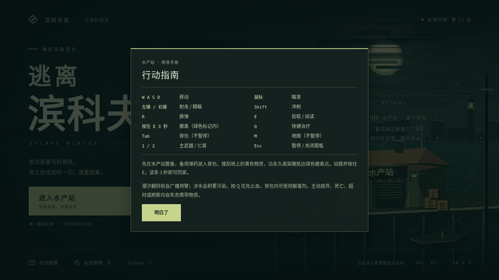
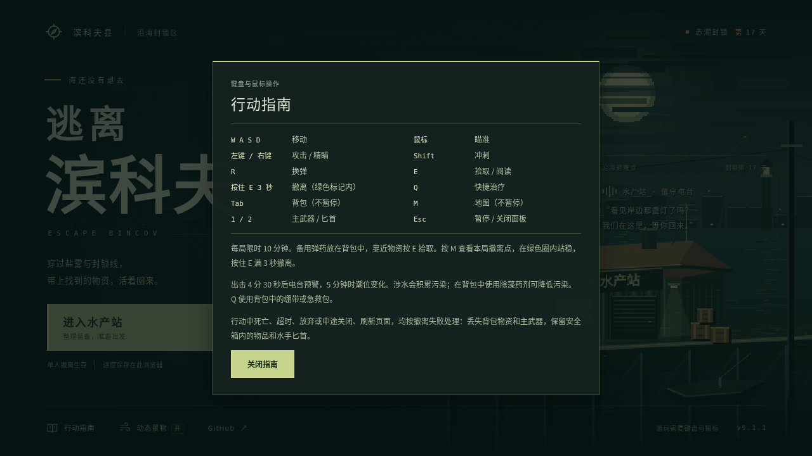
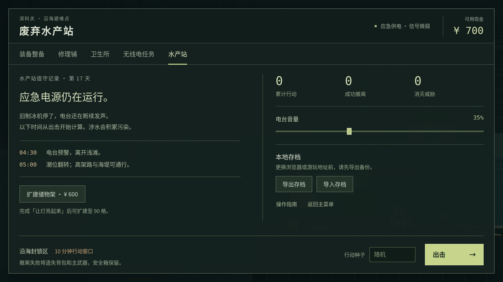
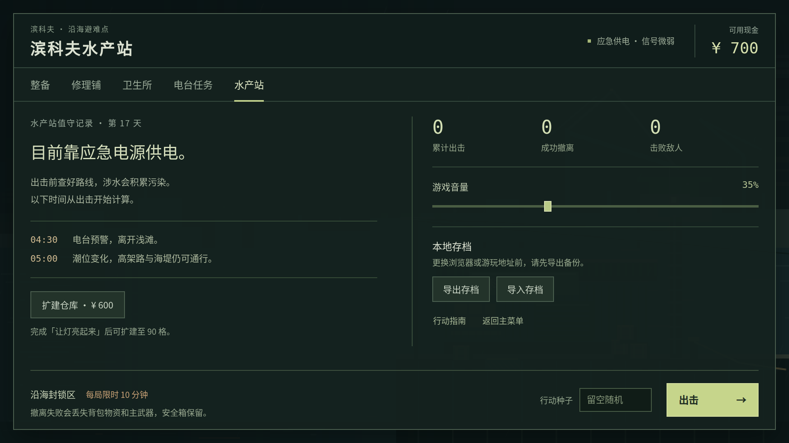
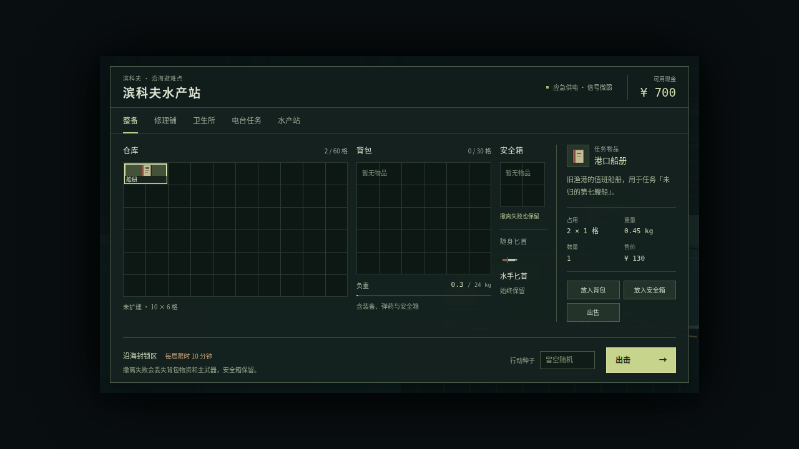
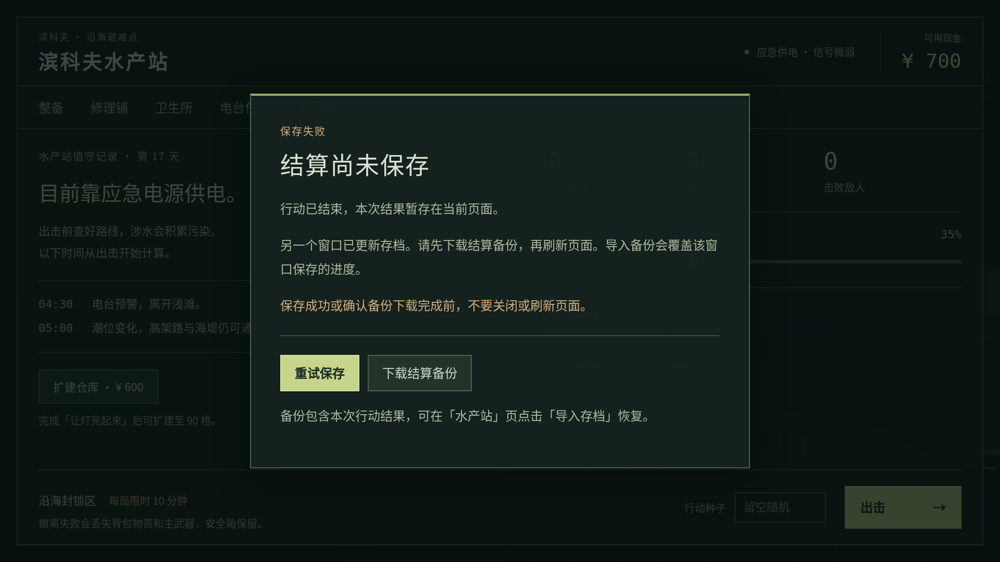
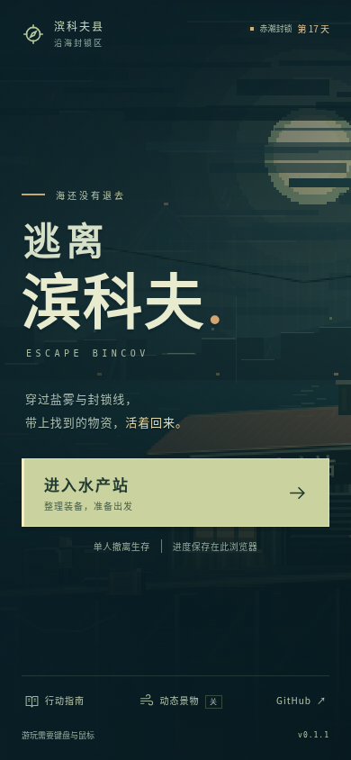

# 玩家可见文案校对

2026-10-04 · 基线 `702692a0c6d79ea5d51a291eac60f16013ab0688` · 分支 `agent/player-copy-pass`。

## 检查范围

本轮逐项检查主菜单、整备、商店、任务、站内设置、行动 HUD、背包、地图、暂停、结算，以及保存失败、多窗口冲突和导入导出提示。可见文字、按钮、悬浮提示和读屏标签一并核对。

数据表覆盖 20 种物品、4 种武器、4 种敌人、2 位商人和 3 项任务；地图覆盖 15 栋建筑、5 个区域、3 个撤离点和 5 段留言。已有明确名称予以保留，修改混用、含糊或与规则不符的表达。README、完整游玩手册和 ZIP 内的中文说明同步使用同一套术语；历史验收材料保留原样。

## 主要修改

| 原文或问题 | 本轮处理 |
| --- | --- |
| 废弃水产站 / 滨科夫水产站 | 正式名称统一为「滨科夫水产站」，一般提示简称「水产站」 |
| 操作指南 / 行动指南 | 统一为「行动指南」，包括读屏标签 |
| 装备整备、无线电任务、储物架升级 | 改为「整备」「电台任务」「扩建仓库」 |
| 解毒剂、基础匕首、12G | 对应「除藻药剂」「水手匕首」「霰弹」，保留受限格子内的明确短名 |
| 电台音量 | 改为「游戏音量」，与实际控制范围一致 |
| 生命体征、消灭威胁、携行重量 | 简化为「生命」「击败敌人」「负重」 |
| 盐雾在身后合拢、装备仍在背包中 | 结算直接说明装备和物资已带回，进度已保存 |
| 失败会失去携带物资 | 明确丢失背包物资与主武器，保留安全箱内的物品和水手匕首 |
| Q 使用急需的医疗品 | 明确 Q 只使用背包中的绷带或急救包；除藻药剂需在面板中使用 |
| 污染低时显示「流血 · 状态稳定」 | 只显示实际存在的异常状态，不再与「状态正常」并列 |
| 无主武器时仍把匕首标为主武器 | 该状态显示「随身匕首」 |
| 所有拒绝操作都提示检查现金、空间或物资 | 分别说明购买、交付、扩建、换装、转移的前提；保留「生命已满」的治疗提示 |
| 进度保存在本机 | 明确保存在此浏览器，换入口需先导出 |
| 结算备份冲突后直接建议刷新、导入 | 强调先确认备份下载完成，且导入会覆盖另一窗口保存的进度 |

物品描述先写实际用途与效果。商人、电台和环境留言保留夜港怪谈的气氛，改用具体物件和自然口吻，减少重复的抒情句、装饰编号和无用途的坐标。长期约定及 20 种物品的全名/短名表见 [COPY-GUIDE.md](COPY-GUIDE.md)。

## 真实截图

截图为 Linux Chromium 138 直接输出，未修图。改动前从基线 HTML 运行；改动后从本分支最终 HTML 运行。指南和站内设置使用新存档；长物品说明及存档错误面板使用显式 `?test=1` 夹具，便于覆盖罕见状态。手机为视口模拟。

### 行动指南 · 1280×720

改动前：

改动后：

### 水产站 · 1920×1080

改动前：

改动后：

### 物品说明、存档冲突与手机主菜单

## 验证

本地环境：Linux、Node 24.19.0、pnpm 11.25.0、Chromium 138.0.7204.0。浏览器通过既有 `BINCOV_CHROME` 配置选择；没有更改依赖、lockfile 或 CI 环境；便携检查的文案定位已同步为新标题。CI 仍使用 pnpm 11.19.0 和项目固定的 Playwright。

| 检查 | 实际结果 |
| --- | --- |
| `pnpm test` | 59 项通过 |
| `pnpm package` | 严格类型检查、两份 HTML、两个 ZIP 与哈希清单通过 |
| `pnpm test:browser` | 24 步通过 |
| `pnpm test:ui` | 两种桌面尺寸、38 个场景通过；增加流血提示与无效治疗反馈的回归断言 |
| `pnpm test:title` | 16 组通过，覆盖 12 种视口、指南焦点、动态开关、旋转与往返 |
| `pnpm test:save-browser` | 9 项通过，包括写入失败、回滚、重试、导入导出和真实双窗口冲突 |
| `pnpm test:portable` | 6 项通过，实际解压最终 ZIP 后离线操作 |
| 补充文案检查 | 9 组通过；20 种物品在两种桌面尺寸检查完整描述与按钮可达性，覆盖导入和两种待保存面板 |
| 规则差异检查 | 去除文案字面量后，domain、world、art、main 和 save-backup 与基线完全一致 |

存档键、数据结构、物品 ID、战斗与经济数值、地图坐标、结算规则没有改动。显示逻辑仅涉及状态组合、空装备栏和按操作区分的失败文案；既有会话事务仍决定操作是否成功。两份 HTML 字节一致，离线包大小见 [发布清单](release-manifest.json)。完整验证摘要见 [verification.json](copy/verification.json)，补充检查见 [copy-report.json](copy/copy-report.json)。

本轮未重跑十分钟 `test:play`，没有进行真机手机、真实屏幕阅读器或长期功耗测试。手机触控战斗仍属于后续适配范围；文案不能替代这些功能。PR 与 CI 状态以 GitHub 为准，未自行合并或部署。
