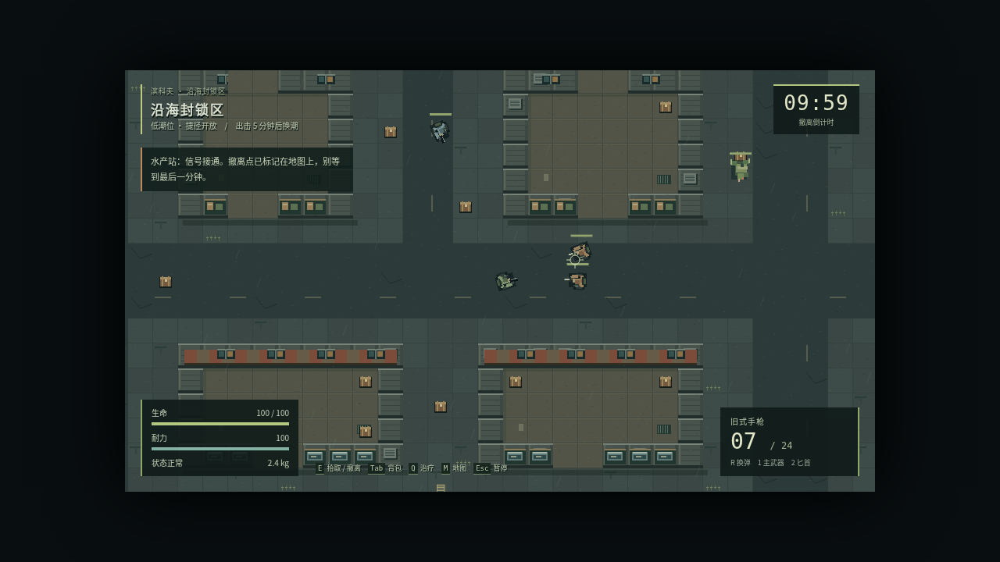
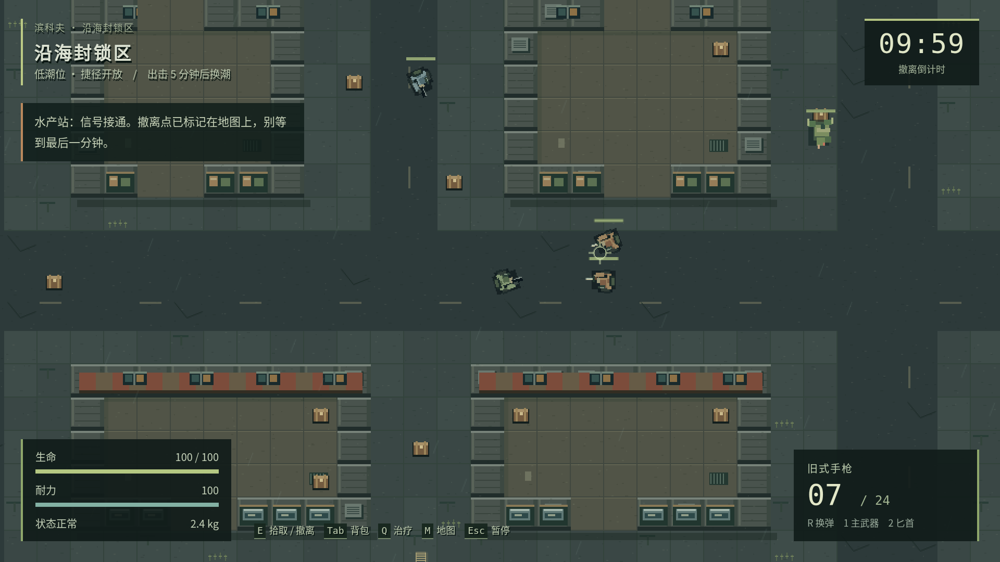

# PR #2 桌面回归修复

日期：2026-10-04。唯一已接受基线为 `main` 的 `193007318ea7d8cdc9e23a5fe812be65ff3bfdb0`；待修 PR #2 为 `585705a9ce86363cb8f039a4ee02b7bbe18bc21a`，已包含该 main。开发在本地独立分支 `fix/pr2-desktop-regressions` 完成，按维护者要求将原子提交追加到原 PR #2 的 `docs/mobile-adaptation-2026` 分支，不另建重复 PR、不合并 main。

## 修复与对照

| 问题 | 修复前 PR #2 | 修复后的行为 |
| --- | --- | --- |
| 1280×720 触屏电脑键鼠失效 | 被强制切入手机布局，持续按 D 位移为 0，鼠标弹药消耗为 0 | 混合指针电脑及宽视口保留桌面布局；键鼠输入始终可用，含手机布局中的外接键鼠 |
| Esc 恢复后无声 | 画面与计时恢复，原生 AudioContext 仍为 suspended | 暂停到继续的统一状态转换恢复音频，Esc 和继续按钮行为一致 |
| 无效治疗打断移动 | 满血无流血时，Q 被拒绝后角色位置不再变化 | 同步世界回滚保留正在按住的键或摇杆；不消耗药品，不重置前台时钟 |

修复没有跳过事务回滚。世界、库存和生命状态仍按原快照回滚；只把输入释放移到读档、暂停、失焦等生命周期边界。失败医疗写入仍回滚并暂停，恢复后不会自动复活旧按键或触点。

手机布局依据主指针、精细指针及视口判断，不再把 `any-pointer: coarse` 当成排斥键鼠的开关。活动摇杆优先于同类键鼠意图，松开后仍能使用外接设备。真实鼠标保持按下单发，右键精瞄时按左键仍能射击；触摸画布产生的兼容鼠标事件不会额外开火。

## 可重复的回归测试

新增 `pnpm test:desktop-input` 并纳入 PR CI，共 10 项：普通桌面与触屏桌面的 1280×720 / 1920×1080 键鼠；844×390 手机布局中的键鼠；重复 Esc 暂停/继续；暂停音频；失焦后键盘恢复；无效治疗时持续移动；写入失败后的回滚与输入释放。桌面射击包含右键与左键组合、按住不连发、松开不补发和触摸不伪造鼠标射击。

`pnpm test:mobile` 新增「一指推动摇杆，另一指点击无效治疗」的真实 CDP 多指序列，补齐移动端相同路径。原有旋转、取消、快照恢复和故障回滚断言保留。单元测试补充外接键鼠与摇杆优先级/释放语义。

同一份测试脚本可用 `--entry <HTML路径>` 和 `--filter <正则>` 对比构建。三个核心复现对照结果：

| 构建 | 核心检查 | 证据 |
| --- | --- | --- |
| 最新 main `1930073` 的真实独立 HTML | 3/3 通过 | [main-report.json](desktop-regressions/main-report.json) |
| 修复前 PR #2 `585705a` 的真实独立 HTML | 0/3，三处均稳定失败 | [before-report.json](desktop-regressions/before-report.json) |
| 本次修复构建 | 10/10 通过，覆盖全部核心问题 | [desktop-input-report.json](desktop-regressions/desktop-input-report.json) |

输入由 Playwright 真实键鼠/触点驱动；测试只用位置、生命值和敌人冷却夹具排除战斗干扰。音频测试包装原生 AudioContext 构造器以读取状态，不替换音频实现，不使用自动播放放行参数；它证明音频引擎恢复运行，不能代替物理扬声器试听。main 暂停时本身不挂起音频，核心对照只要求暂停冻结计时、继续后音频运行；本候选额外检查暂停与失焦确实挂起音频。

## 本轮验证

Linux x64、Node 24.19.0、pnpm 11.25.0、Chromium 138.0.7204.0 / SwiftShader。使用环境中已安装的依赖和浏览器；仓库与 CI 仍固定 pnpm 11.19.0，没有新增依赖或改锁文件。

| 命令/检查 | 结果 |
| --- | --- |
| `pnpm test` | 71/71 |
| `pnpm package` | 严格类型检查、两个 HTML、两个 ZIP 和哈希清单通过 |
| `pnpm test:browser` | 24/24，两种桌面分辨率及完整撤离/死亡/超时流程 |
| `pnpm test:ui` | 38/38 |
| `pnpm test:title` | 16/16，含 12 种视口 |
| `pnpm test:save-browser` | 9/9 |
| `pnpm test:mobile` | 10/10 |
| `pnpm test:portable` | 6/6，解压后普通入口、无测试钩子及外部请求 |
| `pnpm test:desktop-input` | 10/10 |
| `node scripts/legacy-compat-test.mjs <main的HTML>` | 3/3，真实新旧 HTML 同源共存 |
| `git diff --check`、制品哈希与 ZIP CRC | 通过 |

短回归合计 **187 项**。本轮汇总见 [verification.json](desktop-regressions/verification.json)，手机报告见 [mobile-report.json](desktop-regressions/mobile-report.json)。CI 会对 PR 最新提交重新执行全部短回归（旧新版共存为额外本地检查），完整诊断和截图保存在 `browser-evidence` 附件中。

`pnpm test:play` 另外完成 **10 分 23 秒**的真实计时自动流程：两局、一次成功撤离、一次战斗死亡结算、40 次击杀，无页面错误或外部请求。该脚本只读取测试钩子，通过真实键鼠操作，不修改位置、生命、敌人、计时或 RNG；不能代替真人手感/平衡性测试。完整记录见 [natural-play-report.json](desktop-regressions/natural-play-report.json)。

最终 HTML 为 **1,669,035 字节**；两个入口字节一致，制品全部由 `pnpm package` 生成。准确 SHA-256 见 [发布清单](release-manifest.json)。

## 实际桌面画面

以下是 `hasTouch: true` 的 Chromium 触屏桌面仿真，保留桌面 HUD，没有手机摇杆遮挡。画面采用种子 42、位置与敌人冷却夹具；不是概念图或物理设备证明。

## 边界

三处报告的回归均已修复，当前自动检查未发现新增阻塞。未修改存档格式、玩法数值、伤害或单发语义，离线能力保留。原移动候选仍待 iPhone Safari / Android 真机、多指系统打断、物理音频与文件操作、20 分钟热稳定性及大陆三网验收。此任务不合并、打标签或更新正式 Pages。
