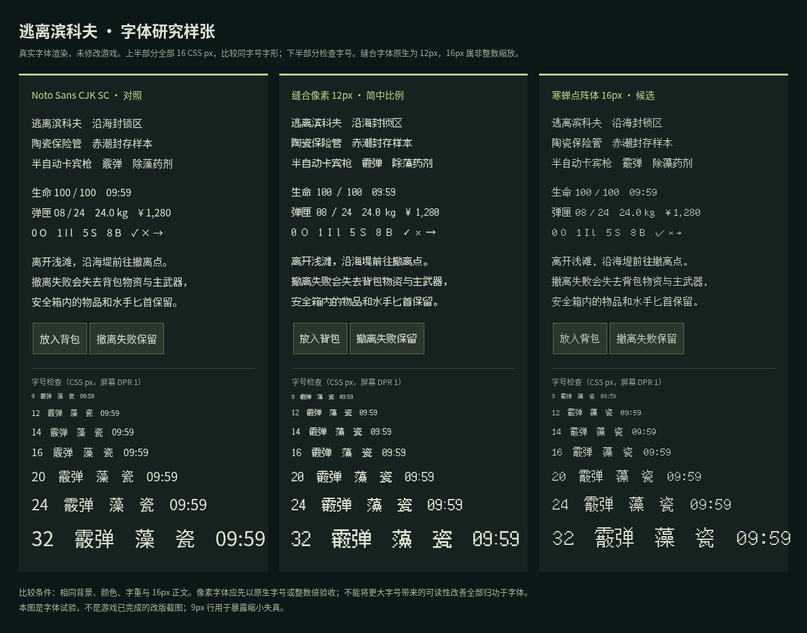
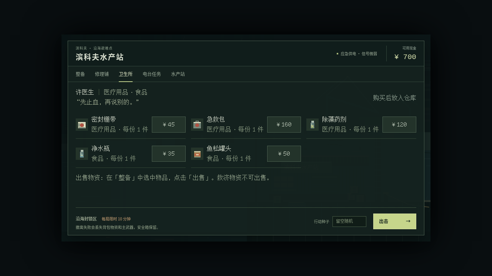
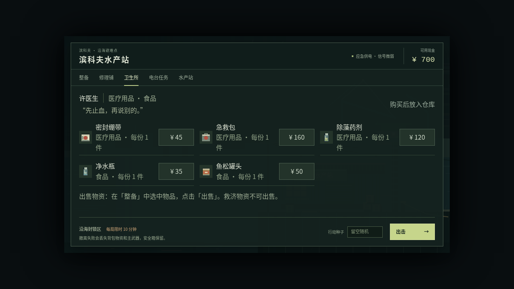

# 字体专项：推荐寒蝉点阵体 16px

> 2026-10-06 归档说明：本文保留 PR #11 在 `09e0713` 的研究、方案或实施证据，文中的“待实现／未合并”和截图均属于当时记录。核心美术、字体及后续战术界面已由 [PR #20](https://github.com/xuys2025/escape-bincov/pull/20) 合入主线；当前效果与验证见 [战术界面实施记录](tactical-ui/README.txt)。本次在原 PR #11 归档剩余资料，保留主线实现；旧库存布局、通用地面包裹及旧字体子集不再重新接入。真人辨识、真机及未完成动画等边界按历史记录保留，不视作已验收。

> 2026-10-05：维护者已授权开始实现。本文件保留调研时的判断；实际完成范围、逐图审查、截图和验证见 [美术重绘实现记录](ART-REDRAW.md)。

2026-10-05 · 仍以 main `a34c7a1ba810919fc33d4fce158aba0a028a0f78` 为唯一游戏基线，追加至 [美术调研 PR #11](https://github.com/xuys2025/escape-bincov/pull/11)。维护者要求明确选出一个既符合画风、又重视易读性的字体。

**推荐「寒蝉点阵体 16px Regular」（ChillBitmap_16px）作为界面主字体候选。正文/按钮以原生 16px 起步，标题与关键数字以 32px 为主要档位。** 它能延续当前海港、旧设备与像素场景的质感，同时给「霰、藻、瓷」等复杂中文留下足够的笔画空间。最重要的落地条件是同步改掉现有 9–11px 密集排版，不能只把全局字体名替换掉。

本轮已做实际字形、字符覆盖、界面试排和体积测试；尚未正式集成游戏。以下可读性判断是相同条件下的视觉审阅，不是用户阅读速度实验，不能声称所有人、所有设备都已经验收。

## 1. 为什么推荐这一款

| 比较维度 | 寒蝉点阵体 16px | 缝合像素体 12px 简中比例 | Noto Sans CJK SC Regular（控制组） |
| --- | --- | --- | --- |
| 与现有画风关系 | 16px 点阵细线、方正轮廓，与程序像素地图/图标及旧仪表气质一致 | 像素特征更粗、更强；复杂字在较少像素内更密 | 清楚、平稳，但与像素场景的联系较弱 |
| 原生小字号 | 16px 保留复杂汉字结构；缩到 9/12px 会破坏笔画，不能用于现有小字直接换皮 | 原生 12px 更紧凑，放到 16px 为非整数缩放；24px 可清晰放大，但不适合所有密集正文 | 字号更自由，是正文可读性与回退的可靠控制组 |
| 本轮语料覆盖 | 738/738，含 633 个 CJK 字符；无缺字 | 缺 `✓`，其余覆盖；该符号需回退或独立图标 | 738/738 |
| 数字与混排 | 16px 样张检查了 09:59、100/100、¥1,280、24.0 kg 及 0/O、1/I/l；正文与数字可共用主字体 | 保留点阵仪表感，缩放尺度要一致 | 辨识良好，仍可作为对照与缺字回退 |
| 本轮 WOFF2 子集 | 30,928 B | 23,976 B | 208,328 B（单个 SC 字体面，不是整个 TTC） |
| 结论 | **兼顾风格与中文正文结构，推荐进入正式排版原型** | 可作更强复古风格的备选；本轮不推荐作为统一正文 | 保留系统回退/舒适阅读方向，不作为这次像素主字体首选 |

选择不是因为点阵越明显越好。等字号样张中，寒蝉保留了较完整的笔画与字内留白；缝合的 16px 非整数缩放更容易出现粗细不均；Noto 在小字号仍有优势，因此不能为了风格把寒蝉强行缩小。字体选择与可读字号必须一起落地。

## 2. 实际对照图

### 同字号字形与字号阶梯

上半部分三款字体统一为 **16 CSS px、Regular、相同前景/背景**，检查长名称、数字和段落；下半部分包含 9/12/14/16/20/24/32px 阶梯。缝合字体的原生规格是 12px，16px 对照用于展示非整数缩放的代价。没有把字号增大产生的收益全部归因于字体本身。

样张另以 DPR 2 完成一次浏览器渲染。两次均确认三款 FontFace 已加载；不是只改了 CSS 名称后仍在使用系统回退。DPR 2 渲染记录在 [browser-report.json](art-research/fonts/browser-report.json)，未作为真机结果。

### 游戏内 1280×720 试排

以下从未修改的 main HTML 加载后，仅在浏览器中临时注入字体与商店排版 CSS。候选与控制组采用相同 16px 字号、卡片高度和按钮宽度；保留原游戏文字、图标和三列结构，未修改源码或打包产物。顶部导航和整备底栏仍为基线样式，**这些是局部研究试排，不是已完成的 UI 改版**。

| 寒蝉 16px 候选 | Noto 16px 控制组 |
| --- | --- |
|  |  |

两种字体在 1280×720 与 1920×1080 的 5 张商店卡片均未出现横向溢出；CDP 确认候选标题实际使用 `ChillBitmap_16px`，控制组实际使用 `NotoSansCJKsc-Regular`。Noto 的部分描述换行更早，说明字体字宽确实会影响排版。该检查不覆盖仓库、搜刮、任务和所有动态文案，不能把商店通过扩大为全界面通过。

[1920×1080 寒蝉实际试排](art-research/fonts/shop-chill16-1920.png)：当前 main 将整个游戏框放大两倍，因此本图 16px 逻辑字号实际呈现为 32px。后续是否把站内 DOM 独立按视口排版，仍按总计划原型比较。

## 3. 推荐使用规则

- **正文、按钮和物品全名：16px / 24–28px 行高，Regular。** 先保留清晰字内空间，不加粗合成、不加负字距。标题/关键计时优先 32px；不自动把所有现有 19/23/26px 都原样套用点阵字体。
- **格子短名：先改布局。** 现有 36px 格子容纳不下所有 16px 三字短名。比较加大格子、标签移到选中详情/底部或使用更短且明确的标签；名称和数量必须可辨，不能再缩成 9px，也不能把图标遮住。具体方案须与库存交互一起验证。
- **数字与符号：** 使用同款字体并验证等宽效果，保留 `¥ × / % kg`、负号、中文标点和箭头。对数字混淆、计时宽度变化、字号变化重新测量，不仅看静态标题。
- **离线和回退：** 内嵌静态 WOFF2 子集，系统中文无衬线作缺字/加载异常兜底；运行时不请求远程字体。新增文案必须重新生成字集，检查动态字符串与符号，不能只覆盖本次样张。
- **Canvas：** 等待 `document.fonts.load` / `document.fonts.ready` 后再生成招牌、地图文字与 Phaser Text，避免缓存旧字形。DOM 与画布共用同一字体规范。
- **发布门槛：** 720p/1080p、手机横竖屏、系统缩放与浏览器 125%/150% 缩放、iPhone/Android 真机及长文阅读均要验收。16px 原生和整数倍是像素结构的起点，不保证不同 DPR/抗锯齿环境完全相同；极窄布局优先重排与滚动。

## 4. 版本、许可与包体

下载来源为[作者仓库](https://github.com/Warren2060/ChillBitmap)的 [v2.502 release](https://github.com/Warren2060/ChillBitmap/releases/tag/v2.502)，文件 `ChillBitmap_New.zip` 内的 `ChillBitmap_16px.ttf`。注意 release 为 v2.502，但 **16px 字体自身 name 表版本为 Version 1.000**，不能将二者混为一个版本。仅评估普通版 16px，未把 SE/7px 当成同一字体。

| 对象 | SHA-256 |
| --- | --- |
| ChillBitmap_New.zip | `444de42cd0ec499baa3eca2958f64f76e5d1fc305751ebb9a0d5311dcbb6f137` |
| ChillBitmap_16px.ttf | `9c699de0d24e482700fa0a08ce3abe58ef2ceaf6173323c77b767c72cd538512` |
| 本轮试验 WOFF2 子集 | `8ad736aebf91f31d556af9bd7f00daac740e0c3a3efa1696474482c89b87b158` |

已读取作者 README、仓库 License、下载包的 `ChillBitmap_16px_License.txt` 及字体 name 表。16px 基于 Unifont；字体内部明确标记 **SIL OFL 1.1 与 GPL v2+（含 GNU 字体嵌入例外）双许可**，不能只引用 7px 字体或构建代码的说明。正式内嵌建议按 OFL 路线保留实际字体版权、许可与上游来源；子集/改名时复核保留名称条款，并同步第三方声明。官方附带 OFL 文本部分有模板占位，归属还须保留字体内实际版权元数据，不能复制占位当作作者名称。

这轮只归档截图、脚本/测量证据，没有把完整字体或子集文件作为游戏资产提交，也没有更改项目许可证。

| 体积对象 | 本轮测量 |
| --- | ---: |
| 原始完整 16px TTF | 12,636,508 B |
| 738 字符试验子集 WOFF2 | 30,928 B |
| 纯字体 data URL + `@font-face` 增量 | 41,364 B，约为当前 1,702,024 B HTML 的 2.43% |
| 插入纯字体 CSS 后的试验 HTML | 1,743,388 B |
| 相同单文件 ZIP 压缩方法的增量 | 32,457 B |

这是可行性测量，**尚未包含正式版权声明、初始化/回退和布局改动**，也不是 `pnpm package` 的最终制品大小。ZIP 对照统一用 Python `ZIP_DEFLATED`、level 9；原 HTML 同法压缩为 404,726 B，候选为 437,183 B。不能把原始 TTF 的 12.6 MB 当作必然上线成本，也不能把 30 KB 子集当成最终 HTML 增量。

## 5. 方法、证据和下一步

通过 TypeScript AST 收集 `src/*.ts` 的字符串和模板片段，再加入研究标签，得到 [738 字符保守语料](art-research/fonts/corpus.txt)，其中 633 个 CJK 字符。它包含部分技术字符串/HTML，不是完美的运行时文案提取器；不能保证未来内容、用户输入或代码点拼接永远无缺字。使用字体 cmap 检查覆盖后，以 FontTools 4.61.1 + Brotli 1.2.0 子集化，保留 name 表，生成浏览器试验用 WOFF2。

证据：[字体覆盖/字节数/哈希](art-research/fonts/font-metrics.json)、[浏览器加载/实际字体/卡片溢出检查](art-research/fonts/browser-report.json)。浏览器为 Chromium 151.0.7922.173；共 6 个试验画面（DPR 1/2 样张、两尺寸两字体商店），无页面异常；人工检查并归档 4 张。本轮没有执行阅读速度问卷，也未试验真机、字体冷启动耗时或全部 Canvas 文本。

下一步进入总计划 M1：固定字体版本和许可 → 可复现字符提取/子集 → 16px 真实布局原型 → 全页面、存档/输入与离线回归 → 真机阅读验收。既有游戏行为和存档协议保持不变。字体研究已经收敛到上述单一推荐；正式接入仍属于下一阶段实现。
