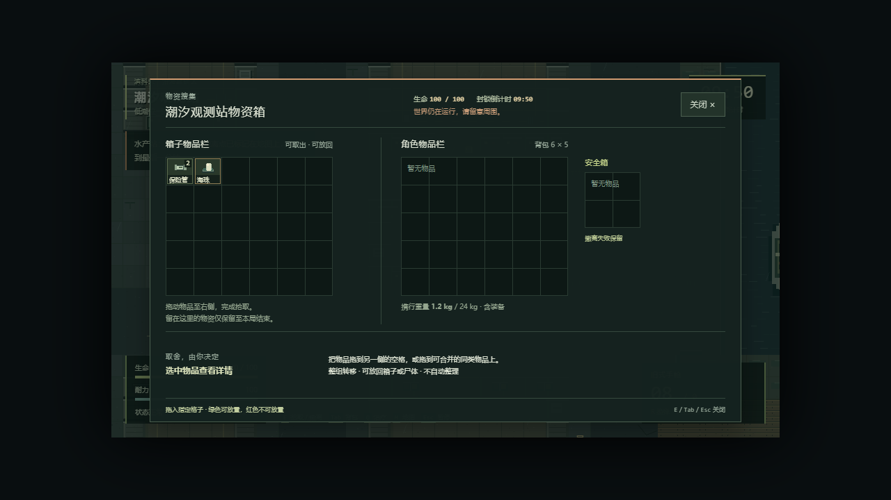
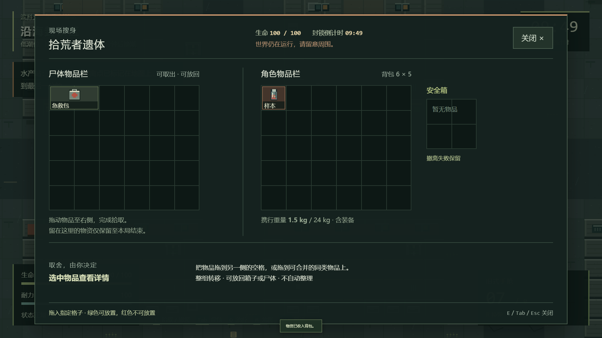
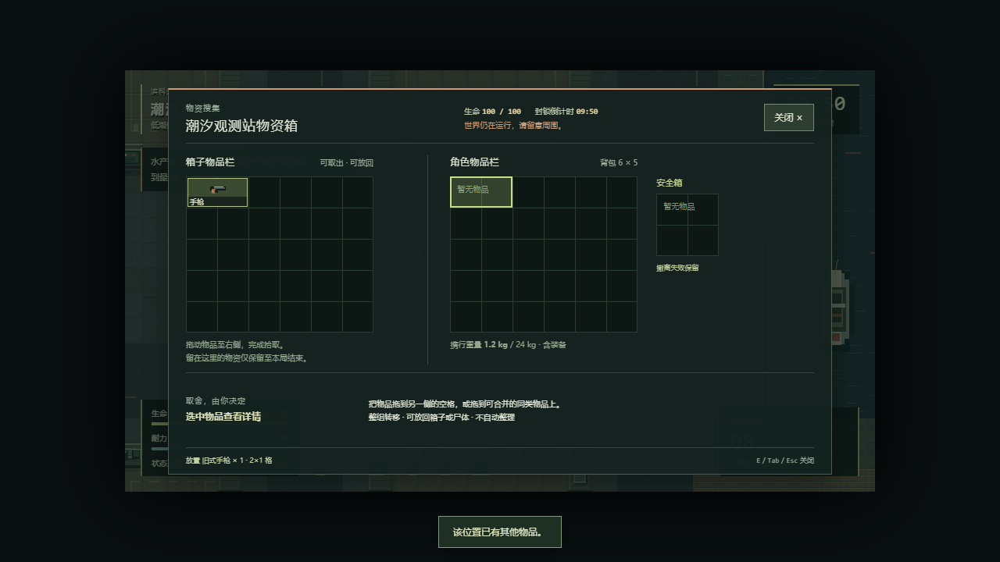
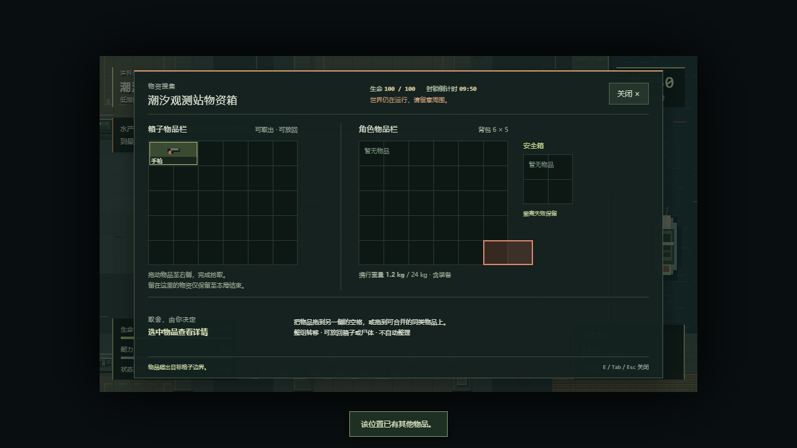
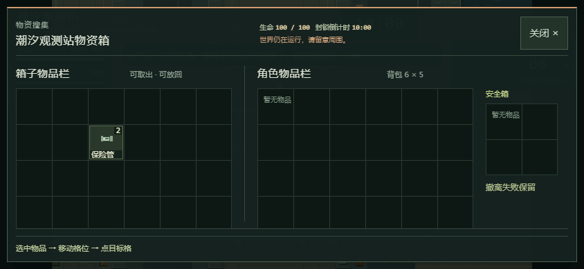

# 箱子与尸体搜刮

桌面靠近箱子或敌人尸体，行动画面的提示会列出范围内可访问的来源。用鼠标滚轮切换高亮目标，再按 E 打开；同名尸体加序号，空来源显示“已搜空”，也可选中。关闭搜刮后再切换其他来源。左侧是来源物品栏，右侧是角色背包与安全箱；手动拖到目标格才会转移。没有容器提示时，地面散落物仍按 E 直接收入背包；与容器重叠时可点「附近」逐件拾取。选择目标时移动、攻击、敌人和计时照常运行，撤离交互优先。手机目标选择尚未定案，仍沿用原来的最近目标操作。

## 操作与取舍

- 箱子、尸体和背包均为 6×5 格，安全箱为 2×2 格。允许双向拖放，空容器仍可存放物品。
- 单击查看详情；拖动时显示物品占格。绿色表示可放置，红色表示越界、占用或不能合并。整组转移，不自动寻找其他空位，不拆分、不交换或自动旋转；已有旋转物品保持原方向。
- 同类物品在堆叠上限内可合并，救济和普通物资分开。来源物品要先收入角色物品栏才能装备或使用。
- 超过 24 kg 仍可携带，沿用减速和额外冲刺消耗规则。
- 搜刮期间不能移动或射击，敌人、伤害、倒计时和潮汐继续运行；顶部显示生命与剩余时间。受击不会自动关闭面板。
- E、Tab、Esc 或关闭按钮结束搜刮；M 切到地图。退出后释放原来按住的按键和鼠标，再进行新的移动或射击。
- 死亡、超时、切出窗口、存档冲突或来源超出距离／被潮水隔断会结束搜刮。尚未放下的物品不会转移。
- 留在箱子或尸体中的物品只保留至本局结束。刷新会恢复最近成功保存的行动及容器余量；死亡、超时或放弃仍按失败处理，安全箱保留。

## 每局物资

原来的 60 份初始物资先按同一种子生成，再配对分入最多 10 个箱子。每箱接收两份原始物资，物品进入格子后可堆叠；至少 40 份仍散落。箱子不会额外产出物资，不能通过重复打开刷新内容。

配对仅使用同区域永久陆地的普通物资，步行距离不超过 6 格，按原生成顺序选位置、最近路径选配对。箱子不增加碰撞，不占撤离区或便笺交互点。任务样本、船册和浅滩物资保持原位置与 E 快捷拾取。

敌人首次死亡时把原掉落收入尸体，普通敌人保留一次掉落、精英保留三次；保持原种子与掉落表。玩家主动丢弃的物品仍散落地面。

## 保存与实现边界

实施期间最新 main 已更新至 `0a69908`。维护者于 2026-10-05 明确确认保留新版行动恢复，并允许手机复用现有点选格操作。容器仍不跨局保留，但会随当前行动快照保存。

沿用主线 `escape-bincov.session.v2`、外层会话版本和备份封套，新增 `RaidCheckpoint.containers`，世界标记为 `coast-v2`。旧 `coast-v1` 快照保留地面剩余物资，以空容器列表恢复，不重新投放物品。旧页面拒绝新世界标记，避免静默丢弃容器内容；`escape-bincov.save.v1` 的原始迁移备份保持不变。

`SaveSession.transferLoot` 先验证来源和整组落格，在容器副本中准备变化，由现有事务将角色、来源余量和完整世界写入同一检查点，成功后才发布容器内容。拒绝、保存失败或异常时，双方物品保持原状；UI 在每次落下前复核行动、容器、距离、视线及本次拖动身份。重复事件和关闭面板后的拖放不能再次领取物品。

当前不包含搜索读条、鉴定、拆分堆叠、一键拾取、容器跨局保存或新触控手势。手机复用“选物品 → 移动格位 → 点目标格”，目标格使用相同的整组校验与保存事务；横向滚动可查看来源、背包和安全箱。

## 验证方法

`pnpm test` 覆盖指定格、堆叠、救济标记、保存回滚、安全箱恢复及 100 个种子的物资守恒和可达性。`pnpm test:loot` 使用受控位置和库存夹具，通过真实键盘及鼠标拖放，在 1280×720 与 1920×1080 验证开箱、尸体、关闭输入、实时危险和异常写入；报告写入 `test-results/loot-browser-report.json`。

常规浏览器、存档、界面、主菜单和便携检查继续执行。真实计时自动玩家通过只读场景信息选择路线，用键鼠打开容器并拖放物品；它不替代真人手感和平衡性评价。实际执行结果见本轮 `handoff.md`，没有执行成功的检查不算通过。

本轮滚轮目标选择的决议、前后截图和验证见 [QOL-01 实施记录](QOL-IMPLEMENTATION.md)。

## 2026-10-05 实际验收（PR #9 历史记录）

基于最新 main `0a69908`，Windows / Node 24.19.0 / pnpm 11.19.0 / Chrome 154.0.8037.93。两份 HTML 为 1,702,024 字节，SHA-256：`2984e201d2b33c0f242e2c290f01425652463ef20b25df47b528471b4be5e731`。

| 命令 | 结果 |
| --- | --- |
| `pnpm test` | 109/109；含100种子守恒、可达性、容器回滚与旧快照兼容 |
| `pnpm package` | 通过，严格类型检查、HTML、ZIP和清单一致 |
| `pnpm test:loot` | 45/45：桌面两尺寸各20、844×390触控4、实际旧main HTML兼容1 |
| `pnpm test:browser` / `pnpm test:desktop-input` | 24/24、10/10 |
| `pnpm test:ui` / `pnpm test:title` | 38/38、16/16 |
| `pnpm test:save-browser` / `pnpm test:portable` | 9/9、6/6 |
| `pnpm test:mobile` / `pnpm test:mobile-ux` | 10/10、11/11（默认用例） |
| `pnpm test:play` | 约10分19秒，两局均撤离，42个容器打开记录、35次转移、32击败 |

[验收摘要](loot/verification.json)、[搜刮报告](loot/loot-browser-report.json)、[自动试玩报告](loot/natural-play-report.json)。已提交 [PR #9](https://github.com/xuys2025/escape-bincov/pull/9)；GitHub CI 因首次外部贡献等待上游维护者批准（`action_required`），尚未执行，最新状态见 [PR 检查页](https://github.com/xuys2025/escape-bincov/pull/9/checks)。已有主线能力的真机验收仍待补充；本轮触控为Chrome模拟，自动试玩不替代真人手感评价。

旧main HTML兼容检查通过 `BINCOV_LOOT_LEGACY_HTML` 指定 `0a69908` 的实际生成物；默认 CI 搜刮检查为44项。基准短时战斗样本平均约138/140 FPS，仅代表本机浏览器，不是设备性能保证。

## 实际画面

截图来自打包后的游戏；为复现布局，专项测试设置了位置与库存。改动前的独立角色背包可参考[主线原背包截图](mobile-experience/inventory-1280.png)。

