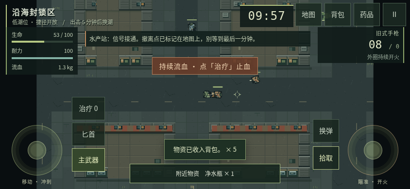
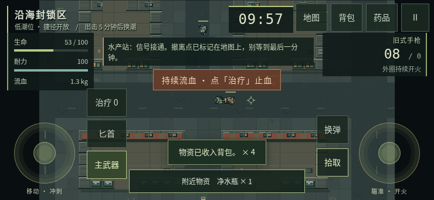
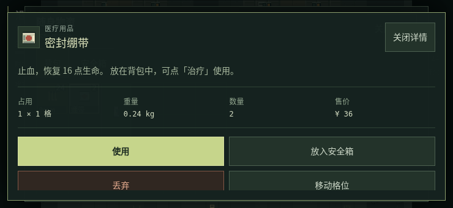
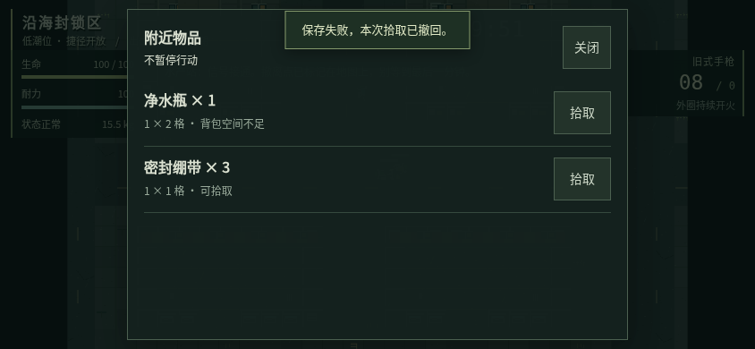
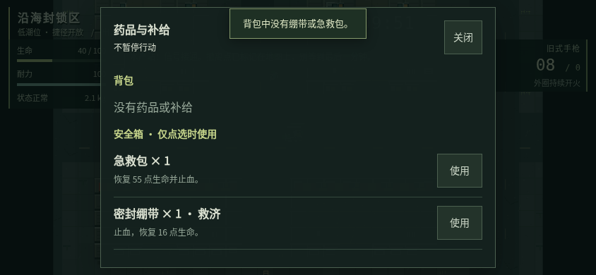
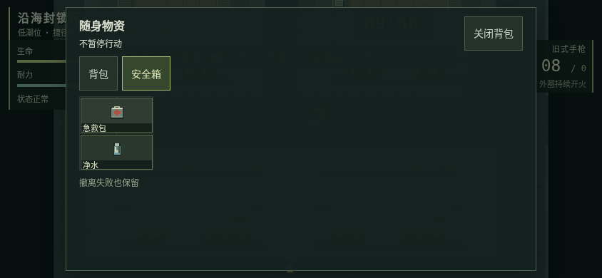
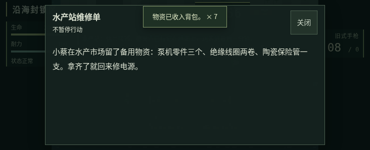
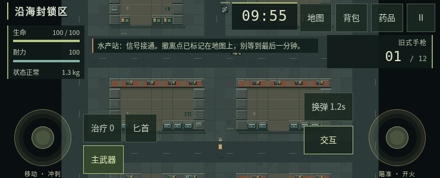

# 移动游戏体验修复 · PR #7

日期：2026-10-04。唯一基线为最新 main `4d7e6173a0a3a6ee0df3d7e113d4f0a984e364b2`（v0.2.0），交付继续使用 PR #7 的 `docs/mobile-loot-feedback-plan` 分支。维护者授权开始修复并等待审阅；没有合并、打标签或更新正式 Pages。

[基线核实与原计划](PLAYER-FEEDBACK-PLAN.md)保留了修复前的复现和实际画面。原始私人聊天截图没有提交。本页记录实现与本轮验证，不能把历史计划诊断脚本当作修复成功测试。

## 玩家现在能做什么

| 问题 | 候选修复的行为 |
| --- | --- |
| 移动格位后关闭重开，物品不能再选 | 关闭、取消、切页签、切容器和保存失败清除摆放状态；取消保留原位置。可放的起点用虚线标出 |
| 短屏背包关闭、安全箱和详情关闭难以触达 | 背包顶部固定关闭与背包/安全箱切换，格位区域独立滚动；详情顶部固定关闭，正文和操作独立滚动 |
| 拾取成功消息挡住下一件物品 | 成功消息移到附近说明上方，限制在战斗按钮之间，1.5 秒退场；连续成功合并计数。失败解释继续保留较长显示时间 |
| 触控仍提示 Q 或 E | 流血、绷带/匕首详情、世界撤离标签按输入方式显示；桌面保留原按键说明 |
| 最近物品放不下，旁边能叠加的也拿不了 | 多件物品时出现「附近」入口，逐件选择；退出范围自动更新。原距离和视线要求不变，点击按稳定 UID 重新检查，部分拾取只扣实际拿走的数量 |
| 用药需要翻背包，不清楚来源 | 顶部「药品」列出背包和安全箱补给、数量、救济标记与效果。点选消耗对应物品实例；快捷「治疗」仍只使用背包，保留绷带/急救包原优先级 |
| 短屏阅读和换弹状态被隐藏 | 阅读使用可滚动面板，随时关闭；换弹按钮显示剩余秒数，治疗显示背包可用数量，武器按钮显示当前选择 |
| 急救包与净水瓶拼不进安全箱 | 长方形物品可旋转 90°。原位置不能放时先预览再点合法格位，取消不改方向；自动收纳尝试当前方向、再试另一方向，不挪动已有物品 |

背包、地图、附近物品、药品和阅读面板**不暂停行动**；暂停、屏幕旋转、失焦、存档故障仍停止行动并释放输入。安全箱仍为 2×2，治疗效果、伤害、弹药规则、负重和撤离读条未调整。没有新增依赖或运行时联网资源。

## 存档与失败边界

| 数据 | v0.2.0 输入 | PR #7 写入 |
| --- | --- | --- |
| 主存档键 | `escape-bincov.session.v2` | 同一个键，Web Lock 和写前冲突检查不变 |
| session.version | 2 | 3，增加 `migrationBackup` |
| profile.version | 1 | 2，物品可选布尔 `rotated` |
| raid.version / worldVersion | 1 / coast-v1 | 2 / coast-v1，世界内容不变 |
| 已结算备份封套 | formatVersion 1 | formatVersion 2，仍接受旧 v1 |
| 行动备份封套 | formatVersion 2 | formatVersion 3，仍接受旧 v2 |

旧物品保持原位置、原方向和 UID。首次迁移保留整份旧 session 原始字节；旧 `save.v1` 的 `legacyBackup` 也继续保留。新格式按旋转后的有效宽高校验碰撞、边界、数量、UID 和来源。未知、损坏、格式不匹配或超限记录拒绝覆盖。完整记录包含原始备份，仍受 2 MiB 上限约束，无法容纳时显示保存故障并允许导出，不删除原始备份来腾空间。

拾取的地面数量/移除与背包收入同一事务保存；转移、旋转和用药的保存失败均回滚。安全箱方向经过检查点、刷新恢复、失败结算和备份导入导出保持不变。具体协议见 [移动实现与恢复协议](MOBILE-IMPLEMENTATION.md)。

v0.2.0 HTML 会拒绝新记录并保留原字节，不能继续旋转后的进度。回退版本应保留格式 3 的读取和导出能力；升级前仍应导出备份。

## 本轮实际验证

环境：Linux x64、Node 24.19.0、pnpm 11.25.0、Chromium 138.0.7204.0 / SwiftShader。仓库和 CI 仍固定 pnpm 11.19.0。浏览器为离线 HTML 与真实键鼠/触控事件；位置、敌人冷却、满背包和配额故障使用显式 `?test=1` 夹具，不是物理手机或真人手感结论。

本地共 **76 项单元测试 + 124 项浏览器检查通过**；严格类型检查与打包通过。报告保留执行时间，[汇总与构建哈希](mobile-experience/verification.json)绑定实际 HTML。

| 命令 | 结果 | 报告 |
| --- | --- | --- |
| `pnpm test` | 76/76 | 旋转碰撞、来源、迁移字节、备份与恢复包含在单元回归中 |
| `pnpm package` | 通过 | [制品清单](release-manifest.json)，两个 HTML 字节一致 |
| `pnpm test:browser` | 24/24 | [完整流程](mobile-experience/browser-report.json) |
| `pnpm test:desktop-input` | 10/10 | [键鼠/触屏电脑](mobile-experience/desktop-input-report.json) |
| `pnpm test:ui` | 38/38 | [双分辨率界面](mobile-experience/ui-report.json) |
| `pnpm test:title` | 16/16 | [主菜单](mobile-experience/title-report.json) |
| `pnpm test:save-browser` | 9/9 | [存档故障/原生备份](mobile-experience/save-browser-report.json) |
| `pnpm test:mobile` | 10/10 | [多指/恢复](mobile-experience/mobile-report.json) |
| `pnpm test:mobile-ux` | 11/11，含实际旧 HTML | [移动体验](mobile-experience/mobile-ux-report.json) |
| `pnpm test:portable` | 6/6 | [解压离线入口](mobile-experience/portable-report.json) |

新增移动体验回归已纳入 CI；默认 10 项，实际旧 HTML 用例需要下列环境参数，已在本地另行运行。CI 状态以 PR 最新 Actions 为准。

新增 `pnpm test:mobile-ux` 覆盖 667×375、740×300、740×340、740×341、844×390、915×412、932×430，另注入左 44、右 12、底 20 CSS px 安全区。关闭入口先检查完整视口、至少 48×48 和中心命中，再实际点击，避免把自动滚动当作易用性。原移动脚本继续覆盖五档竖屏、多指移动/连发、取消、旋转暂停、医疗与丢弃失败、检查点和撤离。

实际旧 HTML 复测命令：

```bash
mkdir -p test-results/mobile-ux
git show 4d7e6173a0a3a6ee0df3d7e113d4f0a984e364b2:dist/index.html > test-results/mobile-ux/v020.html
BINCOV_LEGACY_HTML=test-results/mobile-ux/v020.html pnpm test:mobile-ux
```

它从实际 v0.2.0 行动读取记录 2，在新页面迁移、继续并旋转，再用旧页面验证拒绝写入与字节未变。CI 默认运行其余用例；单元回归也覆盖旧格式、迁移写入失败与原字节保护。

## 实际运行画面

下列截图均为本轮最终打包 HTML 的未修改浏览器截图；战斗位置、物资与药品使用上述夹具。桌面检查尺寸为 1280×720 和 1920×1080。

















[桌面 1280×720 背包](mobile-experience/inventory-1280.png) · [桌面 1920×1080 背包](mobile-experience/inventory-1920.png)。

## 尚未完成的验证和范围

- iPhone Safari、Android、QQ 内置浏览器真机未实测，系统安全区、原生文件操作与持续热负载仍待验证。
- 保持宽度、仅改变视口高度会暂停的现有策略保留。浏览器栏收起风险只有仿真证据，未据此取消保护或声称已修复。
- 本轮未重跑约十分钟自然计时自动实战；战斗数值、AI、潮位和时钟规则未调整。短回归不能替代真人手感与平衡评价。
- 触控精瞄、控件自定义、振动、PWA、平板适配及大陆运营商访问没有顺带实施。

PR #7 保持开放等待维护者审阅；是否合并与上线，以 GitHub 的实际记录为准。
