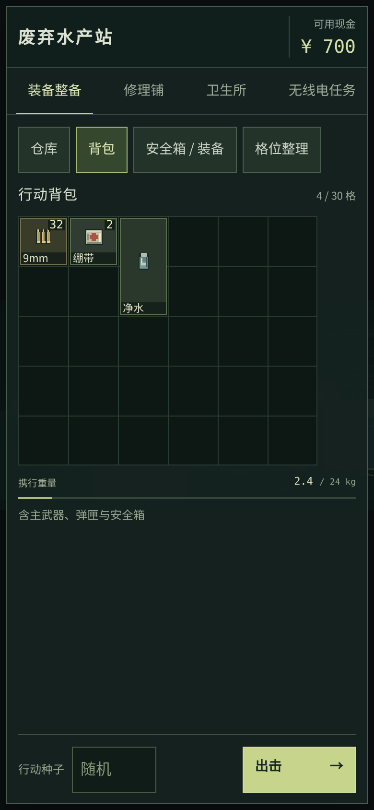
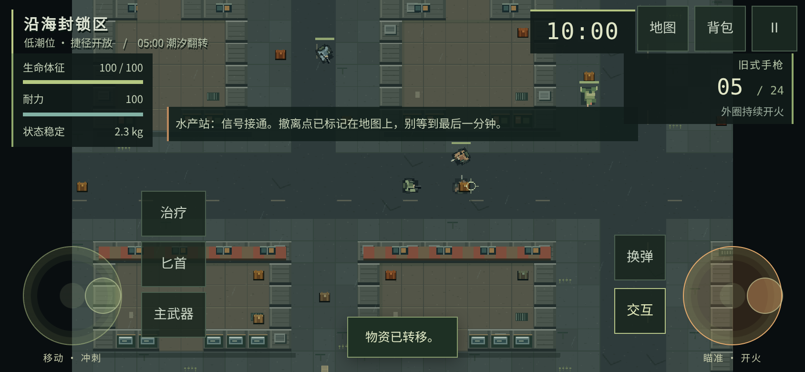
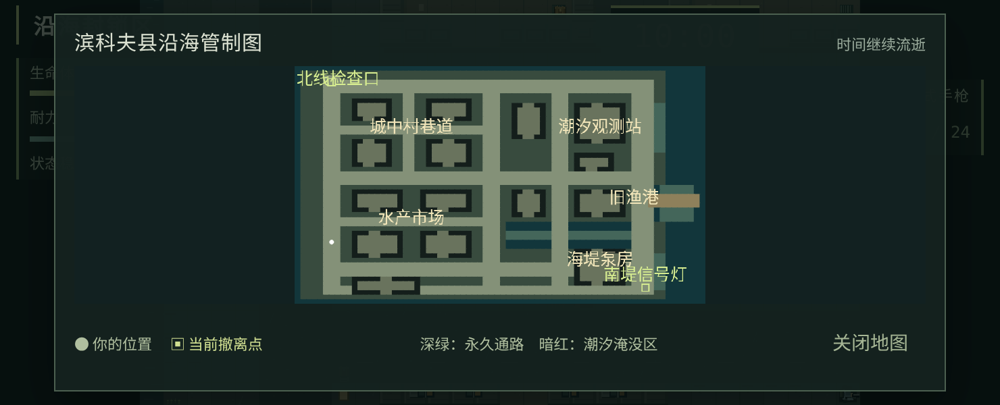
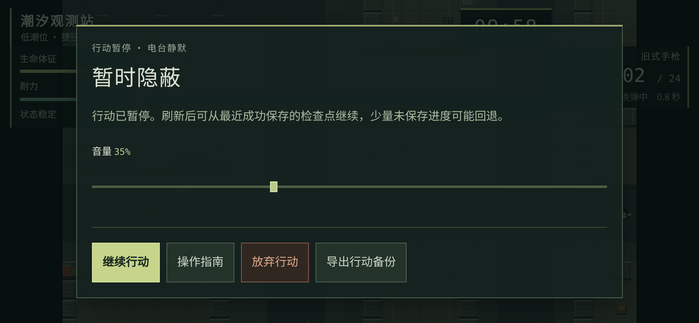

# 📱 移动适配实现与恢复协议

实现日期：2026-10-04。接入最新 `main` 的 `702692a`（已合并 PR #3 存档会话与 PR #4 海港主菜单），所有改动在 PR #2 中按原子提交交付。原计划与 D1–D3 决定见 [移动端计划](MOBILE-ADAPTATION-PLAN.md)。

**这是可供验收的移动候选版。** 浏览器仿真不能证明 iPhone/Safari、Android 真机、20 分钟热稳定性或中国大陆运营商访问已经通过；这些项目在发布支持声明前必须补测。

## 玩家可见行为

- 手机整备支持横竖屏；战斗需要横屏。旋转、失焦和后台切换释放全部输入，暂停后点击继续。
- 左盘移动，外圈冲刺；右盘内圈瞄准、外圈连续开火，松开停止。沿用伤害、弹药、冷却与装填规则；桌面依然按下单发，右键精瞄。
- 治疗、换弹、主武器／匕首、搜刮／按住撤离、地图、背包、暂停均有独立触控入口。地图和背包仍不暂停。
- 世界保持 960×540 和原 16:9 视野，控件按 CSS 像素独立布局。命中区至少 48 px，物品格 52 px，摇杆 96–104 px；保留绿色海港像素画面。
- 仓库默认列表，可切到格位整理；单击物品查看操作，选择“移动格位”后点击目的地。不依赖拖拽和双击完成手机库存操作。
- 刷新或页面回收后，在主菜单选择“继续上次行动”，从最近成功检查点恢复，并保持暂停。死亡、超时、主动放弃仍按失败结算。
- 运行时资源全部内联，不增加账号、联网依赖、远程字体或 CDN。

## ADR：完整记录的同步原子替换

选择 `localStorage` 中的一条完整会话记录作为提交点；已结算档案、活动世界和终局标记在同一次 `setItem` 中替换。配合页面持有的 Web Lock 和写前版本检查，同源新版窗口只有一个写入者。没有安全写入能力时明确阻止出击并提供原始存档导出，不静默清档。

这不是多份存储拼接：世界在一个库、奖励在另一个库的方案被排除。IndexedDB 的单事务方案也可行，但当前快照较小，先选择同步提交以保留现有会话的事务边界；后续若真机显示写入成本不可接受，再迁移整条记录到单一事务存储，不能同时维护两个主档。

M0 原型：Linux、Chromium 138、headless、初始 25 名敌人与 60 件物资，完整记录 **11,378 字节**。200 次 JSON 序列化／解析加 localStorage 写入，P50 约 0.1 ms、P95 约 0.2 ms；50 次 IndexedDB 事务提交，P50 约 0.2 ms、P95 约 2.8 ms。该实验只用于选择原型，不代表手机性能，也不包含完整场景重建成本。原始记录见 [storage-prototype.json](mobile/storage-prototype.json)。

规范依据：[Web Locks](https://developer.mozilla.org/en-US/docs/Web/API/Web_Locks_API)、[Web Storage](https://html.spec.whatwg.org/multipage/webstorage.html)、[页面生命周期](https://developer.chrome.com/docs/web-platform/page-lifecycle-api)。系统回收未必触发最后的保存事件，因此周期检查点才是恢复基础。

## 存档边界与迁移

| 记录 | 用途 |
| --- | --- |
| `escape-bincov.save.v1` | 旧版档案；仅在没有 v2 时读取并迁移，保留原键 |
| `escape-bincov.session.v2` | 新版唯一主档，包含 profile、raid、revision、savedAt、terminal 和 legacyBackup |
| profile.version = 1 | 已有经济／库存领域结构；不把未知世界字段塞给旧版读者 |
| raid.version = 1 / worldVersion = coast-v1 | 完整局内状态的格式与内容兼容边界 |

旧版代码会丢弃未知字段，遇到未知存档版本还可能重建档案。因此新协议使用独立记录，并在首次迁移时把旧档原始字节保存在 `legacyBackup`。之后不重新合并旧键；旧页面的写入不能覆盖新版独有进度。检测到旧键或新键被另一页面修改时，当前页暂停并要求处理冲突。旧 HTML 回滚不能读取新版行动：回滚包必须保留 v2 读取、校验和导出能力；不要直接把 0.1.1 HTML 覆盖回来宣称恢复了进度。

旧版未结算行动没有世界快照，只能沿用一次失败恢复，并明确提示；已有 v2 的未知版本、损坏数据或读取异常必须拒绝写入并允许导出原始字节，绝不视作空档。

检查点包含：行动标识和种子、负载／弹药来源、玩家位置与生命状态、已用时间与潮汐标志、敌人稳定 ID 和 AI 状态、剩余物资、飞行弹丸、冷却与装填、噪声、已读记录、疲劳与随机流状态。恢复时重建表现对象；不重复调用 beginRun，不重新生成战利品，不恢复手指状态或撤离读条。

- 出击：携入扣账、初始装填和初始世界一次提交成功后再进入场景。
- 运行：约每 2 秒保存；暂停、旋转、离页额外尝试。最多可能回退自最近成功提交以来的未保存进度；不声称防存档回退作弊。
- 物品：拾取、丢弃、装备、治疗、转入安全箱与世界变化在同一同步事务中提交；失败时恢复完整世界、库存和生命状态。
- 结算：候选档案、终局标记和活动快照清除同一次提交；成功才进入结果页。失败保留原候选、停止行动，允许重试与导出结算备份。
- 故障：周期写入失败立即暂停，显示最近成功保存时间；恢复存储后重试。若所有写入都失败，刷新只能读到先前已成功的检查点，无法保证保留内存结果。
- 页面恢复：Web Lock 在 pagehide 释放；BFCache 返回重新加载，重新取得所有权后读取最新记录，避免旧内存覆盖新版本。

## 备份与计时

已结算备份继续兼容 v1 严格导入；活动行动使用独立的 v2 备份封套，并连同完整世界校验。导入活动备份需在水产站确认覆盖，写入成功后返回主菜单继续行动。待保存结算导出的仍是可恢复最终结果的已结算备份。导出成功提示要求玩家确认文件实际落盘。

行动时钟使用前台单调时间，125 ms 帧完整计入 125 ms；模拟按最长 40 ms 的子步推进。连续开火每个呈现帧最多请求一次，不补发积压攻击。超过 2 秒的无法安全推进间隔显式暂停，该间隔按暂停处理。后台与手动暂停不计入行动，继续和检查点恢复都重新建立时钟基点。

## 验证入口

`pnpm test`、`pnpm package`、`pnpm test:browser`、`pnpm test:ui`、`pnpm test:save-browser`、`pnpm test:portable`、`pnpm test:mobile`、`pnpm test:play`。测试钩子仅在 **`?test=1`** 暴露，普通入口不包含可用的调试对象。

旧版共存复测：从 `f4c50bdf1ae7cd6a1c1309ea77aa765169ac4b6b` 提取真实 `dist/index.html`，执行 `node scripts/legacy-compat-test.mjs <旧版HTML路径>`。旧/新页面在同源本地路由运行，验证旧版写入不能覆盖 v2、新版冲突停止写入以及第二个新版窗口的排他所有权。

移动脚本用 Chromium 的真实 CDP touchStart / touchMove / touchEnd / touchCancel 验证双指操作，并覆盖 5 档竖屏与 6 档横屏、格位移动、旋转暂停、检查点完整恢复、活动备份、医疗失败回滚、撤离取消与一次结算。位置与冷却会使用明示夹具，不能把自动测试当作真人手感评价。

## 本地验收结果

环境为 Linux x64、Node 24.19.0、pnpm 11.25.0、Chromium 138.0.7204.0 / SwiftShader；仓库与 CI 仍固定 pnpm 11.19.0。最新单文件 HTML 为 **1,666,134 字节**，与原版精修基线相比约增加 62 KiB，未增加运行时请求。两个 HTML、两个 ZIP 与 SHA-256 清单由 `pnpm package` 生成。

| 检查 | 结果 | 证据 |
| --- | --- | --- |
| 领域、输入、恢复、会话 | 69/69 通过 | `pnpm test` |
| 桌面完整流程 | 24/24 通过 | [browser-report.json](mobile/browser-report.json) |
| 桌面界面 | 38/38 通过 | [ui-report.json](mobile/ui-report.json) |
| 触控与恢复 | 9/9 通过 | [mobile-report.json](mobile/mobile-report.json) |
| 存档故障与原生备份流程 | 9/9 通过 | [save-browser-report.json](mobile/save-browser-report.json) |
| 解压后的普通离线入口 | 6/6 通过 | [portable-report.json](mobile/portable-report.json) |
| 新主菜单与往返 | 16/16 通过，含 12 种视口 | [title-report.json](mobile/title-report.json) |
| 旧/新两份真实 HTML 共存 | 3/3 通过 | [legacy-compat-report.json](mobile/legacy-compat-report.json) |
| 自然计时自动游玩 | 约 10 分 23 秒，两次撤离、30 击杀 | [natural-play-report.json](mobile/natural-play-report.json) |

长流程使用真实键鼠输入，测试钩子只读取状态，不改血量、时间、种子或敌人；它在接入 PR #4 主菜单之前运行。主菜单同步后复跑了上表全部短流程，没有重复长流程；不能将自动玩家当真人手感评价。汇总与当前 HTML 哈希见 [verification.json](mobile/verification.json)。GitHub CI 以 PR 最新 Actions 为准。

验证中还修复了桌面右键瞄准＋左键开火的组合事件、短屏武器信息遮挡、地图高度和边缘标签裁切。旧浏览器测试曾直接返回整个 Phaser 对象，导致驱动序列化阻塞画面并触发停顿保护；改为只返回必要数据。故障注入分别覆盖检查点失败和终局失败，避免先触发周期保存而误测另一条路径。

## 实际运行画面

下列截图来自当前构建的 Chromium 触控仿真。整备为 390×844，战斗为 844×390，短屏地图为 740×300 CSS 像素；DPR 2 截图不表示游戏使用了两倍世界缓冲区。战斗截图使用位置和敌人冷却夹具，地图另行从种子 42 的正常 UI 捕获。

<table><tr><td width="28%"></td><td></td></tr></table>

## 真机与发布边界

M0–M4 的代码与本地自动验收已完成；M5 的物理设备和网络验收尚未完成。发布手机支持声明前仍需：iPhone Safari 与 Android 浏览器上的多指/系统打断/后台回收、音频恢复、原生文件导出导入、软键盘与安全区，以及至少 20 分钟持续运行。大陆三网访问、鸿蒙和微信未验证，不据此承诺兼容性。

本 PR 交付候选版，未自行合并、打标签或更新正式 Pages。合并前检查最新 `main` 和 CI；生产回退应保留 v2 读取与导出能力。
