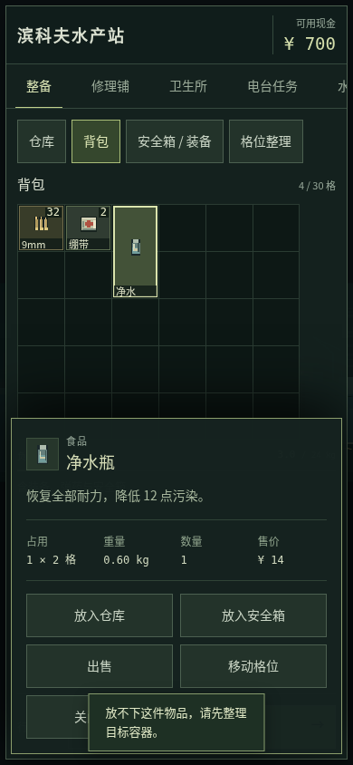
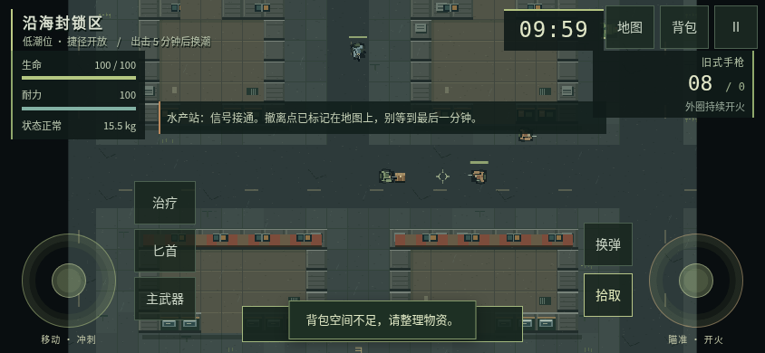
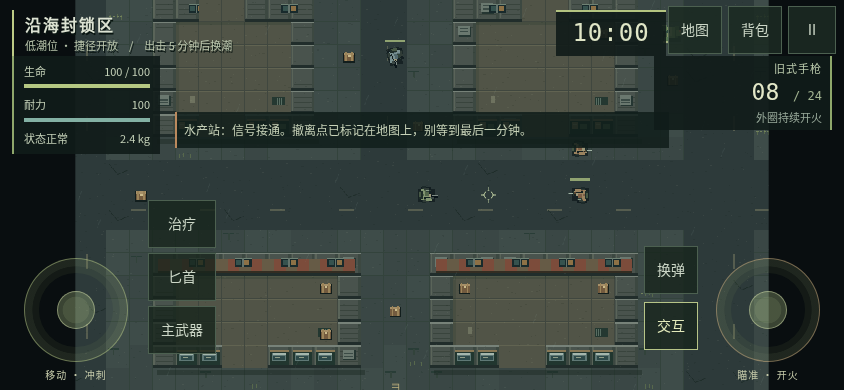

# 安全箱收纳与手机搜刮、用药反馈：核实和修改计划

日期：2026-10-04。唯一基线：[`4d7e6173a0a3a6ee0df3d7e113d4f0a984e364b2`](https://github.com/xuys2025/escape-bincov/commit/4d7e6173a0a3a6ee0df3d7e113d4f0a984e364b2)，v0.2.0 的最新 main。接手时没有其他待合并 PR。

本轮需求是核实截图反馈并提出修改计划。本 PR 提交核实记录、基线诊断脚本、真实截图和交接；**下面的功能改进尚未实现**。不改变游戏源码、存档、依赖、制品或线上版本。私人聊天截图不进入公开仓库。

## 1. 核实结论

| 反馈 | 最新 main 的实际行为 | 判定 |
| --- | --- | --- |
| 横向两格急救包和竖向两格水瓶不能一起放安全箱 | 安全箱 2×2，急救包固定 2×1，净水瓶固定 1×2；没有旋转状态或旋转操作。两种放入顺序均失败，穷举四种合法位置组合均相交 | 已复现，属于缺少旋转能力，并非安全箱少算容量 |
| 舔包费劲 | 只能拾取 43 世界像素内且视线通畅的最近一件物品，没有附近物品选择列表。最近一件放不下时，重复点击仍尝试它 | 已复现一个明确原因；不能凭此穷尽真人手感问题 |
| 手机没有专门治疗按钮 | 行动横屏左摇杆右上侧已有「治疗」，五档横屏均可见、命中区可点击；实际触控让生命 50→66，并消耗一个背包绷带 | 在本轮仿真环境未复现“完全没有按钮” |
| 手机需要打开背包才能选药 | 快捷治疗只读取背包内的绷带、急救包。安全箱中的药不参与；净水瓶、除藻药剂、罐头也不参与快捷治疗 | 能力范围确实有限，且缺少可直达的药品选择入口 |

截图里的“矿泉水”对应当前正式名称「净水瓶」；它恢复耐力、降低污染，不是回血药。治疗和补给应在界面中说明用途。

### 安全箱为什么会失败

横放的急救包占满一整行，竖放的净水瓶必然穿过这一行。调换放入顺序或移动格位都无法解决；两件物品总面积等于四格，并不等于按固定方向能拼进 2×2。

从新档操作即可复现：进入水产站 → 仓库选急救包 → 放入安全箱 → 背包选净水瓶 → 放入安全箱。得到「放不下这件物品，请先整理目标容器」，水瓶仍在背包、急救包仍在安全箱，没有丢失。反向顺序的领域逻辑同样失败。

涉及 [`src/domain.ts`](../src/domain.ts) 的 `Item`、`ITEMS`、`fits`、`space`、`addItem`、`moveItem`、`transferItem`，以及 [`src/ui.ts`](../src/ui.ts) 的 `grid`、`details` 和 `secure`。现有领域测试明确记录“rotations are not implicit”，因此这是原有能力缺口，不能归因于移动适配回归。

### 搜刮的具体阻碍

在显式测试夹具中，背包格位全部占满，但一个绷带堆还能放一个。角色脚下放一瓶净水，旁边 20 像素放一个绷带，两者都在拾取范围内。连续点两次拾取，仍提示空间不足，119 个绷带不变，两件地面物品均保留；把角色移近绷带后再点，可成功叠加为 120 个。

这说明失败原因是“无法选择被最近物品挡住的候选项”，不是背包真的完全不能接收物资。当前没有尸体容器或尸体物品列表；“舔包”在实现中是拾取地面掉落。根因位于 [`src/game.ts`](../src/game.ts) 的 `interact`，候选物品按距离排序后只取第一项。截图使用合成满包和物品位置，不表示自然游玩中默认携带这么多绷带。

### 治疗按钮存在，但不等于任意药品快捷使用

[`src/mobile.ts`](../src/mobile.ts) 已创建 `data-command="heal"` 按钮，并接入与 Q 相同的动作。`RaidScene.heal()` 当前的选择顺序是：流血且背包有绷带时优先绷带；否则优先急救包，再尝试绷带。它不会搜索安全箱。

本轮逐个检查 667×375、740×300、844×390、915×412、932×430 CSS 像素：按钮均完整在视口内，至少 48×48，中心命中正确元素。触控点击可正常治疗。打开背包、地图、暂停等覆盖层时，战斗控件整体隐藏，这是现有行为。

另设生命 40、背包无药、安全箱一个急救包：点治疗提示「背包中没有绷带或急救包」，生命仍为 40；再点背包 → 急救包 → 使用，生命变为 95。安全箱药品可以使用，只是快捷治疗没有覆盖。

**仍不能确定的部分：** 用户截图是反馈聊天，不是游戏画面，无法判断对方打开的包版本、浏览器、视口、覆盖层或手机输入模式。本轮没有 iPhone Safari、Android 或 QQ 内置浏览器真机；不能把 Chromium 结果当作所有手机上的反证。后续若真机确实不显示按钮，应核对这些实际条件，避免无证据地归为“旧缓存”或改坏触屏电脑模式判断。

## 2. 推荐修改方案

保留 2×2 安全箱、物品原有面积/重量/堆叠上限、死亡保留规则和背包不暂停规则，针对已确认的操作缺口改进。

### P1：支持物品旋转，并让自动放入尝试另一方向

1. 为每个物品实例记录方向，默认原方向；只允许 0°/90°。统一有效宽高函数，碰撞、格位预览、绘制、详情尺寸和保存校验共同使用，不能只旋转图标。
2. 桌面和手机详情都提供「旋转」。手机点按即可完成；桌面不复用战斗的 R 换弹键。正方形物品不显示无效操作。
3. 手动旋转先计算可放结果，越界/碰撞时展示预览并允许另选合法格位；确认成功才提交。取消、失败或写入异常均保留原坐标、方向、数量和 UID。
4. 「放入背包／安全箱」先按当前方向寻找空位，找不到再尝试旋转，不挪动已放好的其他物品。地面拾取也可尝试两种方向；继续保留现有部分拾取/叠加语义。手动指定格位不暗中跳到别的位置。
5. 跨容器转移使用完整候选库存，不能先拿走源物品再发现目标放不下；兼顾合堆、`relief` 来源和安全箱检查点。旋转不能让救济与普通物资混合。

**核心验收：** 空安全箱先放急救包再放水瓶、先放水瓶再放急救包，两种顺序都能完成；两件共占四格，数量/重量不变。装满后拒绝第三件，拒绝时不丢物品。

**存档是此阶段的前置工作。** 当前 `cleanInventory`、`checkpointSafe`、备份校验和检查点还原全部按原始宽高处理，不能添加方向字段后仍写入旧格式。实施时需要：

- 为新库存语义提升会话、档案与备份的格式版本，保留现有存储地址和窗口互斥机制；旧 v1/v2 输入迁移为原方向。版本设计及具体编号先写入恢复协议。
- 用候选记录完成校验后一次写入；迁移失败保留原始字节及当前进度，不重排、丢弃或静默归零。
- 当前 v0.2.0 对未知会话版本会拒绝读取，这是保护边界。应实测旧 HTML 拒读新记录、旧窗口不能覆盖新记录，以及导出原始备份的退路；不能声称新档可无损降级到旧版。
- 验证旋转后的整备、活动行动恢复、安全箱失败结算、正常撤离和两类备份导入导出；不能只测刚旋转时的画面。

不采用直接扩大安全箱或统一改净水瓶尺寸的捷径：这些会改变容量取舍或旧存档格位含义，且不能解决其他长条物品。

### P2：附近物品可点选，减少靠挪动角色挑物品

1. 一件可拾取物品时保留直接拾取；多件时提供清晰的「附近物品」入口，在紧凑面板中显示名称、数量、占格和可装入状态，每行独立拾取。
2. 候选仍需满足原 43 世界像素距离和视线条件；列表不能隔墙拿物或扩大拾取距离。点击时按稳定 UID 重新校验距离、视线、物品仍存在及空间。
3. 列表打开后停止旧摇杆/开火输入，但世界和计时继续；关闭或切屏释放输入。角色被移动或物资变化时及时刷新，不依赖已销毁的精灵对象。
4. 被挡住的绷带应可在列表中单独选取；不能简单静默跳过水瓶而令提示与实际所得不一致。空间不足时说明形状/空位问题，支持在背包整理后继续搜刮。
5. 第一版先做选择和单件转移，不加入默认「全部拾取」，避免扩大误拾取和部分提交的处理范围。撤离区仍优先显示撤离动作，附近列表使用独立入口，不与按住三秒撤离混用。

**核心验收：** 原满包夹具无需挪动角色即可选中、叠加旁边绷带；水瓶保留。部分拾取只扣实际拿走的数量；保存失败时库存和世界物资一起回滚；触控取消、列表关闭不会留下持续移动或射击。

### P3：保留一键治疗，增加可发现的药品选择

1. 保留「治疗」直接使用背包绷带/急救包及当前优先级，让已有玩家不增加操作步骤；显示可用数量和明确的不可用原因。
2. 提供可见的「药品」展开入口，不能只靠未提示的长按。与治疗、摇杆及其他按钮一起检查短横屏，所有触控目标至少 48×48。
3. 药品面板列出背包、安全箱中的绷带、急救包、除藻药剂、净水瓶和罐头，标明来源、数量与效果，点选使用。玩家明确点选才消耗安全箱物资，不让旧的治疗按钮偷偷改为自动消耗安全箱。
4. 无药时给出「背包无治疗物品」并允许打开选择面板查看安全箱；满血无流血等无效操作保留具体解释，不消耗、不打断另一根手指的移动。
5. 复用现有医疗事务和效果，不借此改变治疗数值、施药时间、物品规则或默认键位。每次成功使用后刷新数量；保存失败回滚生命状态、物品和世界并显示现有故障入口。

**核心验收：** 普通治疗仍一次点击；安全箱药和除藻药剂等无需打开完整格子背包即可明确选择。满血无效用药、无药、多指持续移动、暂停、失焦、旋转及存储故障均不引入旧输入回归。

## 3. 实施顺序与回归门槛

建议延续一个后续实现 PR，按下列边界保留原子提交；每一步完成后检查对应失败场景。

| 顺序 | 交付内容 | 重点检查 |
| --- | --- | --- |
| 1 | 将本轮复现转成期望修复后行为的回归；明确新格式协议 | 不把“当前缺口存在”断言作为未来 CI 成功标准 |
| 2 | 方向数据、统一尺寸、版本迁移与事务 | 旧字节保留、拒绝损坏数据、两方向碰撞、数量守恒、UID 唯一、来源不混用 |
| 3 | 格位预览、旋转按钮、自动换方向放入 | 两种安全箱放入顺序，桌面拖放和手机点选 |
| 4 | 附近物品选择 | 最近物品阻挡、距离/视线复验、部分拾取与失败回滚 |
| 5 | 药品入口及状态反馈 | 快捷治疗规则不变，明确选择安全箱药，多指与桌面输入 |
| 6 | 说明、截图、打包与完整回归 | 制品一致、离线、真机边界、更新交接 |

未来实现至少执行 `pnpm test`、`pnpm package`、`pnpm test:browser`、`pnpm test:ui`、`pnpm test:desktop-input`、`pnpm test:mobile`、`pnpm test:save-browser`、`pnpm test:portable`。如果改变主界面、模式判断或全局输入，再执行 `pnpm test:title`。短回归全绿后再核对最终 CI。

UI 验收覆盖桌面 1280×720、1920×1080；手机竖屏 390×844 整备，以及横屏 667×375、740×300、844×390、915×412、932×430。截图须为真实实现，不以本计划的基线截图冒充修改效果。存档需另覆盖旋转状态的刷新恢复、失败结算、跨版本/跨窗口拒绝覆盖和备份往返。

真机补测应覆盖 iPhone Safari、Android 常用浏览器；若使用 QQ 内置浏览器分享试玩，再独立记录其版本、横屏视口和按钮实际显示情况。本轮没有这些设备，不列为已通过。

## 4. 本轮已经执行的验证

环境：Linux x64、Node 24.19.0、pnpm 11.25.0、Playwright 1.63.0、Chromium 138.0.7204.0 / SwiftShader。仓库及 CI 仍固定 pnpm 11.19.0；本轮不改锁文件和依赖。离线安装因缓存缺包失败，随后 `pnpm install --frozen-lockfile --registry=https://registry.npmjs.org` 成功。

| 实际命令/检查 | 结果 |
| --- | --- |
| `pnpm test` | 71/71 通过 |
| `pnpm package` | 通过，包含严格类型检查；生成物与基线逐字节一致，没有制品差异 |
| `pnpm test:mobile` | 10/10 通过，含有效输入、拒绝治疗、多指、旋转、恢复、医疗与丢弃失败回滚 |
| `node --import tsx docs/feedback-20261004/verify-feedback.mjs` | 12 项专项观察完成，记录上面的真实缺口和未复现项；无页面错误或运行时外部请求 |
| 文档相对链接、诊断脚本语法、`git diff --check` | 通过，提交前复核 |

证据：[专项报告](feedback-20261004/report.json)、[专项诊断脚本](feedback-20261004/verify-feedback.mjs)、[既有移动专项报告](feedback-20261004/mobile-report.json)。诊断脚本通过仓库已有 `BINCOV_CHROME` / `BINCOV_CHROME_ARGS` 配置浏览器，输出到被忽略的 `test-results/feedback/`；它只描述此基线的行为，不加入 CI，后续修复应改为验证期望行为。

诊断脚本初次运行在采集场景时误将 Phaser 对象返回给驱动，序列化导致停顿保护暂停；调整为只返回必要标量后完整通过，没有改动游戏代码或放宽断言。全部夹具仅通过 `?test=1` 使用，图片均为实际运行截图。

本轮未在本地重跑全套桌面、存档专项、便携专项和十分钟自然实战；没有修改其代码，相关完整短回归由 PR CI 验证并以实际 Actions 结果为准。**基础测试全绿只证明原有用例通过，不表示本计划中的体验缺口已经修复。**
