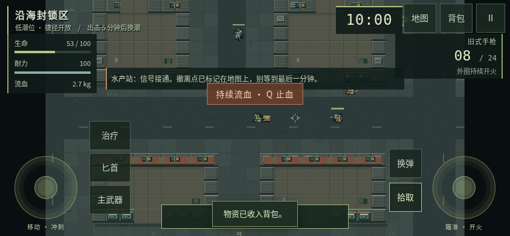
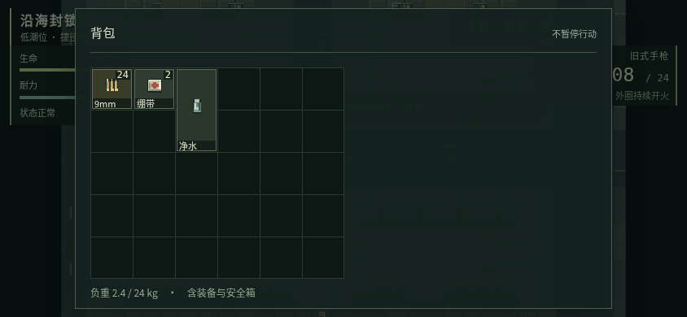
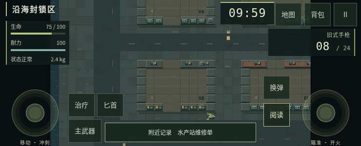

# 移动游戏体验专项：反馈核实、关联排查与修改计划

日期：2026-10-04。唯一基线：[`4d7e6173a0a3a6ee0df3d7e113d4f0a984e364b2`](https://github.com/xuys2025/escape-bincov/commit/4d7e6173a0a3a6ee0df3d7e113d4f0a984e364b2)，v0.2.0 的最新 main。接手时没有其他待合并 PR。

本轮先核实截图并提出计划，随后按维护者「开始修复，仍放在 PR #7 等待审阅」的授权完成实现。P0–P2 的实际行为、验证、截图和存档兼容性见 [移动体验修复记录](MOBILE-EXPERIENCE-FIXES.md)。**下文保留 main 基线诊断与原计划，是修复前的历史证据。** PR #7 尚待审阅，不代表正式 Pages 已更新。私人聊天截图不进入公开仓库。

## 1. 核实结论

| 反馈 | 最新 main 的实际行为 | 判定 |
| --- | --- | --- |
| 横向两格急救包和竖向两格水瓶不能一起放安全箱 | 安全箱 2×2，急救包固定 2×1，净水瓶固定 1×2；没有旋转状态或旋转操作。两种放入顺序均失败，穷举四种合法位置组合均相交 | 已复现，属于缺少旋转能力，并非安全箱少算容量 |
| 舔包费劲 | 只能拾取 43 世界像素内且视线通畅的最近一件物品，没有附近物品选择列表。最近一件放不下时，重复点击仍尝试它 | 已复现一个明确原因；不能凭此穷尽真人手感问题 |
| 手机没有专门治疗按钮 | 行动横屏左摇杆右上侧已有「治疗」，五档横屏均可见、命中区可点击；实际触控让生命 50→66，并消耗一个背包绷带 | 在本轮仿真环境未复现“完全没有按钮” |
| 手机需要打开背包才能选药 | 快捷治疗只读取背包内的绷带、急救包。安全箱中的药不参与；净水瓶、除藻药剂、罐头也不参与快捷治疗 | 能力范围确实有限，且缺少可直达的药品选择入口 |
| 下方成功提示挡住附近物品 | 「物资已收入背包」与附近物品说明都固定在底部中央。五档横屏中，成功提示覆盖物品名称文本矩形的 100% | 新截图补充后已复现，是提示布局冲突 |
| 触摸操作仍提示键盘按键 | 流血横幅固定显示「持续流血 · Q 止血」；触控下的绷带详情仍写「按 Q 使用」 | 新截图补充后已复现，两处可见文案未适配输入方式 |

截图里的“矿泉水”对应当前正式名称「净水瓶」；它恢复耐力、降低污染，不是回血药。治疗和补给应在界面中说明用途。

### 安全箱为什么会失败

横放的急救包占满一整行，竖放的净水瓶必然穿过这一行。调换放入顺序或移动格位都无法解决；两件物品总面积等于四格，并不等于按固定方向能拼进 2×2。

从新档操作即可复现：进入水产站 → 仓库选急救包 → 放入安全箱 → 背包选净水瓶 → 放入安全箱。得到「放不下这件物品，请先整理目标容器」，水瓶仍在背包、急救包仍在安全箱，没有丢失。反向顺序的领域逻辑同样失败。

涉及 [`src/domain.ts`](../src/domain.ts) 的 `Item`、`ITEMS`、`fits`、`space`、`addItem`、`moveItem`、`transferItem`，以及 [`src/ui.ts`](../src/ui.ts) 的 `grid`、`details` 和 `secure`。现有领域测试明确记录“rotations are not implicit”，因此这是原有能力缺口，不能归因于移动适配回归。

### 搜刮的具体阻碍

在显式测试夹具中，背包格位全部占满，但一个绷带堆还能放一个。角色脚下放一瓶净水，旁边 20 像素放一个绷带，两者都在拾取范围内。连续点两次拾取，仍提示空间不足，119 个绷带不变，两件地面物品均保留；把角色移近绷带后再点，可成功叠加为 120 个。

这说明失败原因是“无法选择被最近物品挡住的候选项”，不是背包真的完全不能接收物资。当前没有尸体容器或尸体物品列表；“舔包”在实现中是拾取地面掉落。根因位于 [`src/game.ts`](../src/game.ts) 的 `interact`，候选物品按距离排序后只取第一项。截图使用合成满包和物品位置，不表示自然游玩中默认携带这么多绷带。

### 治疗按钮存在，但不等于任意药品快捷使用

[`src/mobile.ts`](../src/mobile.ts) 已创建 `data-command="heal"` 按钮，并接入与 Q 相同的动作。`RaidScene.heal()` 当前的选择顺序是：流血且背包有绷带时优先绷带；否则优先急救包，再尝试绷带。它不会搜索安全箱。

本轮逐个检查 667×375、740×300、844×390、915×412、932×430 CSS 像素：按钮均完整在视口内，至少 48×48，中心命中正确元素。触控点击可正常治疗。打开背包、地图、暂停等覆盖层时，战斗控件整体隐藏，这是现有行为。

另设生命 40、背包无药、安全箱一个急救包：点治疗提示「背包中没有绷带或急救包」，生命仍为 40；再点背包 → 急救包 → 使用，生命变为 95。安全箱药品可以使用，只是快捷治疗没有覆盖。

**补充截图后的判断：** 第一张图是反馈聊天；随后提供的实际触控游戏截图中，左侧「治疗」按钮清楚可见，同时显示底部提示遮挡和「Q 止血」。这张图支持“按钮已有、用药引导存在问题”，但无法确定其他玩家所用包版本及浏览器情况。本轮没有 iPhone Safari、Android 或 QQ 内置浏览器真机；不能把 Chromium 结果当作所有手机上的反证，也不能无证据地归为“旧缓存”或改坏触屏电脑模式判断。

### 新增：成功提示盖住下一件物品

在同一位置放两件物资，用实际触控拾取第一件，附近说明更新为第二件「净水瓶 × 1」，成功提示同时出现。五档横屏均复现文本完全被盖住，而非仅两个边框相交。

844×390 下，成功提示矩形为 x=350.99、y=332.20、宽 142.02、高 42.80；附近物品名称文本矩形为 x=361.97、y=349.41、宽 120.05、高 17，后者完全处于前者内部。740×300 短横屏同样覆盖全部物品名称文字。

根因：[`src/style.css`](../src/style.css) 中 `.mobile .interaction` 距底 12px（短屏 8px），`.mobile #toast` 距底至少 15px、层级 100，两者没有共同排版与避让；[`src/ui.ts`](../src/ui.ts) 的 `toast()` 持续 3.3 秒，连续拾取会重新计时。透明度或层级微调不能确保两条内容同时可读。

### 新增：触控界面残留键盘说明

`RaidScene.updateHud()` 的流血横幅直接写死「Q 止血」，没有手机分支；`ITEMS.bandage.description` 的「按 Q 使用」被详情面板原样显示。两处均已在触控模式下实测。现有 `interact()` 已把部分拾取/撤离提示替换为触控文案，不能据此推断整个界面都已适配。

另检查到场景 Canvas 撤离文字对象仍含「按住 E 3 秒」，相机内存在旧文字和新的移动 DOM 标注两层。DOM 标注可能遮住旧文字，因此只记录为待统一处理的文字残留，**不声称每次都能看见 E 提示**。后续文案检查必须覆盖 DOM 和 Canvas。

### 从反馈向外排查：适合一起修的关联问题

以下均以同一 main 的实际运行和源码为依据。五档横屏指 667×375、740×300、844×390、915×412、932×430 CSS 像素；安全区和浏览器栏的模拟不等于真机验收。

| 新发现 | 复现和影响 | 同批处理判断 |
| --- | --- | --- |
| 局内格位移动可把物品选择卡住 | 点背包 → 绷带 → 移动格位，没有取消按钮或放置提示；关闭再打开，`placement=true`、`selected=''`，再点任何物品均不出详情 | **P0 必修**。用药、丢弃、安全箱转移都会被阻断；这是状态缺陷，不是手感偏好 |
| 局内背包退出及安全箱藏在滚动区下方 | 五档横屏刚打开背包时，关闭按钮顶边约 y=565，安全箱顶边约 y=420，均无法直接命中。740×300 详情的关闭按钮也在屏幕下方 | **P0 必修**。固定退出入口、缩短访问安全箱的路径。保留背包不暂停规则，但不能让玩家找不到回战斗的入口 |
| 短横屏「阅读」成功但正文不可见 | 740×300 点击「阅读」，`noteSeen` 已记录「水产站维修单」，正文已写入 `#radio`，实际 `display:none`、宽高为 0 | **P0 必修**。不能为节省高度直接隐藏玩家主动阅读的内容；潮汐电台消息也使用这个区域 |
| 短横屏换弹状态不可见 | 740×300 实际点换弹，`reloadLeft>0` 且文字为「换弹中 1.2 秒」，但 `#reload` 被隐藏；按钮仍只写「换弹」 | **P0 一起修**。将进行中状态反馈到始终可见的控件，避免把等待误判为点击无效 |
| 附近说明还与战斗按钮边缘相交 | 667×375 时附近面板分别与「主武器」「拾取」相交约 404、115 平方 CSS 像素；740×300、844×390 此夹具未发生 | **P0 并入原提示布局修复**。此处只证实面板边界冲突，不能扩大为文字全被挡或按钮无法点击 |
| 仅改变一点视口高度也会暂停 | 保持横屏宽 844，高从 390 变 380，立即从行动切为暂停 | **P2 条件项**。浏览器栏伸缩可能频繁打断游戏，但这里只复现高度变化规则，尚未证明某款手机浏览器会触发；真机确认后再收窄暂停条件 |

第一项根因在 [`src/ui.ts`](../src/ui.ts)：`place-item` 进入放置状态，取消入口只在整备页渲染；`setOverlay` 只清空选中 UID，没有重置 `placement`，而物品点击处理在放置状态直接返回。关闭重开因此无法自救。修复需要一并覆盖关闭、暂停、旋转、出击/结算和读档等离开路径，不只补一个按钮。

第二项来自局内背包沿用纵向堆叠布局，关闭按钮在所有内容之后。实测打开背包后计时继续，合成流血夹具的 HP 也持续下降，暂停按钮则随战斗控件隐藏。**行动继续是既定规则；问题是高风险场景中的退出和操作路径太长。** 手机不应靠键盘 Esc 作为补救。

第三、四项来自 [`src/style.css`](../src/style.css) 的 `max-height:340px` 横屏规则，分别整体隐藏 `.radio` 和 `.weapon-hud .small`。前者使用 `!important`，游戏调用 `say()` 设置 `display:block` 也无法显示正文。不能简单删掉这两条样式后挤压战斗区域，应重新分配信息位置。

### 已检查的边界与暂不扩大的范围

- 本轮重新运行既有移动专项，覆盖整备转移、多指移动/射击、取消与旋转、暂停、拾取与恢复、用药/丢弃保存失败、撤离和结算；结果见验证表。已有行为应作为修复的保护范围。
- 新专项确认地图关闭入口可直接命中、暂停时计时冻结；844×390 注入左侧 47px、底部 21px 安全区后，八个战斗按钮都在可用范围内、至少 48×48 且中心命中正确。只验证该夹具，不宣称刘海、导航栏或所有安全区已通过。
- 手机没有桌面右键对应的精瞄输入：`PlayerInput.read()` 的触控瞄准不会设置 `precise`，而该状态影响散布和移动速度。这是源码确认的操作差异，先列入真机战斗手感评估；不在本批顺带添加自动瞄准、调武器数值或重做摇杆。
- 暂不增加控件自定义、振动、全屏/PWA、手柄、平板模式或图形重制。它们需要单独的设备、权限或玩法验证，与当前已复现的堵点没有必须同时修改的依赖。
- 真机持续帧率、发热、系统返回手势、来电切后台及 QQ/Safari 浏览器栏行为仍未测量；不能把仿真流畅或没有页面错误当作这些项目已通过。

## 2. 推荐修改方案

本批以手机常用操作能完成、能退出、能看清结果为目标。保留 2×2 安全箱、物品原有面积/重量/堆叠上限、死亡保留规则和背包不暂停规则。先做 P0 操作与信息缺陷，再做 P1 搜刮/补给入口，最后做 P2 旋转收纳和经真机确认的视口处理；旋转的存档工作不能阻塞前面的移动修复。

### P0a：修复操作卡死，始终提供退出入口

1. 局内进入格位移动时显示选中物品、目标格位提示和可见的「取消移动」。无效目标保留当前选择并解释失败；成功才提交坐标。
2. 离开放置流程时集中清理选择与放置状态：关闭面板、切换容器、暂停、旋转、读档、场景转换和保存故障后都不能留下 `placement=true` 而无选中物品的状态。失败保存仍按既有事务回滚，不能用重建背包规避。
3. 局内背包和详情提供固定可触达的关闭入口，内容独立滚动。横屏背包提供「背包 / 安全箱」分区入口，避免把安全箱和关闭操作压在全部背包格子下方；也不把两套大网格强行同时缩小到难以点选。
4. 整备页沿用同样的选择/取消语义；新增旋转预览复用此流程。点关闭只退出当前层，不触发丢弃、使用或确认移动。

**核心验收：** 五档横屏和短屏中，背包/详情的关闭与取消操作至少 48×48、不需先滚动；点「移动格位」→ 关闭 → 重开后仍可选药和转移物品。放置失败、切屏和存档故障不丢物品、不留下输入。背包计时继续的规则不变。

### P0b：统一提示布局、短屏反馈与触控文案

1. 给行动提示建立共同排版区域：附近物品/撤离说明保留固定位置，成功消息在其上方独立一行，两者至少留 8px 间距。按安全区和左右操作区可用空间约束宽度，换行后仍避让摇杆、按钮和危险提示。
2. 连续拾取合并为简短反馈，不能用反复刷新的大提示长期盖住交互信息。极短屏优先保证当前物品、撤离及错误原因可读，普通成功反馈可以缩短或排队。维持不截获触控、不暂停游戏；整备和错误对话框保留各自适当的反馈位置。
3. 按当前输入模式生成动作提示，沿用已有手机/桌面判断。触控文案直接指向屏幕上的同名按钮；桌面与触屏电脑保留适用快捷键。不改按键绑定，不因修文案再次强制切换触屏电脑的布局。
4. 统一流血横幅、物品说明、拾取/阅读/撤离、换弹、切枪、行动指南和 Canvas 标注。物品效果保留在纯领域数据，输入说明在展示层补充；避免到处替换「Q」「E」造成遗漏或误改。
5. 「阅读」使用可见的紧凑阅读面板，正文可滚动且有固定关闭入口；打开时释放旧触控输入，仍遵循当前阅读不暂停的规则。短屏将普通电台消息收为可展开的摘要；潮汐等危险信息保留可见提示，不允许整个区域 `display:none` 后没有替代入口。
6. 换弹按钮显示「换弹中」及剩余时间/进度，当前武器按钮有清楚选中状态；匕首状态使用「挥砍」等准确提示。状态变化只更新显示，不重复调用换弹或消耗弹药，也不新增自动治疗/换弹规则。

| 场景 | 触控文案建议 | 桌面文案 |
| --- | --- | --- |
| 正在流血 | 持续流血 · 点「治疗」止血 | 持续流血 · Q 止血 |
| 背包绷带说明 | 放在背包中，可点「治疗」使用 | 放在背包中可按 Q 使用 |
| 撤离引导 | 停稳，按住「撤离」3 秒 | 站稳并按住 E 3 秒撤离 |
| 切换匕首 | 点「匕首」切换 | 按 2 切换 |

**核心验收：** 同时出现成功消息、附近物品、流血/潮汐警报时，关键文字和操作按钮互不遮挡。用实际文本矩形及截图验证，不能只查元素是否存在；覆盖长物品名、连续拾取、失败提示、短横屏、系统安全区和浏览器栏高度变化。触控流程不再要求不存在的键盘按键；桌面提示和输入行为继续通过回归。此阶段不依赖存档旋转，可先交付。

### P1a：附近物品可点选，减少靠挪动角色挑物品

1. 一件可拾取物品时保留直接拾取；多件时提供清晰的「附近物品」入口，在紧凑面板中显示名称、数量、占格和可装入状态，每行独立拾取。
2. 候选仍需满足原 43 世界像素距离和视线条件；列表不能隔墙拿物或扩大拾取距离。点击时按稳定 UID 重新校验距离、视线、物品仍存在及空间。
3. 列表打开后停止旧摇杆/开火输入，但世界和计时继续；关闭或切屏释放输入。角色被移动或物资变化时及时刷新，不依赖已销毁的精灵对象。
4. 被挡住的绷带应可在列表中单独选取；不能简单静默跳过水瓶而令提示与实际所得不一致。空间不足时说明形状/空位问题，支持在背包整理后继续搜刮。
5. 第一版先做选择和单件转移，不加入默认「全部拾取」，避免扩大误拾取和部分提交的处理范围。撤离区仍优先显示撤离动作，附近列表使用独立入口，不与按住三秒撤离混用。

**核心验收：** 原满包夹具无需挪动角色即可选中、叠加旁边绷带；水瓶保留。部分拾取只扣实际拿走的数量；保存失败时库存和世界物资一起回滚；触控取消、列表关闭不会留下持续移动或射击。

### P1b：保留一键治疗，增加可发现的药品选择

1. 保留「治疗」直接使用背包绷带/急救包及当前优先级，让已有玩家不增加操作步骤；显示可用数量和明确的不可用原因。
2. 提供可见的「药品」展开入口，不能只靠未提示的长按。与治疗、摇杆及其他按钮一起检查短横屏，所有触控目标至少 48×48。
3. 药品面板列出背包、安全箱中的绷带、急救包、除藻药剂、净水瓶和罐头，标明来源、数量与效果，点选使用。玩家明确点选才消耗安全箱物资，不让旧的治疗按钮偷偷改为自动消耗安全箱。
4. 无药时给出「背包无治疗物品」并允许打开选择面板查看安全箱；满血无流血等无效操作保留具体解释，不消耗、不打断另一根手指的移动。
5. 复用现有医疗事务和效果，不借此改变治疗数值、施药时间、物品规则或默认键位。每次成功使用后刷新数量；保存失败回滚生命状态、物品和世界并显示现有故障入口。

**核心验收：** 普通治疗仍一次点击；安全箱药和除藻药剂等无需打开完整格子背包即可明确选择。满血无效用药、无药、多指持续移动、暂停、失焦、旋转及存储故障均不引入旧输入回归。

### P2：支持物品旋转，并让自动放入尝试另一方向

1. 为每个物品实例记录方向，默认原方向；只允许 0°/90°。统一有效宽高函数，碰撞、格位预览、绘制、详情尺寸和保存校验共同使用，不能只旋转图标。
2. 桌面和手机详情都提供「旋转」。手机点按即可完成；桌面不复用战斗的 R 换弹键。正方形物品不显示无效操作。
3. 手动旋转先计算可放结果，越界/碰撞时展示预览并允许另选合法格位；确认成功才提交。取消、失败或写入异常均保留原坐标、方向、数量和 UID。
4. 「放入背包／安全箱」先按当前方向寻找空位，找不到再尝试旋转，不挪动已放好的其他物品。地面拾取也可尝试两种方向；继续保留现有部分拾取/叠加语义。手动指定格位不暗中跳到别的位置。
5. 跨容器转移使用完整候选库存，不能先拿走源物品再发现目标放不下；兼顾合堆、`relief` 来源和安全箱检查点。旋转不能让救济与普通物资混合。

**核心验收：** 空安全箱先放急救包再放水瓶、先放水瓶再放急救包，两种顺序都能完成；两件共占四格，数量/重量不变。装满后拒绝第三件，拒绝时不丢物品。

**存档是此阶段的前置工作。** 当前 `cleanInventory`、`checkpointSafe`、备份校验和检查点还原全部按原始宽高处理，不能添加方向字段后仍写入旧格式。实施时需要：

- 为新库存语义提升会话、档案与备份的格式版本，保留现有存储地址和窗口互斥机制；旧 v1/v2 输入迁移为原方向。版本设计及具体编号先写入恢复协议。
- 用候选记录完成校验后一次写入；迁移失败保留原始字节及当前进度，不重排、丢弃或静默归零。
- 当前 v0.2.0 对未知会话版本会拒绝读取，这是保护边界。应实测旧 HTML 拒读新记录、旧窗口不能覆盖新记录，以及导出原始备份的退路；不能声称新档可无损降级到旧版。
- 验证旋转后的整备、活动行动恢复、安全箱失败结算、正常撤离和两类备份导入导出；不能只测刚旋转时的画面。

不采用直接扩大安全箱或统一改净水瓶尺寸的捷径：这些会改变容量取舍或旧存档格位含义，且不能解决其他长条物品。

## 3. 实施顺序与回归门槛

计划阶段约定以下实施顺序；实际交付与验证见 [修复记录](MOBILE-EXPERIENCE-FIXES.md)。下表保留当时的验收门槛，各项失败场景纳入对应回归。

| 顺序 | 交付内容 | 重点检查 |
| --- | --- | --- |
| 0 | 将本轮真实复现转为修复后行为的回归 | 不把“当前缺口存在”断言作为未来 CI 成功标准 |
| 1 | P0a 放置状态清理、背包/详情退出和容器入口 | 关闭重开可继续选物品；取消/故障无损；所有出口直接可触达 |
| 2 | P0b 提示避让、触控文案、阅读与换弹反馈 | 通知不盖物品/按钮；短屏能读正文、看换弹状态；桌面提示保留 |
| 3 | P1a 附近物品选择 | 最近物品阻挡、距离/视线复验、部分拾取与失败回滚 |
| 4 | P1b 药品入口及状态反馈 | 快捷治疗规则不变，明确选择安全箱药，多指与桌面输入 |
| 5 | P2 方向数据、统一尺寸、版本迁移与事务 | 旧字节保留、拒绝损坏数据、两方向碰撞、数量守恒、UID 唯一、来源不混用 |
| 6 | P2 格位预览、旋转按钮、自动换方向放入 | 两种安全箱放入顺序，桌面拖放和手机点选 |
| 7 | 真机确认视口高度风险；说明、截图、打包与完整回归 | 方向改变/失焦/高度不足仍暂停；若调整浏览器栏响应，需证明不破坏这些保护；制品离线可用 |

未来实现至少执行 `pnpm test`、`pnpm package`、`pnpm test:browser`、`pnpm test:ui`、`pnpm test:desktop-input`、`pnpm test:mobile`、`pnpm test:save-browser`、`pnpm test:portable`。如果改变主界面、模式判断或全局输入，再执行 `pnpm test:title`。短回归全绿后再核对最终 CI。

UI 验收覆盖桌面 1280×720、1920×1080；手机竖屏 390×844 整备，以及横屏 667×375、740×300、844×390、915×412、932×430。截图须为真实实现，不以本计划的基线截图冒充修改效果。存档需另覆盖旋转状态的刷新恢复、失败结算、跨版本/跨窗口拒绝覆盖和备份往返。

新增门槛：局内移动格位的取消/关闭/重开/旋转；从背包及详情一步退出；安全箱切换；300、340、341px 高度下阅读正文与换弹进度；提示、长物品名、按钮、警报同时出现；非零左右/底部安全区。触控检查必须包含真实点击/滚动和命中测试，不能依赖 Playwright 自动滚动后点击成功就认定入口易用。可见关闭入口不能只用 DOM 存在或 `isVisible()` 判定。

真机补测应覆盖 iPhone Safari、Android 常用浏览器；若使用 QQ 内置浏览器分享试玩，再独立记录其版本、横屏视口和按钮实际显示情况。本轮没有这些设备，不列为已通过。

## 4. 本轮已经执行的验证

环境：Linux x64、Node 24.19.0、pnpm 11.25.0、Playwright 1.63.0、Chromium 138.0.7204.0 / SwiftShader。仓库及 CI 仍固定 pnpm 11.19.0；本轮不改锁文件和依赖。离线安装因缓存缺包失败，随后 `pnpm install --frozen-lockfile --registry=https://registry.npmjs.org` 成功。

| 实际命令/检查 | 结果 |
| --- | --- |
| `pnpm test` | 71/71 通过 |
| `pnpm package` | 通过，包含严格类型检查；生成物与基线逐字节一致，没有制品差异 |
| `pnpm test:mobile` | 10/10 通过，含有效输入、拒绝治疗、多指、旋转、恢复、医疗与丢弃失败回滚 |
| `node --import tsx docs/feedback-20261004/verify-feedback.mjs` | 12 项专项观察完成，记录上面的真实缺口和未复现项；无页面错误或运行时外部请求 |
| `node docs/feedback-20261004/verify-feedback-hud.mjs` | 新增 8 项观察完成：五档横屏遮挡、流血提示、绷带详情、场景文字残留；无页面错误或运行时外部请求 |
| `node --import tsx docs/feedback-20261004/verify-mobile-flow.mjs` | 扩展排查 22 项观察完成：五档背包/详情出口、格位状态卡死、持续计时、短屏阅读/换弹、视口变化、按钮边界、安全区模拟及地图/暂停；无页面错误或运行时外部请求 |
| 扩展排查后重新运行 `pnpm test:mobile` | 10/10 通过，覆盖完整既有移动流程；已更新 `mobile-report.json` |
| 文档相对链接、诊断脚本语法、`git diff --check` | 通过，提交前复核 |

证据：[专项报告](feedback-20261004/report.json)、[专项诊断脚本](feedback-20261004/verify-feedback.mjs)、[既有移动专项报告](feedback-20261004/mobile-report.json)。诊断脚本通过仓库已有 `BINCOV_CHROME` / `BINCOV_CHROME_ARGS` 配置浏览器，输出到被忽略的 `test-results/feedback/`；它只描述此基线的行为，不加入 CI，后续修复应改为验证期望行为。

新增证据：[提示与文案专项报告](feedback-20261004/hud-report.json)、[对应诊断脚本](feedback-20261004/verify-feedback-hud.mjs)。新增脚本输出到 `test-results/feedback-hud/`；生命、流血和物品位置使用显式测试夹具，拾取使用真实触控输入。本轮仅追加计划和证据，游戏源码、制品和原有测试未变，无需为新增文档重复本地全套回归。

扩展证据：[移动流程报告](feedback-20261004/flow-report.json)、[可重复诊断脚本](feedback-20261004/verify-mobile-flow.mjs)。输出到 `test-results/feedback-flow/`。报告区分已复现缺陷、操作路径问题、规则确认、视口模拟风险和检查通过；22 项观察不是 22 项新增缺陷，也不意味着已经修复。重新运行的移动专项报告为 [mobile-report.json](feedback-20261004/mobile-report.json)。

诊断脚本初次运行在采集场景时误将 Phaser 对象返回给驱动，序列化导致停顿保护暂停；调整为只返回必要标量后完整通过，没有改动游戏代码或放宽断言。全部夹具仅通过 `?test=1` 使用，图片均为实际运行截图。

本轮未在本地重跑全套桌面、存档专项、便携专项和十分钟自然实战；没有修改其代码，相关完整短回归由 PR CI 验证并以实际 Actions 结果为准。**基础测试全绿只证明原有用例通过，不表示本计划中的体验缺口已经修复。**
