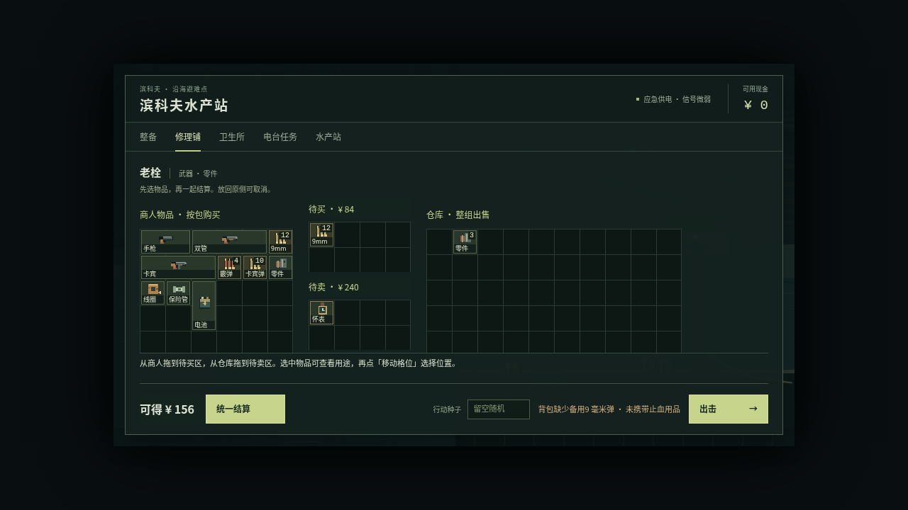
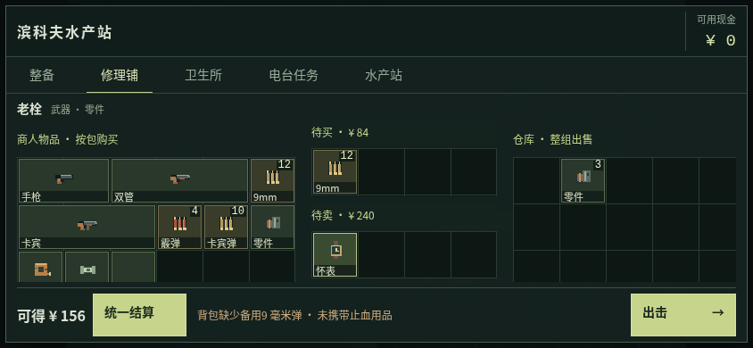
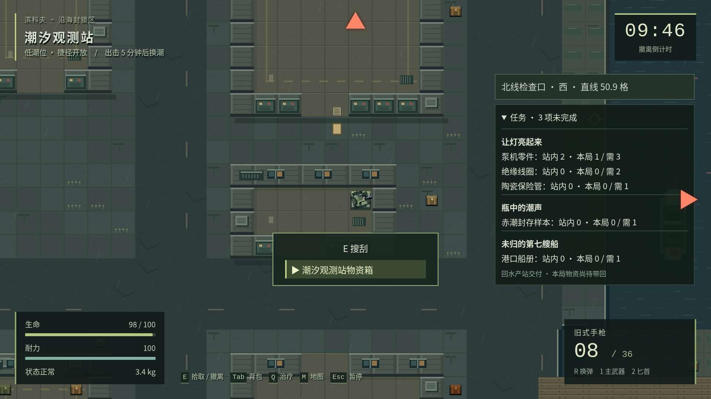
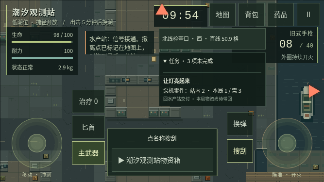
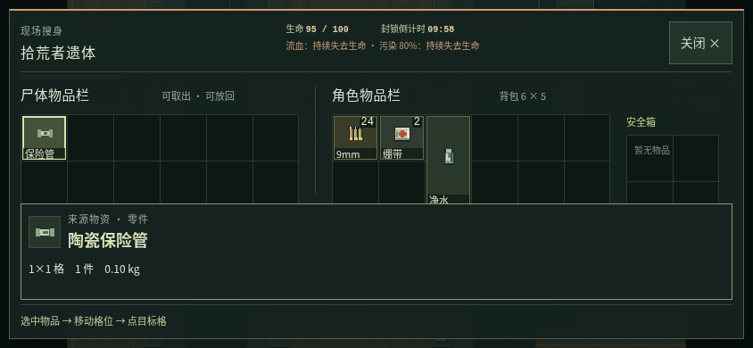

# QOL 定稿实施记录 · PR #10

本轮按 [LMX-323 的 11 项定稿](https://github.com/xuys2025/escape-bincov/pull/10#issuecomment-5995536156)实施。基线为 `49738b89cc8556a0b39d339239bf09945e44ab9e`，保留原 PR 标题、发现记录及先前 D1 提交；没有向 main 推送或合并。

原始问题与旧版证据见 [QOL-DISCOVERY.md](QOL-DISCOVERY.md)，第一阶段桌面目标选择见 [QOL-IMPLEMENTATION.md](QOL-IMPLEMENTATION.md)。它们是注明阶段的历史记录，本页说明后续决定的落实情况。

## 决定与代码证据

| 决定 | 现在的行为 | 主要代码 |
| --- | --- | --- |
| 手机选来源 | 点名称打开指定箱子/尸体，空来源、稳定编号、距离/视线/潮位和撤离优先仍保留 | [game.ts](../src/game.ts)：`interact`、`canLootContainer`；[ui.ts](../src/ui.ts)：`openLoot` |
| 搜刮危险信息 | 固定顶部生命、流血/污染、倒计时、关闭；敌人命中提示但不关闭；物品详情在下方滚动 | [ui.ts](../src/ui.ts)：`lootHtml`；[game.ts](../src/game.ts)：`hurt`、`updateHud`；[style.css](../src/style.css)：`.loot-header` |
| 无收益补给 | 按定稿维持现状，未新增零收益保护；绷带和急救包的原规则未改 | [game.ts](../src/game.ts)：`useItem` |
| 指南返回 | 记住入口，从暂停进入时关闭/Esc 返回暂停 | [ui.ts](../src/ui.ts)：`closeOverlay`、`setOverlay`；[main.ts](../src/main.ts)：Esc 分发 |
| 出击提醒 | 出击旁显示缺项，匹配当前武器且位于背包的备用弹药；区分没带止血品和只在安全箱，仍能轻装出击 | [qol.ts](../src/qol.ts)：`departureWarnings` |
| 任务物品出售 | 仅本次卖出且整笔交易后不足交付时确认；计入买回、仓库、背包和安全箱，列任务/需要/出售/剩余 | [shop.ts](../src/shop.ts)：`saleWarnings`、`questUses` |
| 旋转 | 四类局内物品栏均可旋转；桌面拖动时 R 改预览、Esc 取消，手机移动格位有旋转按钮 | [ui.ts](../src/ui.ts)：`installInventoryDrag`、`placementControls`；[loot.ts](../src/loot.ts)：`moveQuantity` |
| 商店 | 左商人、中间上买下卖、右仓库；按包买、整组卖、净额一次结算；放回取消、离开确认；整备入口引导到商店 | [shop.ts](../src/shop.ts)：`createCart`、`moveShopItem`、`settleCart`；[ui.ts](../src/ui.ts)：`checkout` |
| 部分合并/拆分 | 只补足兼容堆叠的容量，余量留在来源；手选数量后摆格，拆出新 UID，取消不写档 | [loot.ts](../src/loot.ts)：`placementError`、`moveQuantity`；[session.ts](../src/session.ts)：`transferLoot` |
| 受击/撤离指引 | 敌人命中触发约一秒边缘方向，多方向并存；流血/污染不触发；地图选择有效出口后显示方位和直线格距 | [game.ts](../src/game.ts)：近战/弹丸命中、`hitDirections`；[qol.ts](../src/qol.ts)：`exitBearing` |
| 任务追踪 | 默认收起，展开可滚动查看全部未完成任务，站内与本局携带分列，仍需回水产站交付 | [qol.ts](../src/qol.ts)：`questProgress`；[game.ts](../src/game.ts)：`updateHud` |

任务栏的“站内”是仓库数量，“本局”是本次背包与安全箱数量（包含带入的物资），不把安全箱检查点再算一遍。导航距离按现有地图格计算，1 格 = 32 世界像素；不新增现实距离比例或路线规划。

Chrome 原生拖拽期间不会向页面派发 R 键，因此桌面物品改用页面指针拖拽；商店继续使用原生拖放。两者复用同一提交校验，真实浏览器输入验证了旋转、失焦、取消和换来源保护。[实现说明与给 LMX 的评论](https://github.com/xuys2025/escape-bincov/pull/10#issuecomment-5999993580)。

## 验证与截图

环境：Linux、Node 24.19.0、pnpm 11.19.0、系统 Chromium 151。系统浏览器拒绝 `file://`（`ERR_BLOCKED_BY_ADMINISTRATOR`），所以本地浏览器结论是 localhost HTTP 诊断，不能冒充离线验收。原离线脚本及 CI 保留；最终完整 CI 结果记录在 [PR #10](https://github.com/xuys2025/escape-bincov/pull/10) 的验证表与交付评论中。

- `pnpm test` 通过；用 `node --import tsx --test --test-isolation=none tests/*.test.ts` 逐例确认 **121/121**。
- `pnpm package` 通过，严格类型检查、两份 HTML、两个 ZIP 与发布清单同步更新。
- `test:qol` **22/22** HTTP 检查通过：1280×720、1920×1080、844×390、667×375。覆盖混合买卖、放回取消、离开确认、任务误售、保存失败/重试/刷新、物品中心未被遮挡、旋转取消、拆分/部分合并、R 语义、出击缺项、有效出口、任务数量和方向提示消退。[逐项结果](qol-decisions-20261005/verification.json)。
- 指针拖拽提交执行了保持玩法断言的完整 `test:loot` HTTP 诊断，**44 项通过**，含实际敌人伤害、双向保存失败、安全箱、旧拖拽、新窗口冲突、多次恢复、死亡/超时及真实三秒撤离。
- 第一组提交的 `test:loot-target` **24 项通过**，增加手机指定来源、指南关闭/Esc 回暂停、固定危险栏与世界继续运行的检查。完整 CI 会再次执行这些脚本。

截图来自实际构建页面，使用明确的库存、位置和伤害夹具，不是自然游玩或真机验收。新增专项图对应上述 HTTP 检查；危险栏图为第一组提交当时的实图，后续增加了旋转和拆分按钮。

| 桌面商店 | 手机商店 |
| --- | --- |
|  |  |

| 桌面行动信息 | 手机短屏行动信息 |
| --- | --- |
|  |  |

## 兼容性与还需要验收的事情

没有改变存档版本、键名、安全箱/救济规则或结算流程，没有新增依赖和运行时网络请求。商店清单只保存在内存，刷新会丢弃未结算清单；拥有的物资和现金不受影响。结算仍先由会话保存成功，再显示成功；失败整笔回滚。局内容器与背包/安全箱仍写入同一个恢复记录。

已定的功能均已实施；iPhone Safari、Android 实机的触控手感和十分钟真人游玩尚未验收。请 LMX 审阅指针拖拽的兼容性要求、手机短屏的阅读/滚动体验，以及“站内/本局”的任务数量表述；这些实机结论不由桌面自动化代替。PR 仍等待维护者审阅，不代表已合并或上线。
