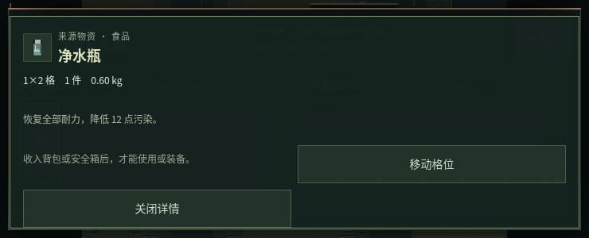
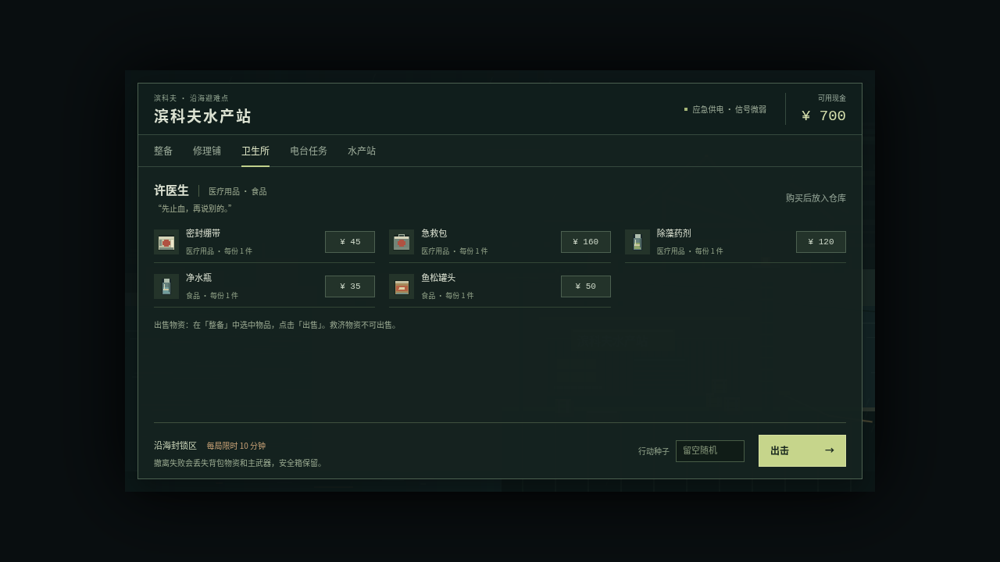

# QOL 专项：玩家体验问题发现与分析

日期：2026-10-05。状态：**分析与讨论，尚未实现修复**。

唯一基线为 [`xuys2025/escape-bincov:main@a34c7a1ba810919fc33d4fce158aba0a028a0f78`](https://github.com/xuys2025/escape-bincov/commit/a34c7a1ba810919fc33d4fce158aba0a028a0f78)，已包含 PR #9 的箱子与尸体搜刮。开始整理 PR 时再次 fetch，main 未变化；当时没有开放中的相关 PR。

本轮按维护者要求先发现问题、给出代码证据，记录在独立分支 `agent/qol-discovery-20261005`。本 PR 只新增分析文档、基线观察记录和真实截图，并更新交接；不修改游戏源码、测试脚本、存档格式、生成物或部署配置。下文建议和候选验收目标均不代表已授权或已完成实现。

## 1. 方法、证据与边界

已按顺序阅读根目录 [AGENTS.md](../AGENTS.md)、[开发手册](AGENT-HANDBOOK.md)、README 和 handoff，再核对涉及源码。代码链接固定到上述提交，避免后续 main 变化使行号失效。

环境为 Linux、Node.js 24.19.0、pnpm 11.19.0、Playwright 1.63.0、Chromium 151.0.7922.173。浏览器使用基线现成的 `dist/index.html`，本地 HTTP 提供页面，HTML SHA-256 为 `2984e201d2b33c0f242e2c290f01425652463ef20b25df47b528471b4be5e731`，与基线发布清单一致。

- 出击缺项、暂停到指南、商店信息通过真实键鼠操作观察。
- 零收益补给、任务样本和搜刮边界使用显式 `?test=1` 夹具设置库存、身体状态、敌人冷却或位置，然后执行真实点击/按键；不使用真实玩家存档。
- 重叠尸体通过现有 `damageEnemy` 生成，首具搜空、次具仍有物资；确认 `canLootContainer` 对两者均为真且 `checkpoint()` 成功后，连续开关三次。夹具证明边界行为，不证明自然遭遇频率。
- 触控为 Chromium 仿真，覆盖 844×390、667×375、740×300、640×300；不能替代 iPhone/Android 真机。桌面检查包含 1280×720 和 1920×1080。
- [观察数据](qol-20261005/observations.json)保留结论对应的原始测量字段与方法；截图为未编辑的浏览器画面。早期无效容器夹具和直接点击装饰格的诊断失败已排除，未当作游戏缺陷。

## 2. 问题总览

P1 表示优先处理操作控制、危险感知或无收益损耗；P2 表示信息与操作流程改进。优先级是本轮建议，不代表已排入开发。

| 编号 | 优先级 | 问题 | 证据状态 |
| --- | --- | --- | --- |
| QOL-01 | P1 | 重叠容器无法切换搜刮目标 | 可保存的尸体夹具 + 真实 E 操作 |
| QOL-02 | P1 | 搜刮遮挡危险信息，短屏详情还遮住搜刮出口 | 桌面/触控截图与命中层级测量 |
| QOL-03 | P1 | 零收益净水、罐头和除藻药剂仍消耗 | 三类物品点击使用前后对比 |
| QOL-04 | P1 | 暂停中关闭指南会直接恢复行动 | 真实菜单操作 + 暂停与计时状态 |
| QOL-05 | P2 | 出击前缺少针对当前装备的缺项提醒 | 真实移出弹药、绷带后出击 |
| QOL-06 | P2 | 未完成任务所需物资可直接误售 | 样本夹具 + 真实出售 |
| QOL-07 | P2 | 搜刮与普通背包的旋转入口不一致 | 两套详情模板 + 搜刮按钮观察 |
| QOL-08 | P2 | 商店购买前无法查看物品效果 | 商店实屏与模板核对 |

## 3. 问题、复现与代码证据

### QOL-01：重叠容器无法切换搜刮目标

**复现。** 种子 42，将两名敌人在同一合法位置击败，搜空 `corpse-enemy-0`，保留 `corpse-enemy-1` 的掉落。角色站在该位置，两具尸体均通过距离、视线与行动状态校验，检查点保存成功。连续三次按 E 打开、Esc 关闭，目标始终是已空的第一具尸体，第二具仍有物资。附近物品列表不提供容器选择。

**影响。** 玩家看到有多个掉落来源，却只能反复检查同一个空来源。完全同坐标时，单靠走位不能改变两个容器的距离排序；场景中的其他候选还可能继续竞争目标。

**代码证据。** [game.ts L627–634](https://github.com/xuys2025/escape-bincov/blob/a34c7a1ba810919fc33d4fce158aba0a028a0f78/src/game.ts#L627-L634) 合并地面物品和容器后固定取第一项，没有玩家选择或轮换状态：

```ts
candidates.sort((a, b) => distance(a.point, this.player) - distance(b.point, this.player)
    || a.point.x - b.point.x || a.point.y - b.point.y || a.key.localeCompare(b.key));
const loot = candidates[0]?.ground, container = candidates[0]?.container;
```

[game.ts L245](https://github.com/xuys2025/escape-bincov/blob/a34c7a1ba810919fc33d4fce158aba0a028a0f78/src/game.ts#L245) 的 `nearbyLoot()` 只读取地面 `this.loot`；[L675–680](https://github.com/xuys2025/escape-bincov/blob/a34c7a1ba810919fc33d4fce158aba0a028a0f78/src/game.ts#L675-L680) 的“附近”按钮沿用该列表，因此不是容器切换出口。

**候选验收目标。** 同位置的空/非空、多非空容器都能明确选择并打开；空容器仍可放回物品；保留撤离优先、距离/视线检查和容器事务。交互形式列在末尾 D1。

### QOL-02：搜刮遮挡危险信息和出口

**复现。** 角色生命约 50、持续流血时开箱或搜身。桌面 1280×720 的底层流血横幅仍生成，但其中心命中的是 `.loot-modal`，面板内仅有生命、时间和泛化危险提示。触控 740×300、640×300 选中来源物品后，详情覆盖搜刮头部的生命、计时及“关闭 ×”；此时 `paused=false`，生命仍在下降。

844×390、667×375 同一操作没有遮住头部，是对照场景。四种触控尺寸在进入“移动格位”后都可真实点选背包格并成功保存转移：**这里的问题是危险信息与出口层级，不是转移失效或完全无法退出**；关闭详情后仍可返回搜刮。

| 触控尺寸 | 选中详情后生命/计时被覆盖 | 搜刮关闭按钮被覆盖 | 点选转移与保存 |
| --- | --- | --- | --- |
| 844×390 | 否 | 否 | 成功 |
| 667×375 | 否 | 否 | 成功 |
| 740×300 | 是 | 是 | 成功 |
| 640×300 | 是 | 是 | 成功 |

**代码证据。** [ui.ts L150–154](https://github.com/xuys2025/escape-bincov/blob/a34c7a1ba810919fc33d4fce158aba0a028a0f78/src/ui.ts#L150-L154) 的 `lootHtml()` 在头部展示生命和时间，没有面板内的流血/污染状态。[style.css L307](https://github.com/xuys2025/escape-bincov/blob/a34c7a1ba810919fc33d4fce158aba0a028a0f78/src/style.css#L307) 让移动详情固定定位并置于 `z-index: 50`，最大高度接近整屏；[L448–463](https://github.com/xuys2025/escape-bincov/blob/a34c7a1ba810919fc33d4fce158aba0a028a0f78/src/style.css#L448-L463) 的搜刮覆盖样式没有预留头部危险状态区。

截图：

- [桌面 1280×720：流血提示被搜刮面板覆盖](qol-20261005/loot-desktop-1280.png)。
- [桌面 1920×1080：搜刮与物品详情](qol-20261005/loot-desktop-1920.png)。
- [手机 844×390：详情上方仍能看到生命与出口](qol-20261005/loot-touch-844.png)。



**候选验收目标。** 在上述尺寸中，未选择、详情、摆放及受伤阶段均保留可见危险状态与明确退出入口；维持搜刮不暂停、输入释放和未放下物品不转移的规则。具体反馈形式列在末尾 D2。

### QOL-03：零收益补给仍然消耗

**复现。** 在合法干燥位置，分别将生命和耐力设为 100、污染和流血设为 0，背包只放一件待测补给。打开背包、选中并点击“使用”。净水瓶、鱼松罐头、除藻药剂三次均从 1 件变为 0 件，相关属性未改变，提示“已使用…”；测量见观察数据的 `core` 项。

**影响。** 玩家误点会失去有限补给，且与绷带/急救包现有的无效使用保护不一致。

**代码证据。** [game.ts L278–292](https://github.com/xuys2025/escape-bincov/blob/a34c7a1ba810919fc33d4fce158aba0a028a0f78/src/game.ts#L278-L292) 对满血且不流血的绷带、急救包先返回 `false`；[L294–305](https://github.com/xuys2025/escape-bincov/blob/a34c7a1ba810919fc33d4fce158aba0a028a0f78/src/game.ts#L294-L305) 的另外三类物品直接设置属性并扣数量，没有零收益判断：

```ts
if (id === 'water') {
    this.stamina = B.maxStamina;
    this.pollution = Math.max(0, this.pollution - B.waterCleanse);
}
if (id === 'food') {
    this.stamina = Math.min(B.maxStamina, this.stamina + B.foodStamina);
    this.hp = Math.min(B.maxHealth, this.hp + B.foodHeal);
}
if (id === 'antidote')
    this.pollution = Math.max(0, this.pollution - B.antidoteCleanse);
if (chosen) { chosen.qty--; if (!chosen.qty) inv.items = inv.items.filter(i => i.uid !== chosen.uid); }
else D.removeItem(inv, id, 1);
```

**候选验收目标。** 所有作用均无收益时拒绝扣除并给出原因；任一相关属性可获益时仍正常使用。背包/安全箱、指定 UID、普通/救济来源与保存失败回滚均保持一致，不改治疗数值或快捷治疗优先级。

### QOL-04：暂停中关闭指南会直接恢复行动

**复现。** 行动中按 Esc 暂停，点击“行动指南”，再点击“关闭指南”。观察从 `overlay='help', paused=true` 变成 `overlay='', paused=false`，计时约由 0.099 秒增长到 0.403 秒；玩家没有点击“继续行动”。

**影响。** 玩家原本仍在暂停菜单的阅读流程中，关闭说明却恢复世界运行，可能来不及重新准备操作。本项是已复现的交互语义风险；现有手册没有规定指南关闭必须返回哪一层。

**代码证据。** [ui.ts L477–482](https://github.com/xuys2025/escape-bincov/blob/a34c7a1ba810919fc33d4fce158aba0a028a0f78/src/ui.ts#L477-L482)：

```ts
case 'help':
    setOverlay('help');
    break;
case 'close':
    setOverlay('');
    break;
```

`setOverlay` 没有保留父面板；[game.ts L234](https://github.com/xuys2025/escape-bincov/blob/a34c7a1ba810919fc33d4fce158aba0a028a0f78/src/game.ts#L234) 由当前面板判断暂停状态。另从源码看到 [main.ts L92](https://github.com/xuys2025/escape-bincov/blob/a34c7a1ba810919fc33d4fce158aba0a028a0f78/src/main.ts#L92) 的 Esc 也会清空当前面板；本轮直接复现的是按钮路径。

**候选验收目标。** 从暂停进入的指南，按钮和 Esc 关闭都回到暂停；主菜单与水产站指南返回各自入口，保留音频与输入的恢复规则。产品语义选择列在末尾 D3。

### QOL-05：出击前缺少动态准备提醒

**复现。** 新档把背包的全部 9 毫米弹和绷带通过“放入仓库”移走，保留手枪和净水瓶，再点击出击；直接开始行动，没有缺少适配弹药或止血物资的提醒。当前有固定的备用弹药说明和失败损失说明，缺少的是对本次配置的检查，不是完全没有新手说明。

**代码证据。** [ui.ts L497–501](https://github.com/xuys2025/escape-bincov/blob/a34c7a1ba810919fc33d4fce158aba0a028a0f78/src/ui.ts#L497-L501) 的 `deploy` 直接调用 `saveSession.beginRun` 后切场景；[session.ts L111–120](https://github.com/xuys2025/escape-bincov/blob/a34c7a1ba810919fc33d4fce158aba0a028a0f78/src/session.ts#L111-L120) 检查会话状态并原子提交出击，没有装备缺项提示流程。

**候选验收目标。** 区分主武器、枪内弹药、背包适配弹药、可快捷治疗来源以及负重；准确呈现当前准备状态，并允许玩家主动选择轻装出击。提醒强度列在末尾 D4。

### QOL-06：未完成任务所需物资可直接误售

**复现。** 在水产站放入一件任务样本，任务仍未交付。选中样本点击“出售”，样本立刻消失、现金从 ¥700 变成 ¥800、任务仍未完成；没有当前任务需求的确认。详情已有“用于任务”的静态说明，本项不声称玩家完全得不到用途信息，也不声称出售后任务永久无法完成。

**代码证据。** [ui.ts L519–521](https://github.com/xuys2025/escape-bincov/blob/a34c7a1ba810919fc33d4fce158aba0a028a0f78/src/ui.ts#L519-L521) 直接在事务中执行出售；[domain.ts L355–365](https://github.com/xuys2025/escape-bincov/blob/a34c7a1ba810919fc33d4fce158aba0a028a0f78/src/domain.ts#L355-L365) 拒绝救济物资和不可售物品，但不读取未完成任务需求：

```ts
if (entry.relief || ITEMS[entry.id].sell <= 0) return false;
save.cash += ITEMS[entry.id].sell * entry.qty;
inv.items.splice(inv.items.indexOf(entry), 1);
```

**候选验收目标。** 在出售前展示未完成任务仍需数量；若加入确认，取消不得改变现金或库存，完成任务后不再重复提醒。保护策略列在末尾 D5。

### QOL-07：搜刮和普通背包的旋转入口不一致

**现象。** 普通背包中长方形物品有“旋转”；搜刮中选中角色的净水瓶，实际详情仅有“使用、放入安全箱、丢弃”，手机另有格位移动和关闭详情。来源物品也没有旋转入口。玩家需要离开搜刮、回到背包整理，再返回原来源；对尚未收入背包的物品还需要先有容纳空间。

**代码证据。** [ui.ts L133–141](https://github.com/xuys2025/escape-bincov/blob/a34c7a1ba810919fc33d4fce158aba0a028a0f78/src/ui.ts#L133-L141) 的普通详情为 `d.w !== d.h` 提供 `rotate-item`；搜刮先分流到 [L143–148](https://github.com/xuys2025/escape-bincov/blob/a34c7a1ba810919fc33d4fce158aba0a028a0f78/src/ui.ts#L143-L148) 的 `lootDetails`，其动作列表没有旋转。

**分类与候选验收目标。** 这是现有功能入口不一致带来的操作负担，不是物品方向损坏。若扩展手动旋转，需要覆盖边界、占格、取消以及角色/容器同一次保存。来源物品是否也可旋转、是否允许拖动中旋转，列在末尾 D6；不将自动旋转默认为本轮目标。

### QOL-08：购买前无法在商店查看物品效果

**复现。** 打开卫生所，药品卡片只有名称、类别、每份数量和价格，没有恢复量、止血/除污染区别或购买前详情入口。新玩家在商店内不能直接比较净水、罐头、急救包的作用；本项不否认外部游玩手册和已持有物品详情中的说明。

**代码证据。** [ui.ts L205–208](https://github.com/xuys2025/escape-bincov/blob/a34c7a1ba810919fc33d4fce158aba0a028a0f78/src/ui.ts#L205-L208) 的卡片模板渲染名称、种类/份数与购买按钮，没有渲染 `d.description` 或检查物品的动作。效果定义已存在于 [domain.ts L49–67](https://github.com/xuys2025/escape-bincov/blob/a34c7a1ba810919fc33d4fce158aba0a028a0f78/src/domain.ts#L49-L67)。



**候选验收目标。** 购买前可查看效果、弹药适配与占格，说明复用物品定义，桌面和触控都可访问；已有数量按仓库、背包和安全箱来源说明，不引入新的价格或商店规则。

## 4. 已运行的验证与剩余工作

以下是 2026-10-05 对同一基线实际执行的结果，不是以上问题已经修复的证明。

| 检查/命令 | 结果 | 范围与限制 |
| --- | --- | --- |
| `pnpm test` | 退出 0 | 当前本地环境只输出 11 个测试文件汇总，没有据此声称 11 个具体用例 |
| `node --import tsx --test --test-isolation=none tests/*.test.ts` | 109/109 通过 | 为核验具体用例执行的额外命令；[保留日志](qol-20261005/unit-tests.txt) |
| `pnpm exec tsc --noEmit` | 通过 | TypeScript 严格检查 |
| 本地 HTTP 浏览器诊断 | 完成 | 真实键鼠与触控仿真；受控边界见第 1 节，观察数据随文档保留 |
| `pnpm test:ui`、`pnpm test:loot` | 环境阻塞，未通过 | Chromium 打开 `file://` 返回 `net::ERR_BLOCKED_BY_ADMINISTRATOR`；未修改原脚本或断言绕过检查 |
| `pnpm package` | 本轮未运行 | 本 PR 只记录分析，没有源码、打包脚本或游玩说明改动；HTML/ZIP/清单保持基线字节 |
| 基线 GitHub CI | 成功 | [main 运行 37261878225](https://github.com/xuys2025/escape-bincov/actions/runs/37261878225)；不能替代本 PR 自身 CI |
| 文档审查 | 通过 | 本地链接、固定提交的源码行号、四处代码摘录、JSON 和五张图片哈希、`git diff --check` |

尚未运行完整本地离线/存档回归、十分钟自然计时实战、手机真机与真人手感验收。重叠尸体的自然发生频率、手机浏览器栏与系统打断对短屏问题的影响仍需补充证据。所有 QOL 项当前均未修复；本 PR 不改变存档兼容性、离线能力或线上玩法。

如后续选择实施，候选验收需保住现有原子保存与失败回滚、旧存档兼容、救济来源、安全箱保留、撤离优先和搜刮不暂停。实现 PR 再按 [开发手册的风险矩阵](AGENT-HANDBOOK.md#6-按风险验证) 执行对应回归。

## 5. 需要讨论的问题（尚未决策）

| 编号 | 关联项 | 需要明确的选择 | 当前建议与取舍 |
| --- | --- | --- | --- |
| D1 | QOL-01 | 容器选择用统一“附近目标”列表、快捷键轮换，还是两者结合？空容器是否降低默认优先级？ | 优先考虑显式列表，让重叠的多个非空容器也可选。仅跳过空容器不能解决所有重叠情况，还会影响放回物品。 |
| D2 | QOL-02 | 危险反馈采用固定状态栏、受击提示，还是受击自动关闭搜刮？ | 优先固定生命、流血/污染、计时及退出入口。自动关闭会打断整理，属于额外交互变化；继续保留世界运行。 |
| D3 | QOL-04 | 指南关闭应回到暂停菜单，还是明确把按钮改成“关闭并继续行动”？ | 建议回到进入前的面板。需统一按钮、Esc、横屏提示和主菜单入口的返回语义。 |
| D4 | QOL-05 | 出击提醒只常驻显示、仅首次确认，还是每次高风险配置都确认？是否允许主动忽略？ | 建议常驻状态与可忽略提醒，保留有意轻装/匕首出击，避免每局增加相同确认。 |
| D5 | QOL-06 | 任务物资只显示徽标，出售时确认，还是引入锁定/买回？ | 建议先显示未完成任务需求，对会影响交付的出售做针对性确认。买回是额外经济与保存流程，不视为小型文案修复。 |
| D6 | QOL-07 | 旋转仅补齐角色背包/安全箱，还是包括未拾取的来源物品？是否支持拖动中旋转？ | 可先评估复用既有手动旋转与预览。来源旋转须进入容器事务；自动旋转继续单独讨论。 |
| D7 | 堆叠规则 | 是否允许拆分、部分转移或快捷收入？ | 当前 [搜刮说明](LOOTING.md#操作与取舍) 明确整组、指定格转移。纯逻辑检查发现：满背包已有 39/40 发时，箱内 6 发不能只取 1 发，而地面物资能取 1 发；对应 [loot.ts L38–42](https://github.com/xuys2025/escape-bincov/blob/a34c7a1ba810919fc33d4fce158aba0a028a0f78/src/loot.ts#L38-L42) 与 [game.ts L249–253](https://github.com/xuys2025/escape-bincov/blob/a34c7a1ba810919fc33d4fce158aba0a028a0f78/src/game.ts#L249-L253)。这是现有规则的取舍，不列为实现缺陷；需权衡搜刮压力与重复操作。 |
| D8 | 后续专项 | 战斗方向反馈、撤离导航、局内任务追踪如何排序？ | 先收集真人试玩证据，再决定范围；当前自动观察不能证明哪个最能改善手感，也不默认引入自动寻路、新 HUD 或数值调整。 |
