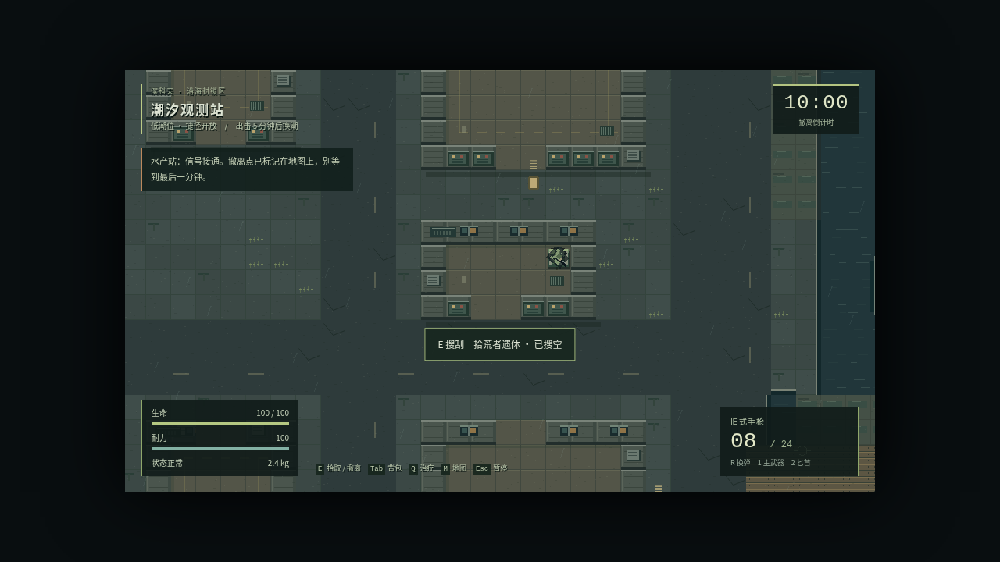
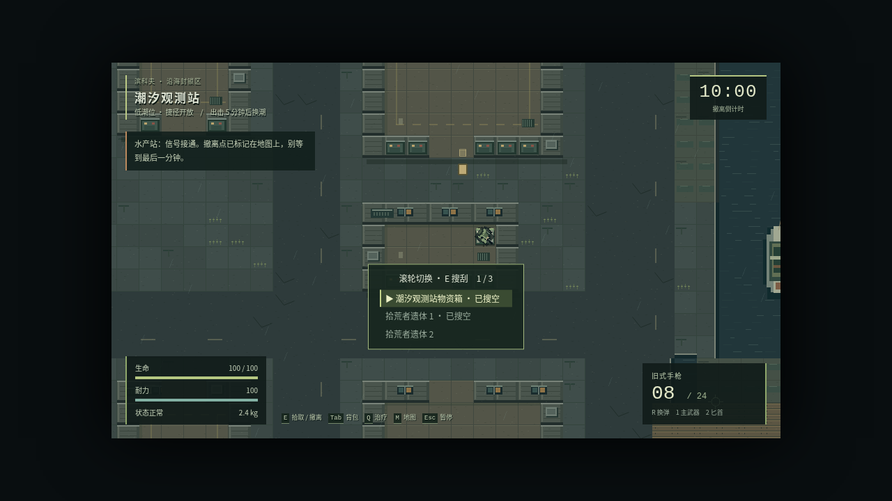
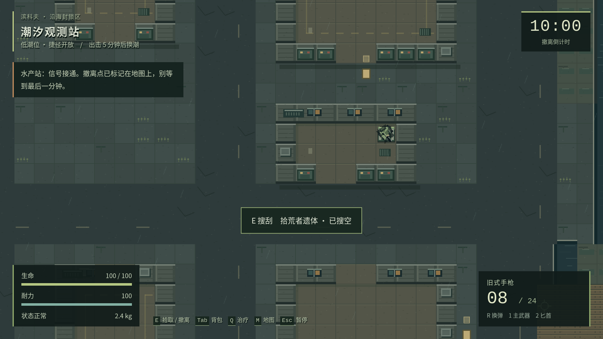
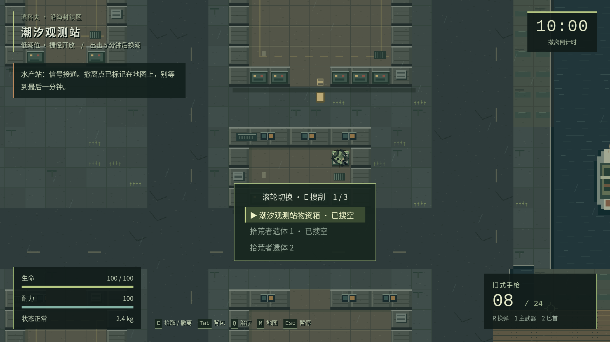
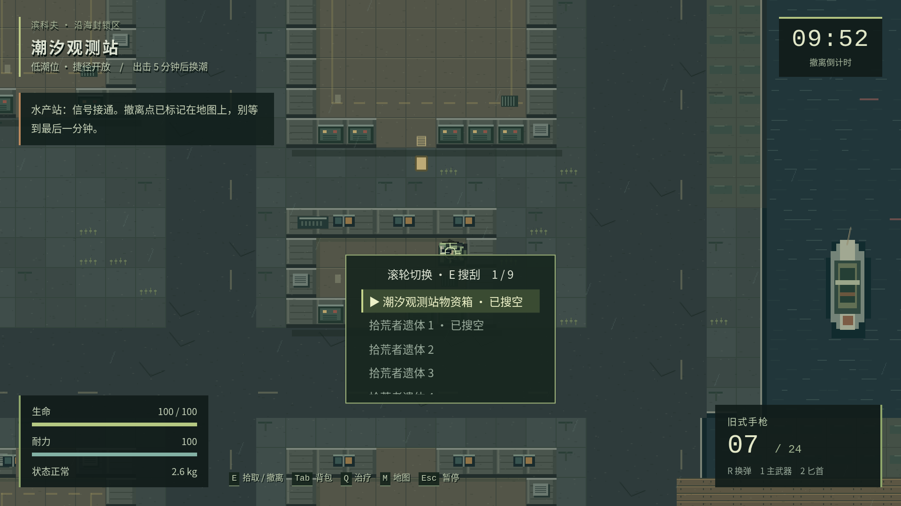

# QOL-01：能选中想搜的尸体和箱子

2026-10-05，基于最新 main `a34c7a1ba810919fc33d4fce158aba0a028a0f78`，在原 [PR #10](https://github.com/xuys2025/escape-bincov/pull/10) 分支继续实施。

本轮只落实[讨论中确定的 D1](https://github.com/xuys2025/escape-bincov/pull/10#issuecomment-5988738899)：桌面在行动画面选择搜刮目标。其他 QOL 项没有定案，没有一起修改。

## 玩家现在怎么操作

- 靠近时，原搜刮提示处列出当前能访问的箱子和尸体。滚轮向下选下一项、向上选上一项，到末尾可以循环；按 E 打开高亮来源。
- 空来源显示“已搜空”，仍能打开并放回物品。同名来源加序号；尸体序号在本局内保持稳定，离开范围不会重新编号。
- 初次进入范围默认选最近目标，同距离按生成顺序排列。选中后轻微移动不会跳到别的目标；选中来源无法访问时才回到当前可访问目标。
- 来源多时列表限制高度，显示当前序号/总数，切换时自动保证高亮行可见。列表不会拦住移动、瞄准或攻击，计时、敌人和潮汐继续运行。
- 搜刮界面只操作已经打开的来源，滚轮不会改换箱子。关闭后回到行动画面，再选择其他来源。
- 沿用小于 43 像素的交互距离、当前潮位下可行走与视线检查；撤离仍优先。附近有容器时 E 对应列表，重叠散落物可通过「附近」拾取；只有散落物时仍可按 E 直接拾取。

手机保持原最近目标与触控交互，不增加未讨论的新手势。

## 改动在哪里

[src/game.ts](../src/game.ts) 保存本局界面的选中 ID、复用原有访问检查并绘制目标列表；[src/main.ts](../src/main.ts) 只在行动画面的游戏区域接收滚轮；[src/style.css](../src/style.css) 增加高亮和有高度限制的列表。[行动指南](../src/ui.ts) 与游玩说明同步更新。

选中 ID 不进入存档。没有改变容器库存、物品转移事务、失败回滚、救济来源、安全箱、世界生成或存档版本；两份独立 HTML 和两种 ZIP 由 `pnpm package` 生成，仍可离线运行。

## 实际画面

截图使用种子 42，将两名同类敌人通过现有死亡逻辑生成在一个真实箱子旁，第一具尸体和箱子搜空。库存、位置与敌人冷却为显式测试夹具，不代表自然遭遇频率；图片未编辑。左侧问题是旧版只提示一具空尸体，另一具无法选中。

| 尺寸 | 修改前（main） | 修改后 |
| --- | --- | --- |
| 1280×720 |  |  |
| 1920×1080 |  |  |

## 验证

环境：Linux、Node 24.19.0、pnpm 11.19.0、Chromium 151.0.7922.173。方法与逐项结果见 [verification.json](qol-targets-20261005/verification.json)。

| 检查 | 本地结果 |
| --- | --- |
| `pnpm test` | 通过，当前环境按 11 个文件汇总 |
| `node --import tsx --test --test-isolation=none tests/*.test.ts` | 109/109，通过 |
| `pnpm package` | 通过，包括严格类型检查；两份 HTML 一致，ZIP CRC、内部入口及发布清单核对通过 |
| `pnpm test:loot-target`，设置本地 HTTP 入口 | 21/21：桌面两尺寸各 10 项，844×390 触控保留行为 1 项 |
| `pnpm test:ui` 默认离线入口 | 环境阻塞：浏览器拒绝 `file://`，报 `ERR_BLOCKED_BY_ADMINISTRATOR`，不计通过 |
| 其余完整浏览器、存档、手机与便携回归 | 由 PR CI 在离线入口执行，结果以 PR 最新检查为准 |

新增专项覆盖：重叠与同名空来源、滚轮方向和循环、E 与高亮一致、面板中不能切源、移动射击/时钟/敌人继续、重叠散落物、失效目标回退、密集列表、离开范围、墙体遮挡、实际换潮与撤离优先。使用真实滚轮、键盘和点击，不通过测试接口代替选择和打开操作。该脚本已纳入 CI，默认使用独立 `file://` 页面并拒绝外部网络请求。

本地 HTTP 诊断示例：先在仓库根目录启动本地静态服务器，再设置 `BINCOV_TEST_URL=http://127.0.0.1:4173/dist/index.html` 执行 `pnpm test:loot-target`。HTTP 诊断不冒充离线验收，也不改变其他测试的断言。测试开发时发现并修复了测试自身返回整个 Phaser 对象造成的序列化停顿，游戏的长帧暂停保护没有放宽。

未做十分钟自然实战、真人手感、iPhone/Android 真机测试。此次变更不调战斗数值；自动测试不能替代手感判断。

## 仍需讨论

1. 手机怎么选择重叠来源：按钮切换、点列表，还是其他操作？本轮保留原行为，所以手机重叠目标问题仍存在。
2. 搜刮时的危险提示、补给防误用、指南返回暂停、出击提醒、任务物资误售、搜刮旋转和购买前详情，仍按原 QOL 清单等待决定。
3. 部分拿取、拆分堆叠、快捷拿取，以及战斗/撤离/任务提示的后续顺序，尚未定案。
