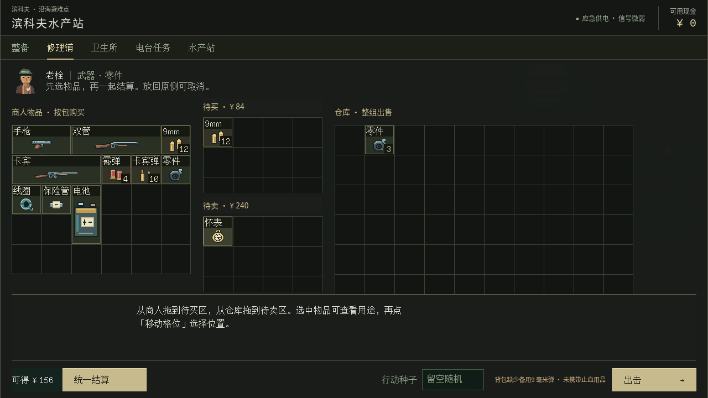
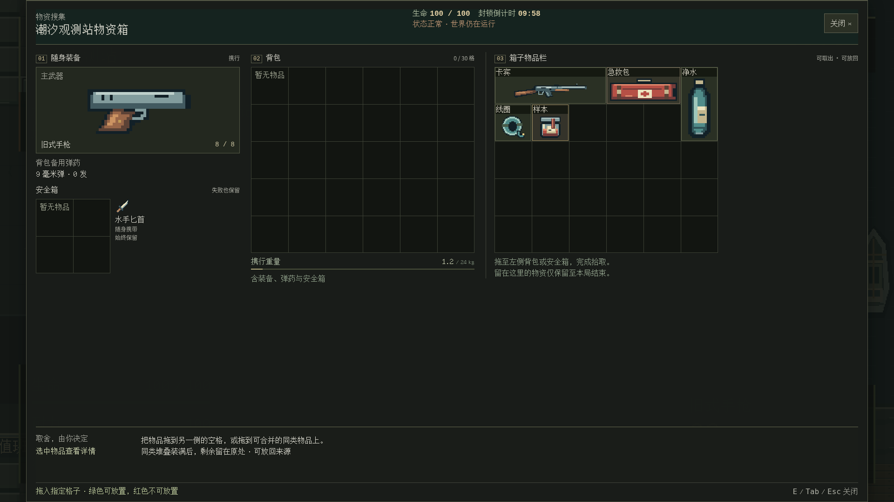
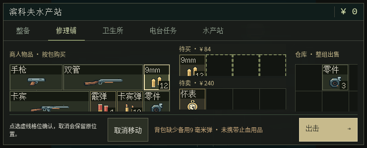
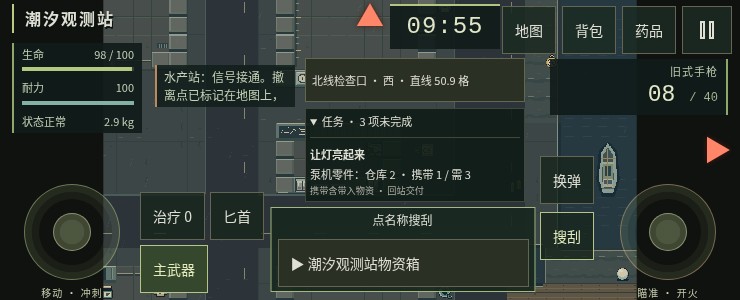

# QOL 主线整合与合并前核验

2026-10-06，在原 [PR #10](https://github.com/xuys2025/escape-bincov/pull/10) 和 `agent/qol-discovery-20261005` 分支续作。最新已接受基线为 `07b1414da9f1ac4c3ad13a23ec914630ccbd7fbb`，包括 #20 的战术界面、美术及 #19 的协作约定。正常合并保留双方历史，未向 main 推送，未合并 PR。PR 标题依用户要求保留。

## 最新决定如何落实

依据 [LMX 补充讨论](https://github.com/xuys2025/escape-bincov/pull/10#issuecomment-6010682822)：

| 决定 | 实现及证据 |
| --- | --- |
| 名称改为“仓库／携带”，按当前位置统计 | [game.ts](../src/game.ts) 的 `updateHud` 更新标签；[qol.ts](../src/qol.ts) 的 `questProgress` 保持仓库／本次背包与安全箱的计数，不重复算安全箱检查点，也不以数量差伪造新拾取量。界面和游玩说明注明包含带入物资 |
| 接受页面处理桌面拖动 | 保留 [ui.ts](../src/ui.ts) 的 `installInventoryDrag`；[qol-test.mjs](../scripts/qol-test.mjs) 检查 R 预览、Esc 取消、拖出视口后松手、失焦、后台事件，以及触屏电脑先触控摆放再鼠标拖动。行动 R 仍换弹 |
| 按顺序安排真机与真人验收 | 下方保留可直接执行的清单，状态均未验收；没有虚指负责人或机型 |

## 与最新主线的整合

- 保留装备、背包、仓库／搜刮来源的战术布局、字体 B、独立库存美术、商人头像、空箱与尸体外观；不回退 #20 的字体、素材、布局和 CI。
- 商店采用已定的商人—待买／待卖—仓库清单流程，摆放和取消保留当前商人的各栏纵向滚动位置；切换商人则重新开始。已复现修复前目录从 70 像素跳回 0 的问题，并加入手机三尺寸回归；[tactical-review.mjs](../scripts/tactical-review.mjs) 同时验证新美术、格位顺序、详情、临时清单和结算后的现金变化。
- 保留固定搜刮危险栏、手机点指定来源、指南返回、旋转／拆分／部分合并、存档回滚和三项行动信息。原发现与分阶段记录仍在 [QOL-DISCOVERY.md](QOL-DISCOVERY.md) 和 [QOL-DECISIONS.md](QOL-DECISIONS.md)。
- 新字符按已接受的固定字体来源和哈希重新生成 OFL 子集；字号较小的辅助信息沿用普通文字字体，避免压缩点阵字。运行时无新增网络请求或依赖。
- 本轮没有改变存档键、版本、任务交付规则、安全箱保护或交易保存协议。生成 HTML、ZIP、字体清单和发布清单由既定脚本更新。

## 自动验证与截图

本地使用 Node 24、pnpm 11.19.0、Chromium 151。系统浏览器的 file:// 限制仍在；本地浏览器检查使用 localhost HTTP，报告注明传输方式。完整离线验证以原 PR 当前提交的 `Build and test` CI 为准，不将历史 CI 或 HTTP 诊断当作本头离线通过。

本地实际执行的检查：

| 检查 | 结果 | 证据与范围 |
| --- | --- | --- |
| `pnpm test` 与逐例规则 | 121/121 | 交易、物品、恢复、任务及地图规则 |
| `pnpm package` | 通过 | 类型检查、字体覆盖、两份相同 HTML、两个 ZIP；CRC 和入口内容核对通过 |
| QOL 最终复测 | 27/27 | [报告](qol-integration-20261006/qol.json)：两种桌面和 844×390、667×375、740×300；含触屏电脑、拖动取消和商店滚动保持 |
| 战术界面 / 美术整合回归 | 8/8、7/7 | [战术报告](qol-integration-20261006/tactical.json)、[美术报告](qol-integration-20261006/art.json)：字体、格位、图像完整性与结算 |
| 搜刮整合回归 | 44/44 | [报告](qol-integration-20261006/loot.json)：双向失败回滚、安全箱、多窗口、刷新、死亡、超时和真实三秒撤离 |
| 来源选择整合回归 | 24/24 | [报告](qol-integration-20261006/targets.json)：具体目标、危险栏、指南返回、可访问性与撤离优先 |
| UI 整合回归 | 38/38 | [报告](qol-integration-20261006/ui.json)：双桌面全部主要页面、出口与布局 |

除 QOL 最终复测外，其余本地浏览器报告记录本轮整合阶段，先于最后的商店滚动保持修复；最终完整离线 CI 再覆盖当前提交全部检查。方法及 QOL HTML 哈希见 [来源说明](qol-integration-20261006/provenance.json)。

布局证据使用明确的库存、位置和伤害夹具，生命周期检查中的失焦／后台切换使用事件夹具；触控是 Chromium 仿真，不是真机。未运行本轮十分钟自动玩家，也未宣称真人手感通过。

| 1280×720 商店 | 1920×1080 搜刮（整合阶段） |
| --- | --- |
|  |  |

| 740×300 摆放与取消 | 740×300 仓库／携带 |
| --- | --- |
|  |  |

历史对照：[整合前 QOL 商店](qol-decisions-20261005/qol-shop-1280x720.png)、[#20 已接受整备](tactical-ui/after-1280x720.png)。旧截图保留当时实现，不回写历史。

## 真机与真人检查清单（尚未验收）

维护者安排持有设备的试玩者操作，Codex 可继续整理反馈和补回归。优先横屏可用高度较小的 iPhone Safari，其次常用 Android Chrome；有全面屏 iPhone 时再补安全区。具体机型、系统、浏览器版本和负责人均待安排。

| 顺序 | 操作 | 观察与记录 | 状态 |
| --- | --- | --- | --- |
| 1 | 短屏进入商店，选详情、横纵滚动、移入待买／待卖、取消并结算 | 三栏可到达，上下清单及结算按钮可点；取消和保存失败不丢钱物 | 未验收 |
| 2 | 同名箱子／尸体列表点名称，打开、关闭、改选 | 打开的来源与所点名称一致，空来源可用，关闭入口可见 | 未验收 |
| 3 | 搜刮中旋转、拆分、部分合并；受击时查看顶部 | 数量／方向正确，危险栏和关闭入口不被详情或预览遮挡 | 未验收 |
| 4 | 展开／收起全部未完成任务，再移动、瞄准和开火 | “仓库／携带”可读，含带入物资；任务栏不盖住操作按钮 | 未验收 |
| 5 | 浏览器栏展开／收起，横竖屏切换，切到后台后返回 | 出口、格位和安全区可用，暂停与继续明确，没有残留拖动或攻击 | 未验收 |
| 6 | 连续十分钟真人行动，经历搜刮、战斗、潮位变化和撤离 | 记录阅读、操作、节奏和误触问题；自动玩家不能替代本项 | 未验收 |

每次记录提交 SHA、入口、设备与版本、屏幕方向、实际可用尺寸、复现步骤、预期／实际结果及截图。失败项仍在 #10 讨论并由维护者安排修复；不以自动化替代真机或真人结论。

## 合并前停止点

源码与主线无冲突、当前提交的完整 CI 成功、生成物与源码一致，才报告技术合并条件满足。维护者决定合并及真机验收与发布安排；本 agent 不启用自动合并、不执行合并或部署。未验收项保持公开登记，不能写成全平台验收通过。
