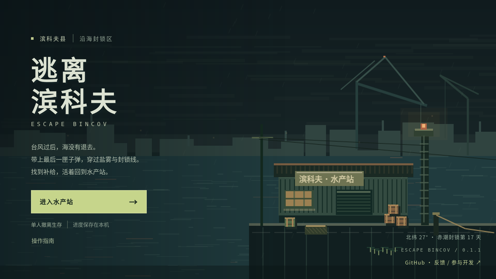
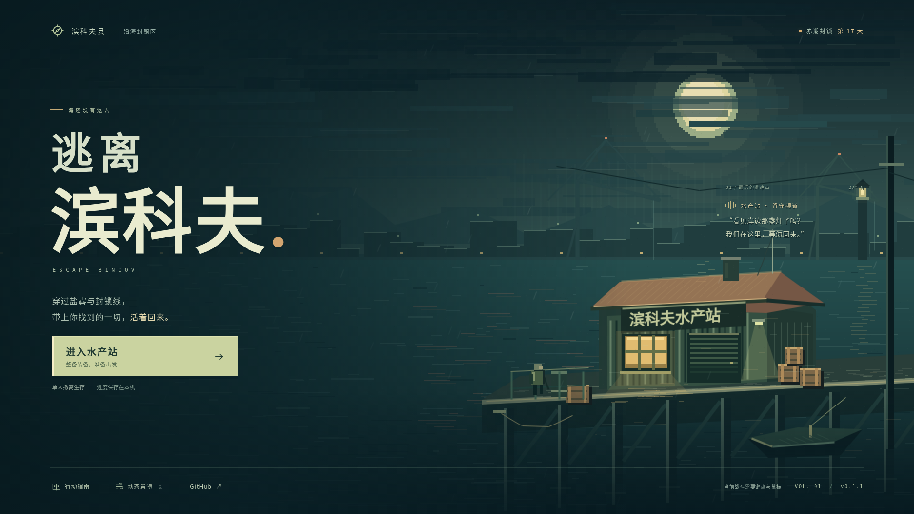
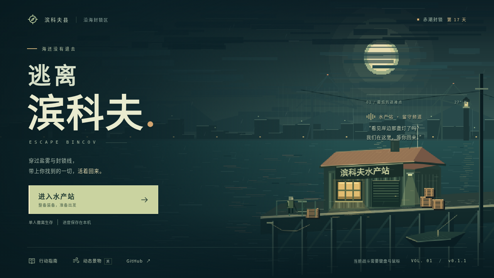
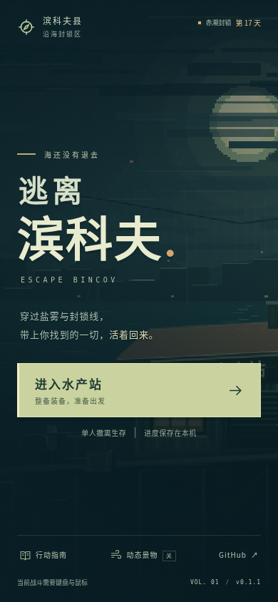
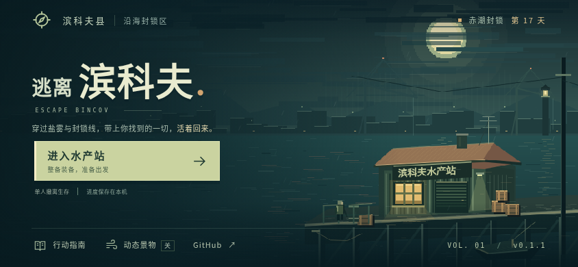

# 夜港主界面重制

> 历史记录：2026-10-06 起主菜单已由[像素值守室与 2.5D 视差](title-parallax/README.md)取代。本文保留 2026-10-04 的设计、截图与验证，不代表当前实现。

2026-10-04 · 最终基线 `a4de2421115d56d491c7eed34ba1293ba8ceae73` · 分支 `agent/harbor-title-screen`。

任务开始基线为 `f4c50bd`；提交前 main 合并了 PR #3，因此已将未发布改动移到最新 main，沿用新的 `app.ts` / `SaveSession` 分层，并重新运行完整验证。

## 玩家看到的变化

主界面延续现有暗绿海港与暖色灯光。新的程序像素画加入月光、风雨云层、远处港机与建筑、潮水反光、锈色屋顶、亮着灯的水产站、码头和归来者。大标题与整备入口保持清晰，电台短句落在建筑上方，避免遮挡主要景物。

主按钮继续进入原有水产站；有过行动的存档显示实际出击与成功撤离次数。底部提供行动指南、动态景物开关和仓库跳转。没有添加虚构的多人模式、服务器状态、账号入口或不可用功能。

## 真实前后对照

以下均为 Linux Chromium 138 的原始浏览器截图，没有修图。旧版来自上述 main 提交的独立 HTML；新版来自本分支源码打包的 HTML。截图使用新存档，无行动/物品夹具。新版启用系统减少动态效果以固定景物位置；正常启动默认有轻微雨丝、倒影与灯光变化。

### 改动前 · 1920×1080

### 改动后 · 1920×1080

### 1280×720

### 手机布局

手机主界面按 CSS 视口独立排布，不把整张桌面菜单缩成小字。按钮和链接至少 44×44 CSS px；支持安全区、横竖屏切换和受限高度下的滚动兜底。**本次只完成主界面布局，局内移动、瞄准、射击与库存仍需要后续触控开发。**

## 实现与性能取舍

- `src/title-art.ts`：一次绘制、缓存四张纹理。菜单仅四个图像对象，三个轻量 tween；没有粒子池、实时噪声、模糊后处理或每帧 Canvas 重绘。
- `src/title-screen.ts`、`src/title.css`：语义化菜单与响应式排布，局内/整备继续使用现有 960×540 逻辑画布和整数缩放。没有新增框架、字体或第三方素材依赖。
- 景物开关仅保存于当前会话，不更改存档结构。系统切换到减少动态效果时立即停止动画、同步按钮状态；关闭系统限制后，玩家可手动重新开启。
- 指南打开时背景菜单 inert，焦点停留在关闭按钮；Escape 关闭后回到指南入口。菜单恢复原生 Tab、Enter 和 Space 操作，局内快捷键保持原行为。
- `scripts/build.mjs` 内联标题样式并声明安全区 viewport；两份 HTML 与两种 ZIP 仍能独立离线运行。

| 制品 | 基线 | 本轮 | 增量 |
| --- | ---: | ---: | ---: |
| 独立 HTML | 1,603,766 B | 1,626,522 B | 22,756 B / 1.42% |
| 网页 ZIP | 379,975 B | 387,116 B | 7,141 B / 1.88% |

主界面 120 帧本地 headless 采样：中位帧间隔约 16.7 ms，P95 约 33.3 ms，Phaser 采样约 58.0 FPS。它用于记录当前环境的表现，**不是手机帧率、真机功耗或长期稳定性的保证**。连续进入/退出水产站五次后仍为四个图像对象、四张标题纹理、三个 tween、一个场景开关监听，没有观察到这些资源累积。

## 验证

环境：Linux、Node.js 24.19.0、本地 pnpm 11.25.0、Chromium 138.0.7204.0、Noto Sans CJK SC。仓库和 CI 继续固定 pnpm 11.19.0，lockfile 未更改。当前 Playwright 浏览器下载返回损坏的 ZIP，故通过既有 `BINCOV_CHROME` 配置使用环境内已安装 Chromium；没有削弱浏览器断言。CI 结果以该 PR 的 Actions 为准。

| 命令 | 实际结果 | 覆盖范围 |
| --- | --- | --- |
| `pnpm test` | 59 项通过 | 领域、世界、存档失败与备份 |
| `pnpm package` | 通过 | 严格类型检查、两个 HTML、两个 ZIP、哈希清单 |
| `pnpm test:browser` | 24 步通过 | 两种桌面尺寸，出击、移动、射击、潮汐、撤离、死亡、超时、刷新 |
| `pnpm test:ui` | 38 场景通过 | 双分辨率菜单、指南、整备、交易、任务、HUD、地图与结果 |
| `pnpm test:save-browser` | 9 项通过 | 失败出击、写入回滚、重试、导入导出、真实双窗口冲突及备份迁移 |
| `pnpm test:portable` | 6 项通过 | 真正解压便携 ZIP，普通离线入口与键鼠操作 |
| `pnpm test:title` | 16 组通过 | 12 种视口、键盘/触摸、无横向溢出、按钮命中面积、指南焦点、场景往返、动态与旋转 |
| `git diff --check` | 通过 | 补丁格式 |

主界面矩阵：1280×720、1920×1080、2560×1080、1024×768、768×1024、360×800、390×844、412×915、430×932、844×390、932×430、640×360。最终矩阵均无横向溢出、无按钮与底栏重叠，所有菜单选项无需滚动即可触达。更极端尺寸保留滚动兜底。

接入 PR #3 的最新 main 后，最终制品重新打包，并重新执行全部规则、浏览器、UI、存档、主界面和便携检查。测试报告摘要见 [verification.json](title/verification.json)，主界面原始报告见 [title-report.json](title/title-report.json)，发布哈希见 [release-manifest.json](release-manifest.json)。新增主界面检查已加入 PR CI。

## 兼容性与待验证项

没有修改存档键、格式、领域规则、战斗、美术地图、物品经济、发布权限或许可证。没有直接推送或合并 main；Pages 仍由维护者合并后触发。

尚未验证 iOS Safari / Android / 鸿蒙真机、安全区真机表现、持续功耗和大陆三网。视口与触摸模拟不能替代这些测试。未重跑十分钟真人手感与平衡性评估，因为本轮不改变玩法。未来移动适配可复用标题的视口布局方式，仍须单独实现局内输入和库存操作。
