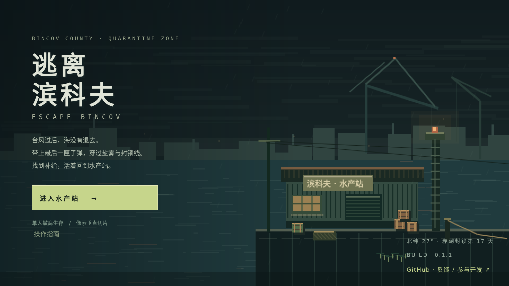
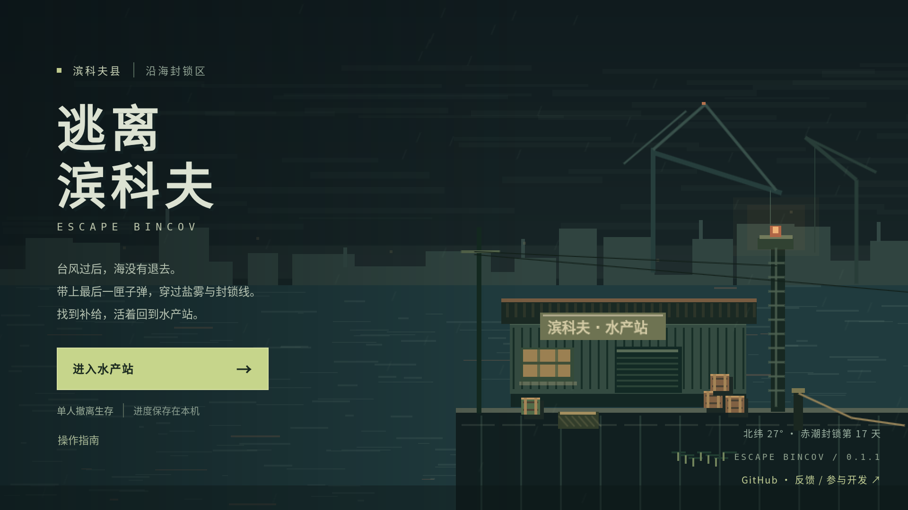
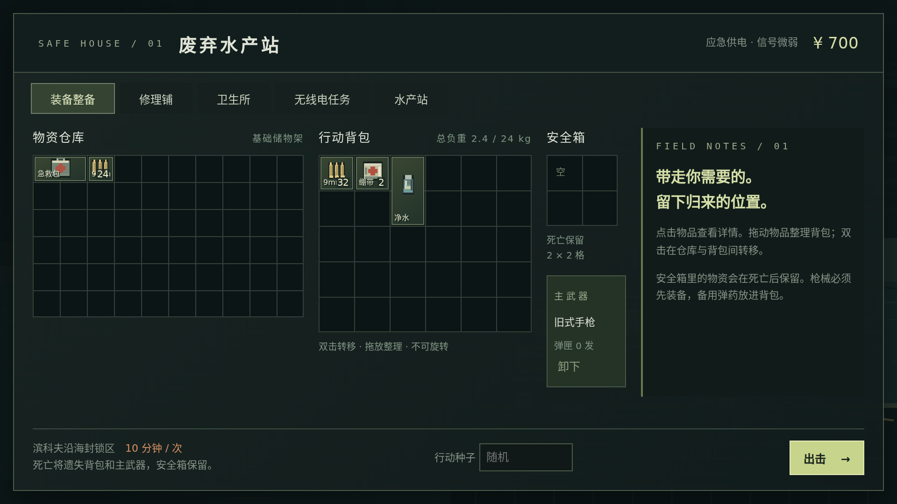
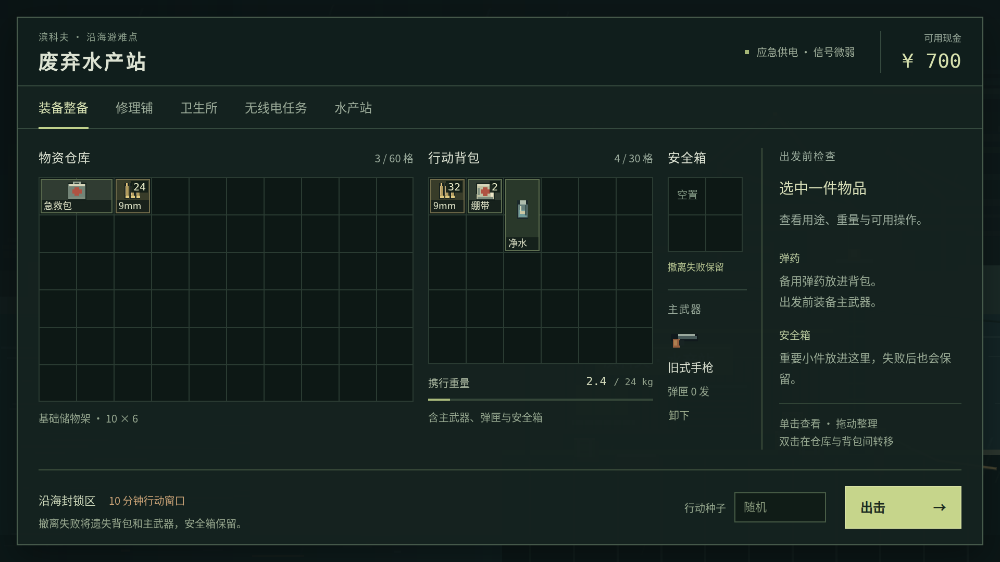
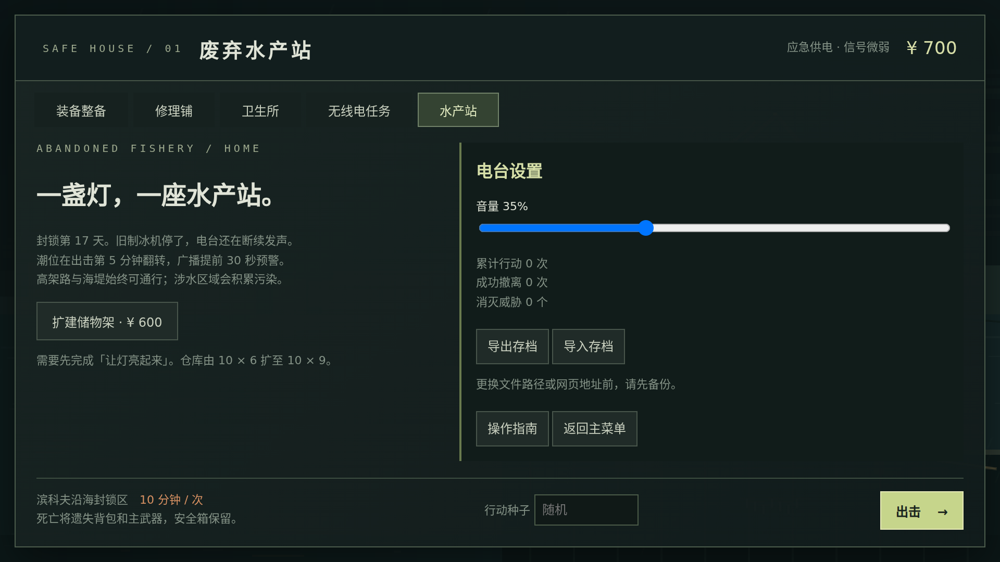
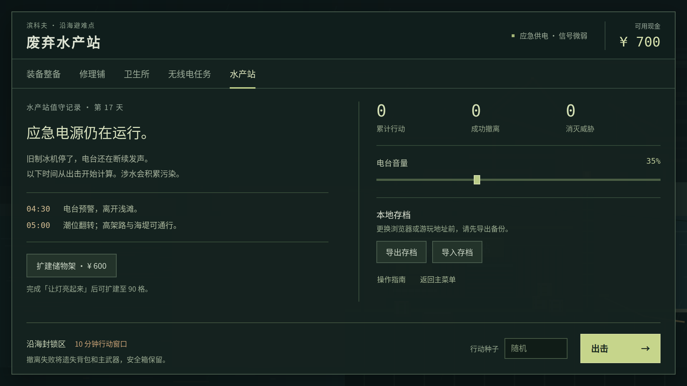
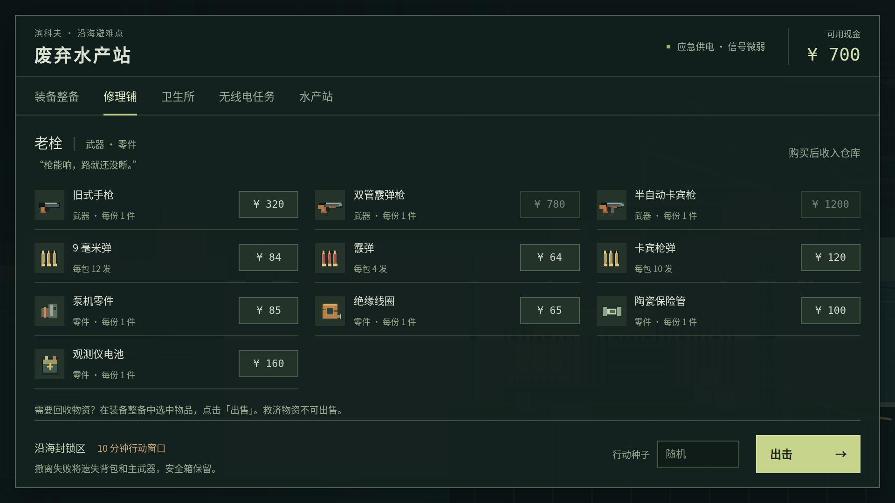
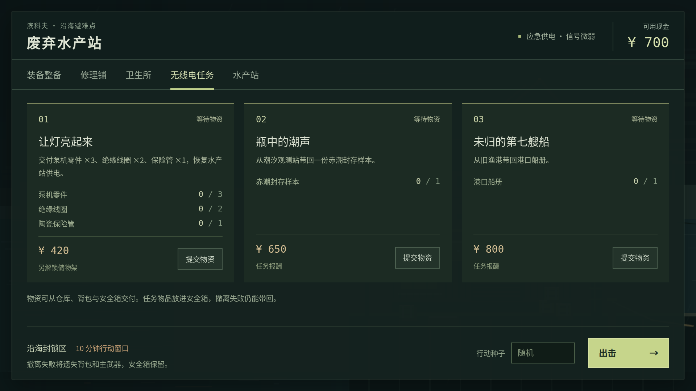
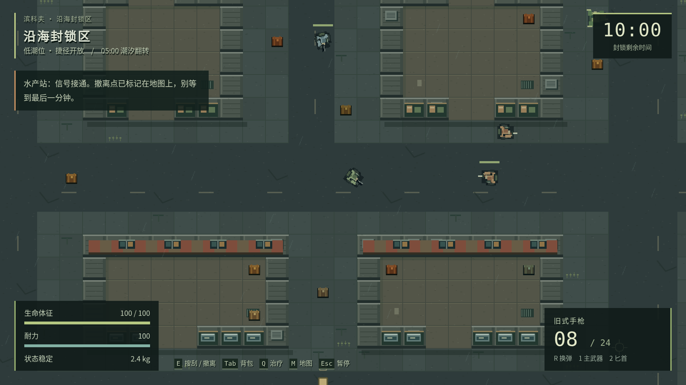
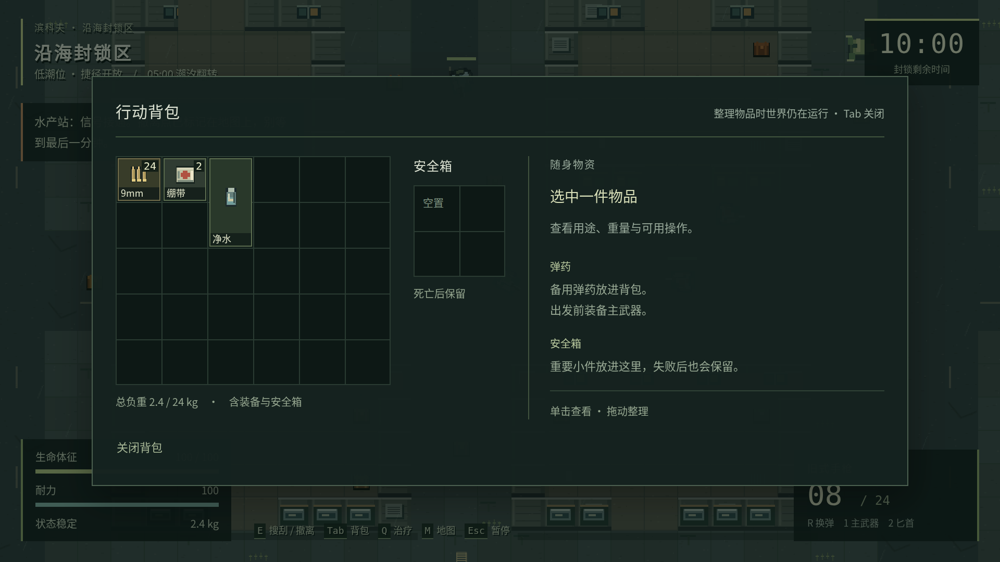

# 界面精修记录

2026-10-04 · 基于 `a0345e8df55c9ea50b2985b0ba549be38bc676c6` · 分支 `agent/ui-polish`

这轮围绕原有暗绿像素风调整界面，让物资、行动状态和可用操作更清楚。保留海港场景、像素素材、配色和中文叙事，减少装饰性英文标题、重复边框与占据操作区的口号。游戏版本仍为 0.1.1，本轮是界面修订。

## 前后对照

以下均为同一运行环境中的真实截图。对照图从全新存档开始；场景中的雨水与海面动画可能处于不同帧。

| 页面 | 调整前 | 调整后 |
| --- | --- | --- |
| 主菜单 |  |  |
| 装备整备 |  |  |
| 水产站 |  |  |

## 玩家能看到的变化

| 区域 | 原来的问题 | 本轮处理 |
| --- | --- | --- |
| 主菜单 | 标注与英文装饰的存在感偏强，入口层级不够统一 | 使用中文地点标注，调整标题、字距、按钮比例及说明留白，保留港口与灯光 |
| 水产站框架 | 导航像一排独立卡片；底栏绝对定位，与长内容相互挤压 | 改用下划线导航；顶部、工作区、出击栏分工清楚；长内容在工作区内滚动 |
| 格子物品 | 仓库、背包、安全箱格子尺寸不一致；数量压住名称 | 整备格统一为 36 逻辑像素；数量置于右上角，名称独立置底；类别只用轻微色差 |
| 库存详情 | 默认区域主要是口号；属性和操作混在一起 | 默认显示出发检查，选中后显示图标、用途、占格、总重、数量、回收价与操作 |
| 装备与负重 | 主武器与弹药状态不够直观 | 显示原有武器图标、弹匣余量、已占格数与负重刻度，重量仍按原规则计算 |
| 修理铺、卫生所 | 同样的厚边框重复包裹每件商品 | 改为图标、名称、份数、价格对齐的商品行，保留原购买与现金限制 |
| 无线电任务 | 不知道还缺多少物资 | 显示每种所需物资的收集数，统计仓库、背包和安全箱；集齐后标明可交付，完成后显示电台回复 |
| 站内设置 | 说明、统计、音量、备份操作挤在一块 | 分为值守记录、潮汐提示、行动统计、音量和存档区；方形音量滑块与像素风一致 |
| 行动与弹窗 | 边框、留白和标题不统一 | 收紧 HUD，统一地图、背包、暂停、结算及存档提示的间距与层级；地图与背包继续明确提示“不暂停” |
| 交互细节 | 焦点和当前选中状态不够清楚 | 补齐按钮/输入框焦点、按下和禁用状态；物品选择同步 `aria-pressed`，导航标注当前位置 |

### 商店与任务

| 修理铺 | 无线电任务 |
| --- | --- |
|  |  |

### 行动中

| HUD | 行动背包 |
| --- | --- |
|  |  |

## 验证与复现

环境：Linux、Node.js 24、Chromium 138.0.7204.0、Noto Sans CJK SC 系统字体。所有截图均由单文件 HTML 实际运行生成，没有外部字体、图片或网络请求。CI 会使用其安装的 Chromium 再执行同一流程。

| 检查 | 结果 | 证据 |
| --- | --- | --- |
| `pnpm test` | 47 项通过 | 领域、地图、旧存档迁移与保存异常回归 |
| `pnpm package` | 类型检查、构建及两个 ZIP 通过 | [制品清单](release-manifest.json) |
| `pnpm test:ui` | 38 个界面场景通过，1280×720 / 1920×1080 | [布局报告](ui/layout-report.json) |
| `pnpm test:browser` | 24 步通过 | [浏览器报告](ui/browser-report.json) |
| `pnpm test:save-browser` | 7 项通过 | [存档报告](ui/save-report.json) |
| `pnpm test:portable` | 6 项通过 | [离线包报告](ui/portable-report.json) |

最终 HTML 为 1,602,448 字节，SHA-256 为 `33215dd8260b37fde6fb74856aa324fa9bf8ce7ffe8bb94a1c58bf1b461b88bb`。对比本轮基线增加 16,021 字节（约 1%），未引入外部运行时资源。

新增 `pnpm test:ui`：覆盖菜单、指南、全部整备页、选中物品、可交付/已完成任务、扩建仓库、HUD、地图、背包、暂停、放弃和结算；在两种分辨率生成截图，并检查面板边界、物品数量与名称不重叠、底栏不遮挡内容、扩建最后一排可以操作、键盘选择保留焦点，以及暂停时钟。

```bash
pnpm install --frozen-lockfile
pnpm exec playwright install chromium
pnpm test
pnpm package
pnpm test:ui
pnpm test:browser
pnpm test:save-browser
pnpm test:portable
```

原图保存在 `test-results/ui/`，CI 的 `browser-evidence` 附件保留完整截图与报告。仓库内选取代表性截图，另保留 [1280×720 整备界面](ui/gear-1280.png) 与 [扩建仓库末行操作](ui/expanded-stash.png)。最终构建大小、哈希见 [制品清单](release-manifest.json)。

## 兼容性与边界

- `domain.ts`、`balance.ts`、`world.ts`、`art.ts` 与 `game.ts` 没有改动；战斗、地图、经济、潮汐和结算规则保持原样。
- 存档仍使用 `escape-bincov.save.v1`；保存失败回滚、待保存结算、重试、备份导入导出和旧格式迁移继续按既有测试验证。
- 保留单 HTML、离线 ZIP、键鼠操作与整数像素缩放；没有新增依赖。1280×720 下仍是 960×540 的整数缩放画面，未擅自拉伸像素画面填满窗口。
- 扩建后的 90 格仓库需要滚动；滚动时背包、安全箱和详情留在工作区，出击按钮始终可见。
- 本轮没有重新执行约 10 分钟的自动玩家平衡测试，因为未改变战斗、敌人、地图或时间规则；本轮也不声称完成真人手感、Firefox/Safari 或移动触控验证。
- 按 `AGENTS.md` 通过 PR 交付。PR 不更新正式试玩，合并并通过 CI 后才会自动更新 GitHub Pages。
