# 像素值守室主界面与 2.5D 视差

2026-10-06 · 分支 `feat/pixel-title-parallax` · 开始基线 main `fc2dccf18c01d424eb0825f39d5a92f7f6eaff35`（任务开始时已 fetch 核对，远端未变化）。

本次按已认可的第二版像素概念重做主菜单。实现包括：像素分层素材、鼠标视差、环境动态、统一点阵字体、多端排布、游戏接入和离线打包。存档、经济、战斗与扩展玩法规则未改动。整备、结算画面继续使用原夜港背景。

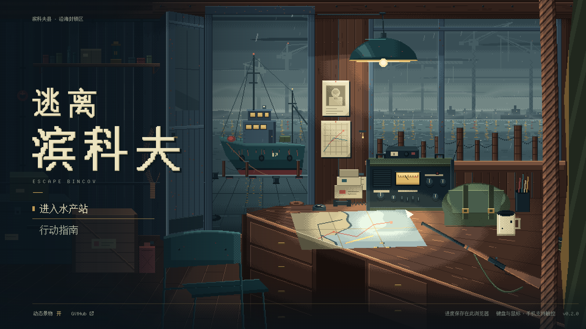

实际运行截图，非概念图。Windows Chrome 154 headless，离线 file:// 普通入口，新存档，指针位于画面中央，动态开启。

## 玩家看到的变化

- **场景**：从水产站值守室望向雨夜港口。前景有缆绳、雨衣和钢管椅，中景是灯下值守桌、电台、海图、步枪、帆布包和杯子，门外系泊着渔船，窗外是木桩、铁链、雾中城市、货轮与港机。
- **2.5D 视差**：七个景深分组按鼠标位置以整像素移动。逻辑像素最大位移依次为：远景 1、码头 3、室内 5、吊灯 6、桌台 7、椅子 9、前景 12。指针离开窗口后缓慢回中；静置 6 秒后只保留极小的镜头漂移。菜单文字和点击区域不随场景移动。
- **环境动态**：
  - 吊灯以五个姿态帧摆动，桌面光池同步平移。灯罩只平移、不旋转，像素边缘不会爬动。
  - 渔船上下起伏 1 px，船首缆绳跟随。
  - 悬挂缆绳只摆动自由端。
  - 水面反光由多组独立的短闪组成。
  - 远处岸灯和航空红灯低频变化。
  - 电台指针游走，状态灯短闪。
  - 灯光中有缓慢飘动的尘埃。
  - 两条雾带无缝平移。
  - 室外有三档景深的雨线。
- **雨不再回跳**：雨改为 70 条对象池中的独立雨线。新的一条总是在门窗上沿之外（墙体和梁后面）生成，落到码头、水面或窗台后才回收，可见区域内不会整层跳回起点。
- **字体**：主菜单中文、英文、数字、按钮和指南统一为 Bincov Text（寒蝉点阵体 16px 子集），只使用 16 px 或 32 px。标题是由同一字形整数放大、加粗并做少量缺口的像素字标，旧版 Georgia 装饰句点已移除。
- **菜单**：
  - 主操作为「进入水产站」。有可恢复行动时，主操作变为「继续上次行动」，并显示「继续未结束的行动 · 恢复后暂停」。
  - 有进度时，主操作下方显示真实的出击与撤离次数。
  - 「行动指南」作为次要菜单项。
  - 底部保留「动态景物」开关、GitHub、版本、输入方式和「进度保存在此浏览器」。
  - 存储不可用时，保留原有的拒绝提示与原始存档导出对话框。
  - 概念图里的文字是「动态场景」，实装继续使用已有的「动态景物」，以保持文案、读屏标签与测试一致。

### 前后对照

| 改动前（`fc2dccf`） | 改动后 |
| --- | --- |
| 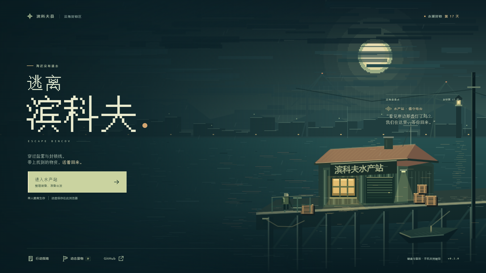 |  |
| 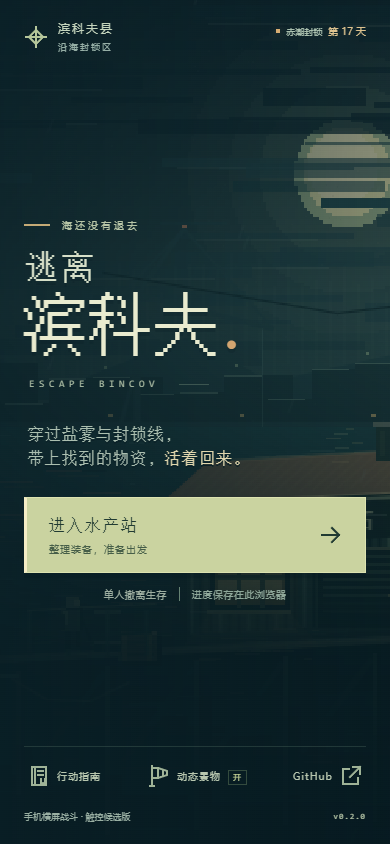 | 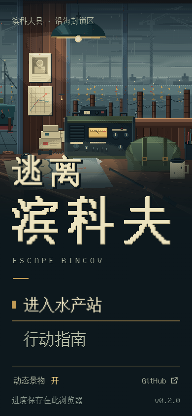 |

旧版雨层回跳录屏：[before-rain-loop.webm](before-rain-loop.webm)（1280×720，约 6 秒）。

### 动态演示

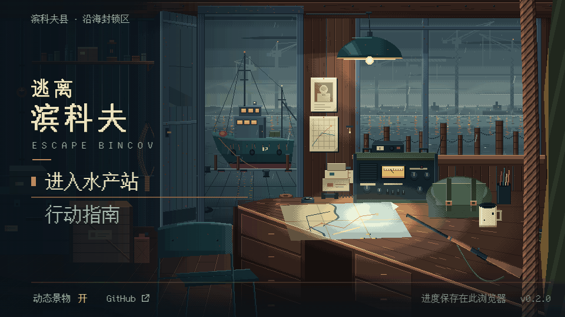

- GIF 为 960×540 视口下的场景 1:1 截图序列，共 90 帧，每帧约 110 ms。逐帧截图本身比实际 60 fps 慢，因此只用于看清像素和视差层次，不代表实际帧率。
- 完整演示：[title-demo-1280x720.webm](title-demo-1280x720.webm)（约 25 秒）。内容依次为静置、慢移到四角、回中、指针离开后回中、关闭动态（画面立即静止）、重新开启（从静止构图平稳恢复）。录屏中的黄框小方块是演示用指针标记，不属于游戏。

### 多端与状态

| 1280×720 | 2560×1080 |
| --- | --- |
| 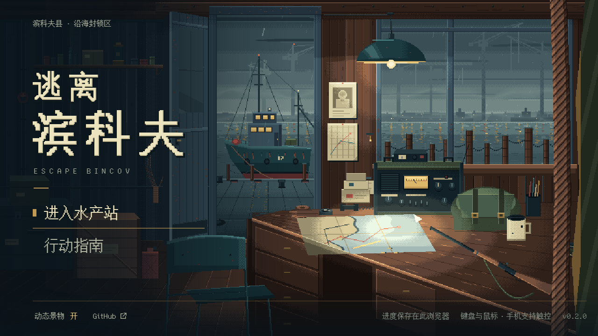 | 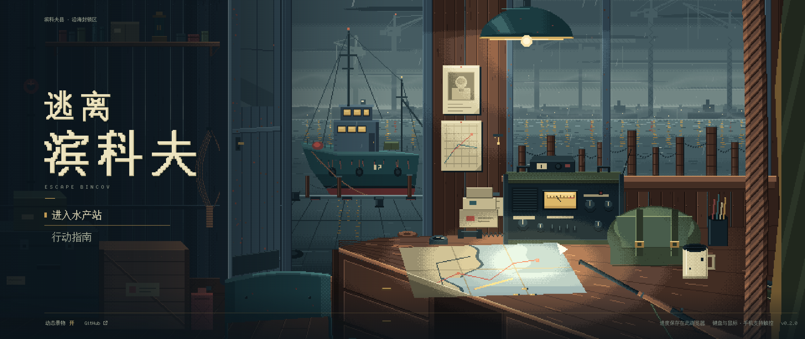 |
| 844×390 | 740×300 |
| 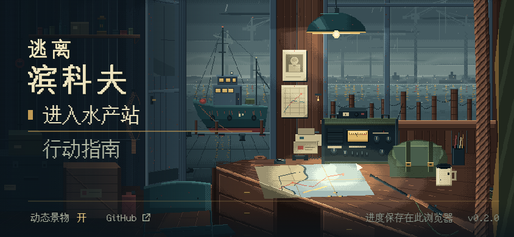 | 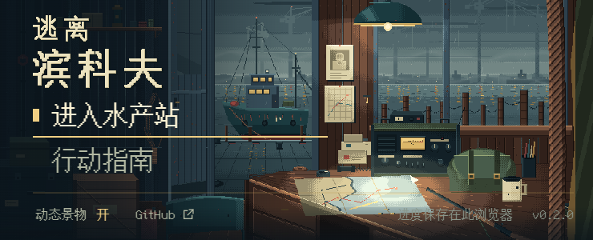 |

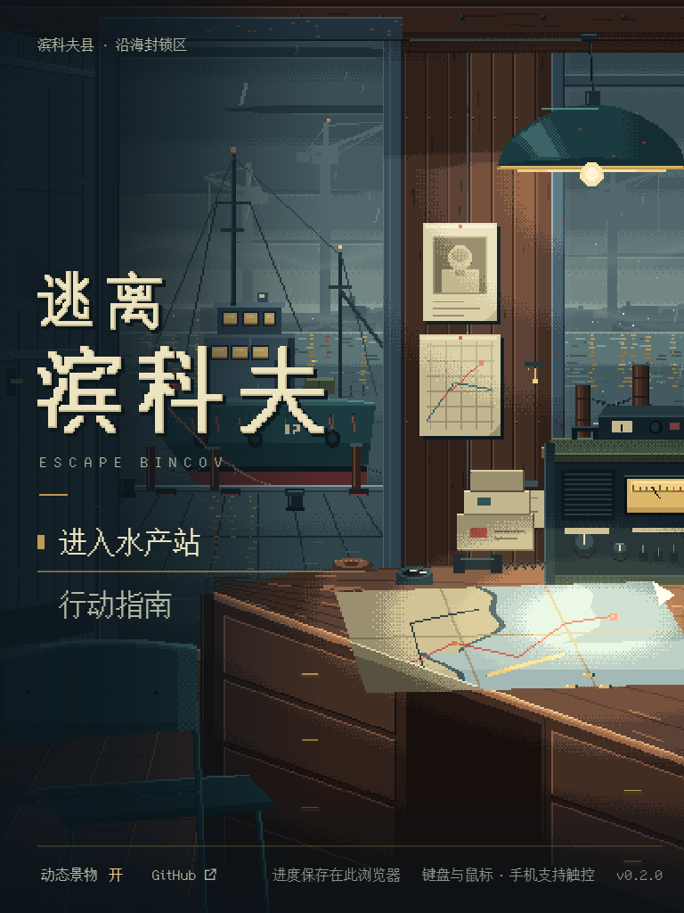 

- 桌面采用等比最近邻 cover 裁切，1920×1080 正好是 2 倍整数缩放。无法整数覆盖的窗口（如 1280×720 的 1.33 倍）按等比最近邻显示并明确裁切，不分别拉伸横纵。
- 竖屏手机单独取景：场景保持 1 倍逻辑像素，取立柱、吊灯、窗与电台；菜单位于其下方的暗部，文字不缩小。
- 低高度横屏依次收起地点行、英文副标题和次数说明，字标降为 1 倍，必要时可滚动。

| 已有进度 | 行动指南 | 浏览器禁止存储 |
| --- | --- | --- |
| 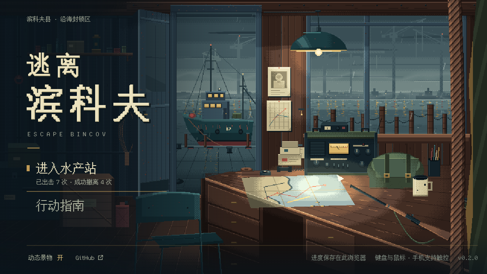 | 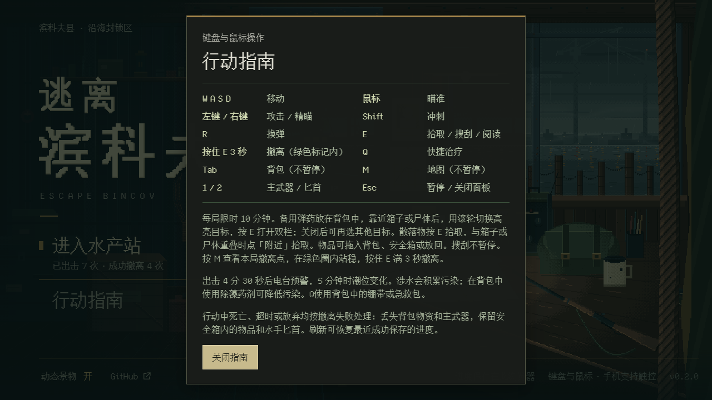 | 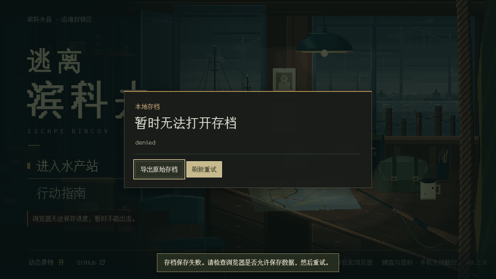 |

「已有进度」截图使用 `?test=1` 写入 7 次出击、4 次撤离的测试夹具；「浏览器禁止存储」截图使用拒绝 localStorage 的浏览器注入。两者都没有修改真实玩家存档。

### 风格一致性与像素检查

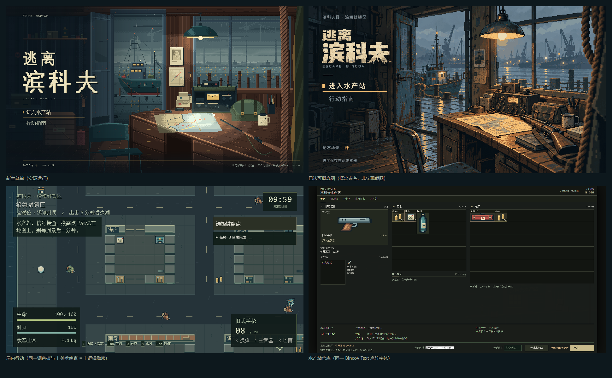

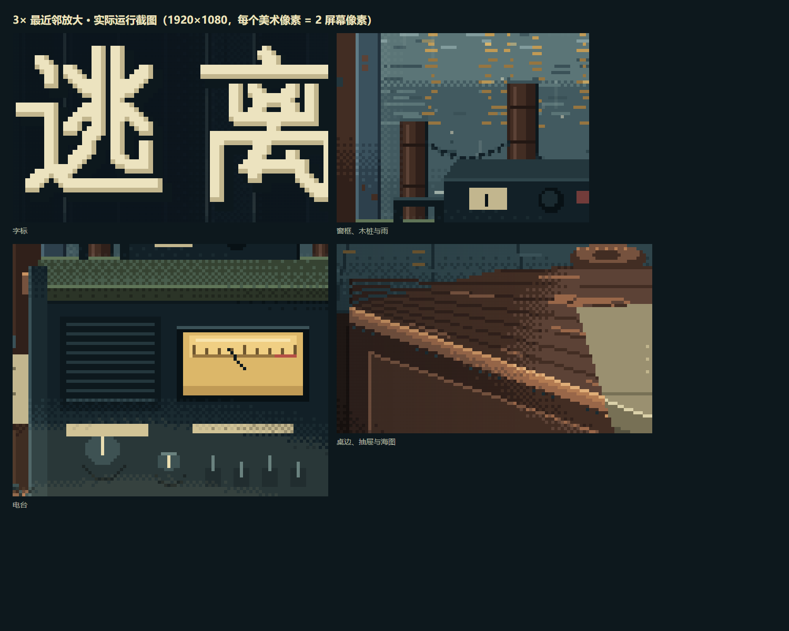

- [概念参考](concept-reference.png)是已认可概念图的压缩副本，只作对照，不进入运行时包。
- 新菜单保留了概念的构图与叙事物件：室内斜望港口、左侧暗区放菜单、灯下桌台、门外渔船、窗外港机。按提案要求，纹理密度收敛到局内水平：大色块、3～5 档材质色阶、只在光影台阶处抖色，没有照片纹理或马赛克滤镜。
- 场景与局内、仓库共用 `src/art/pixel.ts` 的基色、1 美术像素 = 1 逻辑像素的网格和 Bincov Text 字体。
- 与概念图相比，实装更冷、更克制，近景细节也更少。

## 实现

| 位置 | 职责 |
| --- | --- |
| [`scripts/title-art/`](../../scripts/title-art/) | 确定性的程序化像素绘制：调色板与色阶光照（`palette.ts`、`pix.ts`、`light.ts`）、远景、码头与船、室内、桌台道具、字标，以及生成器 `generate.ts` |
| [`assets/title/`](../../assets/title/README.md) | 16 个索引色 PNG 与 manifest（尺寸、帧、文件与像素哈希）。合计 60.4 KiB，按宽×高×4 估算解码后约 8.37 MiB RGBA（不是完整 GPU 内存） |
| [`src/title/layout.ts`](../../src/title/layout.ts) | 图层矩形、景深分组、最大视差、门窗开口与锚点，生成器与运行时共用 |
| [`src/title/assets.ts`](../../src/title/assets.ts) | 构建内联的 data URL；在 Phaser 启动前与字体一起完成解码，避免首屏闪出旧图；字标经 CSS 变量提供 |
| [`src/title/scene.ts`](../../src/title/scene.ts) | 唯一的动态控制入口：视差、全部环境动态、对象池、统一停止条件与清理 |
| [`src/title/motion.ts`](../../src/title/motion.ts) | 无 Phaser/DOM 依赖的规则：指针归一化、帧率无关跟随、整像素偏移、步长上限、装饰随机数 |
| `src/title-screen.ts`、`src/title.css` | 菜单 HTML 与全部菜单样式；`tactical.css` 中与主菜单冲突的覆盖已删除 |
| `scripts/build.mjs` | esbuild 以 `dataurl` 内联 PNG，构建前逐个核对 manifest 哈希 |

- **视差输入**：鼠标与触控笔驱动视差，触摸不驱动，也不改变 `playerInput` 的归属。指南打开时冻结指针视差，关闭后平稳恢复。
- **统一停止条件**：玩家开关、系统「减少动态效果」、页面隐藏、窗口失焦、离开菜单。任一条件生效，全部动态立即停止，并回到居中的静态构图。恢复时把每步时间限制在 50 ms 以内，不补算后台时间。系统减少动态效果解除后，仍需玩家手动重新开启，与旧行为一致。开关不写入存档。
- **生命周期**：场景关闭时移除 pointer、mouseleave、visibility、blur/focus、media query 与场景事件监听。纹理只在启动时注册一次，重复进入菜单直接复用。
- **装饰随机数**：使用独立的固定种子，不消耗地图、战利品或敌人的随机数。
- **加载失败**：解码失败时显示平静的纯色底，菜单仍可完整使用，并在控制台报告真实错误。
- **共享背景**：`drawStationBackdrop`（整备、结算）保持原绘制与纹理键。

## 验收记录

结论分为：通过、部分通过、未运行。仿真不等于真机。

| 编号 | 方法与证据 | 结论 |
| --- | --- | --- |
| V01 | 与概念图并排（style-comparison） | 通过：构图与叙事物件保留，无占位形体；最终审美由维护者确认 |
| V02 | 与实际局内、仓库并排 | 通过：同一色板、网格与字体 |
| V03 | 3× 放大字标、窗框、电台、桌边 | 通过：边缘一致，无平滑模糊 |
| V04 | `test:title` 鼠标到四角、离开回中；单元测试校验各图层留边大于最大位移 | 通过：各组位移精确为 ±1/3/5/6/7/9/12 px，菜单坐标不变 |
| V05 | 60 秒逐帧审计（9901 帧）与录屏 | 通过：雨在可见区内 0 次跳回，2568 次回收均在开口外，雾 0 次回退，姿态只按 ±1 步进 |
| V06 | 诊断接口关闭雨层后采样 5 秒 | 通过：灯光、物件、水面、空气四类仍在变化 |
| V07 | 分层结构与截图检查 | 通过：雨位于室内层之后，尘埃限定在灯锥内，缆绳帧随船体，光池随灯帧 |
| V08 | 1280×720、1920×1080 | 通过 |
| V09 | 2560×1080、1024×768、768×1024 | 通过：等比、无空边、控件完整 |
| V10 | 360×800、390×844、412×915、430×932（Chromium 仿真） | 通过（仿真） |
| V11 | 844×390、932×430、640×360、740×300（Chromium 仿真） | 通过（仿真） |
| F01 | 新档进入水产站，存档字节不变；已有进度截图 | 通过 |
| F02 | 原有恢复回归 `test:mobile`、`test:expansion`、`test:save-browser` | 通过：恢复入口与动作未改 |
| F03 | `test:save-browser`、`test:mobile` 故障注入，存储被拒截图 | 通过 |
| F04 | 鼠标、Tab、Enter、Space、Escape（`test:title`）；`test:desktop-input` | 通过 |
| F05 | 指南打开时背景 inert、焦点进入弹层、关闭后返回；打开指南时旋转 | 通过 |
| F06 | 开关后状态完全静止、aria 状态真实；运行时切换减少动态效果 | 通过 |
| F07 | 页面隐藏、失焦后恢复无时间补算；横竖屏切换 | 通过 |
| F08 | 暖机 1 次后往返菜单与水产站 20 次 | 通过：控制器 1 个，对象、纹理、场景监听及 window/document 监听数不变；JS 堆前后约 17.1 MB |
| F09 | 触摸点按不驱动镜头；触屏电脑混合输入回归 | 通过（仿真） |
| O01 | 两份 HTML 及 ZIP 离线打开（`test:title`、`test:portable`） | 通过：无外部请求，不依赖 assets 目录 |
| O02 | 普通入口没有 `__bincov` | 通过 |
| O03 | `pnpm package`、`test:portable` | 通过：两份 HTML 字节一致，ZIP 入口与清单符合约定 |
| P01 | 帧时间与加载 | 部分通过：headless 桌面数据如下；手机未测 |
| P02 | 暖机后采样 60 秒 | 部分通过：headless 无卡顿；受限设备只有 DevTools 4× CPU 节流仿真 |
| — | iPhone Safari / Android 真机 | 未运行：没有真机，保留为待验收 |

**性能**：Windows、Chrome 154 headless、离线 file:// 入口，动态开启。

| 测量项 | 结果 |
| --- | --- |
| 菜单可交互 | 约 0.50 s（DOMContentLoaded 约 0.24 s） |
| 标题素材解码 | 8 ms |
| 60 秒桌面采样 | p50 6.1 ms、p95 6.2 ms、p99 6.2 ms，无超过 33 ms 的帧（headless 无 vsync，Phaser 约 166 fps） |
| 4× CPU 节流 20 秒 | 与不节流几乎相同；每帧工作量很小，但这只是仿真，不能代表手机 GPU 与功耗 |
| 构建体积 | 独立 HTML 1,923,018 B → 2,010,766 B（+87,748 B，+4.6%） |

完整数据见 [evidence-report.json](evidence-report.json)，由 `node scripts/title-evidence.mjs` 生成。

## 自动检查

本次在 Windows 上执行，环境为 Node.js 24.21.0、pnpm 11.19.0、Chrome 154.0.8037.98（`BINCOV_CHROME`）。CI 的完整列表都已运行，`test:expansion` 使用 CI 同一固定历史提交的 `pre-m0.html`。各命令的实际结果见对应 PR 的验证表，最终以该 PR 当前提交的 Actions 为准。

新增与调整：

- `tests/title.test.ts`（12 项）：
  - 指针归一化与边缘饱和、帧率无关跟随、步长上限、整像素视差方向与幅度、统一停止条件、装饰随机数确定性。
  - 雾带无缝平铺、图层留边、门窗开口真实透明。
  - 提交的 PNG 与 manifest 及生成器逐像素一致，字标只用整数倍尺寸。
- `scripts/title-review.mjs`：旧版断言固定的 4 个对象、4 张纹理、3 个 tween，这只是旧实现的结构，已改为按风险检查：
  - 视口与字体：13 种视口；菜单只用 Bincov Text 16/32 px，字标整数倍。
  - 视差：七组位移的幅度与方向，菜单坐标固定，离开窗口后回中。
  - 环境动态：至少四类，且关闭雨层后仍成立；雨只在开口外回收，雾不回跳。
  - 停止与恢复：指南冻结指针视差；开关、减少动态效果、页面隐藏和失焦都能停止全部动态，恢复时不补算时间。
  - 资源与输入：20 次往返后控制器、对象、纹理和监听数不增长（经 CDP 计数）；触摸不驱动镜头。
  - 帧时间：600 帧采样，记录 p50/p95/p99。
- `scripts/title-evidence.mjs`：生成本页截图、放大图、并排图、录屏、GIF 帧、60 秒连续性审计与性能数据。耗时数分钟，不纳入 CI。

## 未完成与限制

- 没有 iPhone Safari、Android 真机或物理低端设备的视觉、帧率、功耗与触控验收。上述手机结果均为 Chromium 仿真。
- 1280×720 等非整数倍窗口按等比最近邻显示，物理像素宽度会在 1～2 个屏幕像素间交替。这是提案接受的做法，不承诺所有 DPR 和浏览器缩放下像素均匀。
- 美术与概念图的审美一致性仍需维护者确认。概念图中更密的锈点与木纹按提案要求收敛，没有照搬。
- 本次只重做主菜单；整备、结算、局内与仓库的字体和画面不在范围内。
