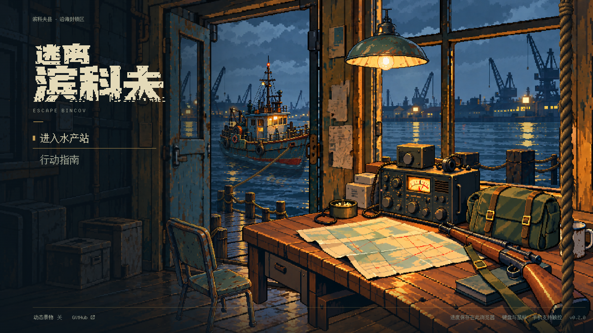
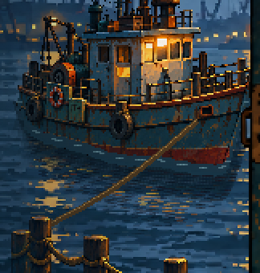

# 像素值守室主界面：修订中

最新状态：用户指出上一版透视、景深和光照未达标，[PR #21](https://github.com/xuys2025/escape-bincov/pull/21) 已改为草稿。**当前版本以 [同一母版分层返修 v3](master-v3/README.md) 与 [概念／母版／实装对照](master-v3/compare.html) 为准，整体美术仍未验收。** 上一轮独立物件方案保留为 [v2 历史记录](depth-v2/README.md)。

以下保留第一次局部修复的历史记录。

2026-10-07 · `feat/pixel-title-parallax` · 本轮重新 fetch 的 main 基线为 `fc2dccf18c01d424eb0825f39d5a92f7f6eaff35`。

新素材已接入后，船缺少与海水的接触和倒影、雾和闪光被不透明背景盖住，字标仍是正文点阵字放大。当前版本补齐这些关系，校准港口位置和遮挡，并更换独立工业像素字标。关闭动态会冻结当前位置，反复进入菜单不会累积销毁监听器。

截图来自当前打包后的单文件 HTML：Windows Chrome 154、1920×1080、离线、减少动态效果。图中文字可点击，画面没有后期修饰。它是实现截图，不是 ImageGen 效果图。

## 修改内容

- 港口原图恢复到 `(0,24)`；真正延展天空、港口与室内边缘，避免视差移动露出透明条带。
- 按船体 alpha 轮廓绘制吃水边缘、贴船暗水、破碎船影和暖色反射。水线局部盖住船底，近码头在船前正确遮挡。
- 雾、远灯、水面光点在不透明港口之上绘制；水面以分散的像素短波变化，关掉雨也能看到。背景底图的主体反光仍保留，变化以局部效果为主。
- 重做“逃离／滨科夫”粗重磨损字标，恢复左上紧凑排布。桌面字标按 144×66 的整数倍显示；真实 DOM 标题和正文 Bincov Text 保留。
- 调整门窗覆盖范围、电台锚点与尘埃所属图层。船、灯和绳索沿用独立帧动画。
- 暂停动态、窗口失焦或系统减少动态效果时保留当前构图；配对移除场景 shutdown/destroy 回调。
- 资产生成器改成导入素材的安全派生与验证流程，逐项核对实际运行图片，旧程序画图命令不会覆盖导入图。

[水面与视差连续录屏](refinement/water-and-parallax.webm)固定镜头段使用测试钩子关闭雨和冻结指针视差，随后真实移动鼠标，并用 DOM 按钮关闭动态。该录屏用于观察变化，不作为物理设备帧率证明。

## 本地验证

环境为 Node 24.19.0、pnpm 11.25.0、Windows Chrome 154.0.8037.98。仓库和 CI 的 pnpm 固定版本仍为 11.19.0；没有改锁文件或增加依赖。

| 检查 | 结果与覆盖 |
| --- | --- |
| `pnpm test` | 195 项通过，包含资产清单、RGBA、门窗与视差边缘验证 |
| `pnpm package` | 类型检查通过，两个 HTML、两个 ZIP 和发布哈希已同步 |
| `pnpm test:title` | 13 个视口、键盘/触摸、指南焦点、七组视差、无雨环境动态、关闭动态、20 次场景往返通过 |
| `pnpm test:title-water` | 定镜头无雨时，可见水域和船影区域实际像素发生变化；关闭动态前后姿态一致 |
| `pnpm test:browser` | 两种桌面尺寸共 24 流程通过，含移动、射击、撤离、死亡、超时和中断恢复 |
| `pnpm test:portable` | 从 ZIP 解压至独立中文目录，普通离线入口和真实键鼠流程通过 |

水面专项不只读取后台参数：相隔约 2.4 秒比较真实 PNG 像素。报告和截图见 [refinement/](refinement/)。所有浏览器检查无页面异常或运行时网络请求。发布内容及哈希以 [release-manifest.json](../release-manifest.json) 为准。

## 差距清单与验收边界

| 条目 | 本轮状态 |
| --- | --- |
| A05 船体 | 已补吃水遮挡、暗水及倒影；船形、比例保留现有生成素材，待用户最终审美确认 |
| A08 水面 | 图层可见性和无雨动态已实测；仍是像素分层表现，不是流体模拟 |
| A09 字标与布局 | 新独立资产已实装，多尺寸排布通过，待用户最终审美确认 |
| A10 接触关系 | 船水和近码头遮挡已修正；不宣称整幅场景所有美术差距均已消除 |
| A01–A04、A06–A07 | 延续此前素材，本轮未重新逐项完成用户美术验收 |

不修改存档格式、领域规则、战斗或经济。手机截图是视口/触摸仿真；iOS/Android 真机、功耗、长期性能与真人审美还需人工确认。PR 不自行合并，Pages 在 main 验证并合并后才更新。

2026-10-06 的早期实现说明和截图保留为 [历史记录](20261006-initial.md)，其中程序素材来源、旧尺寸和旧验收结论不代表本轮版本。
