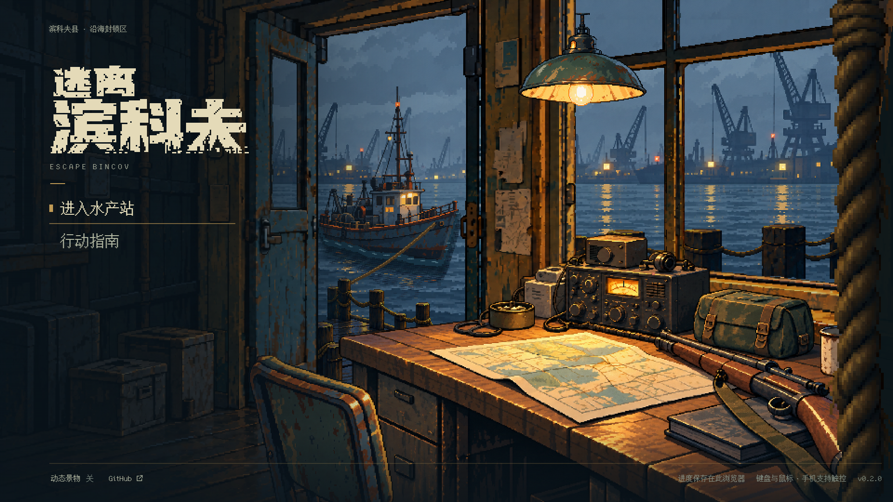

# 主界面空间与光照返修 · 未完成美术验收

2026-10-07 · [草稿 PR #21](https://github.com/xuys2025/escape-bincov/pull/21) · 继续 `feat/pixel-title-parallax`。

用户明确指出 `735cbfa` 的画面仍未达到 `concept-v2-pixel.png`：透视不统一，前景椅子和绳索缺少近距离遮挡，桌台、船与海面的层级和光影不足。上一轮的运行测试只能证明功能，不能证明整体美术完成。PR 已改回草稿。

图为当前离线 HTML 的直接截图，开启系统减少动态效果固定初始构图，无后期修改。比较入口：[概念图／上一版／本轮同尺寸切换](compare.html)。

## 本轮修订

| 空间层级 | 上一版问题 | 当前修订 |
| --- | --- | --- |
| 前景椅子 | 小而完整地摆在地面上，背面形状与概念不同 | 以原概念重新生成近摄椅背，放大并从下边缘裁出，盖住桌台近侧 |
| 前景绳索 | 细绳只像边缘装饰 | 等比放大编织尺度和绳径，补深色近门柱轮廓，遮住右侧桌角；前景水平视差提高至 24 逻辑像素 |
| 中景桌台 | 局部样板透视、物体比例与原图有差距，光层重复加亮 | 重新生成宽桌面和深色柜体，缩小并左移电台与包，校准位置；保留地图折边和道具接触阴影，附加亮光降至 3.5–5.5% |
| 后景船 | 船舱与船壳过于醒目 | 依据同一概念重做高桅杆、小船舱和低船壳，重新登记船位；吃水线、暗水与倒影继续从实际 alpha 轮廓绘制 |
| 远港与水 | 云层与岸线过实，暖光密度接近桌面 | 重新生成灰蓝雾中远港，删除底图中的近码头，独立近码头在其上遮挡；减弱金色反光并校准岸灯位置 |
| 层间运动 | 七组都有移动，但前后差异不足 | 远港 3、室内 5、桌台 8、椅子 16、绳索 24 逻辑像素；菜单 DOM 保持固定 |

四类新素材都由内置 ImageGen 生成，原概念是共同参考。原始 PNG、首轮与桌台二次修订提示词保存在 [素材来源](../../../assets/title/sources/)。运行图通过最近邻采样准备，保持原始 alpha；准备命令不会覆盖原图。旧素材与上一版截图保留，便于比较及回退。

## 验证与证据

本机 Node 24.19.0、pnpm 11.25.0、Windows Chrome 154。CI 仍使用固定 pnpm 11.19.0。图像生成和视觉检查与运行回归分别记录。

- `pnpm test`：195 项通过。
- `pnpm package`：严格类型检查、单文件和两个 ZIP 重新打包通过。
- `pnpm test:title-water`：关闭雨滴、固定镜头时，水域变化 2,536 像素、船影区域变化 14,173 像素；关闭动态前后姿态相同，无外部请求或页面错误。
- 主菜单 13 视口、20 次场景往返与离线 ZIP 回归结果，以同目录保存的 `title-report.json`、`portable-report.json` 为准。
- [动态录屏](water-and-parallax.webm)包含固定镜头无雨检查和真实鼠标移动。触摸视口检查不等同 iOS/Android 真机或功耗验收。

## 当前仍未验收

这是对用户反馈的空间和光照修订稿，尚未得到用户对整幅透视、细节、画风与光影的认可。椅子座面露出比例、桌角与原概念的精确位置、室内门窗整体造型、灯的体积光与所有道具投影仍需逐图审视，不能因技术回归通过改记“美术完成”。本轮保留现有字标，未再次改动其造型。没有合并 main 或更新 Pages。
