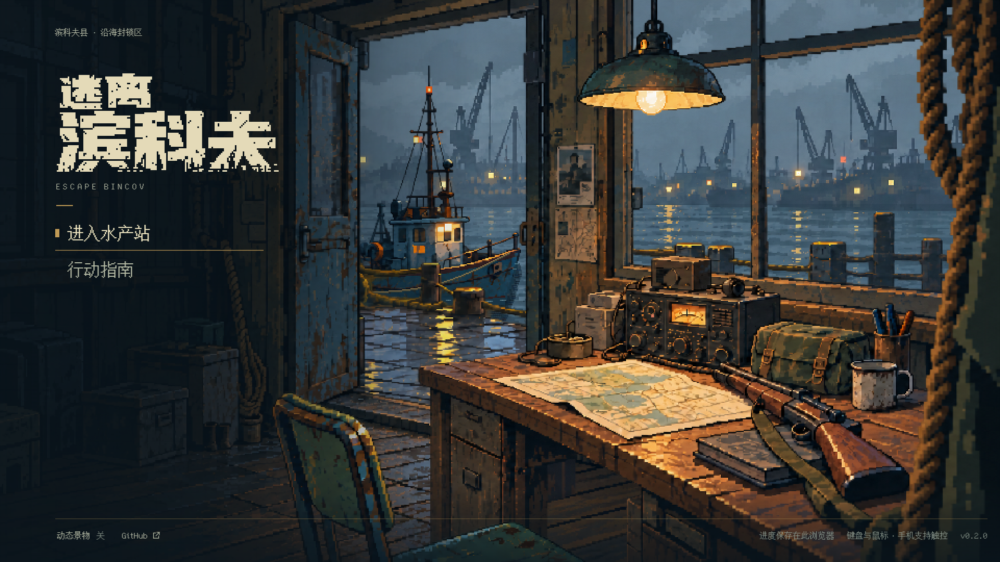
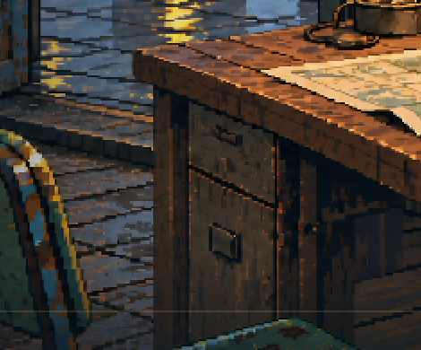

# 同一母版分层返修 · v3 审阅稿

2026-10-07 · [草稿 PR #21](https://github.com/xuys2025/escape-bincov/pull/21) · `feat/pixel-title-parallax` · main 基线 `fc2dccf18c01d424eb0825f39d5a92f7f6eaff35`。

本轮从已认可概念生成无 UI 母版，再按同一画布坐标分离室内、桌台、椅子、前景、船、港口与码头。上一轮独立生成的物件存在机位和比例漂移；本轮重新对齐桌角、椅座、门洞和吊灯。**当前为返修审阅稿，整体美术未获用户最终认可。**

[打开概念／母版／旧版／本轮同画幅对照](compare.html)。上图是打包游戏的直接浏览器截图，没有后期修饰。源图使用内置 ImageGen；[原图与全部提示词](../../../assets/title/sources/master-v3/prompts.md)已保存，旧素材和历史截图保留。

## 分层纠错与逐图检查

| 检查对象 | 发现的问题与处理 | 实际画面复核 |
| --- | --- | --- |
| 室外码头／室内地板 | 首次码头输出把室内地面也带进来，已拒用并重新生成；室内地板归 room，湿码头归 pier，门槛归 room | 看过中心及四角视差截图和门槛局部，湿码头在门槛处结束，未发现露底或室内地板跟随港口移动 |
| 吊灯 | 提取输出改变了大小和高度，首个带大光晕版本拒用；所选图裁切、最近邻缩放到母版锚点 | 再次缩短高度后复拍，灯位在桌台上方，未压住电台或窗台 |
| 椅子／绳索 | 单独生成易变成完整摆件；改用母版位置和边缘裁切 | 椅背、可见座面及右侧粗绳作为前景遮住桌台，四角运动没有空隙 |
| 桌台／道具 | 桌面坡度、柜体和物件比例不统一；采用母版提取层 | 桌角、柜体、地图、枪托、电台顶部和布包侧面形成连续透视，接触阴影随道具保留 |
| 船／水 | 船提取被放大，重新登记桅杆和船壳位置；水线、暗水及破碎船影继续按真实 alpha 轮廓计算 | 船在门洞之外、码头之后，阴影不覆盖室内；远水低对比，反射带对应岸灯方向 |
| 光照 | 原叠加光会二次加亮 | 保留源图暖光和冷影，附加 ADD 降至 1.5–2.5%；地图可读，不再覆盖一个规则亮斑 |

码头提取仍有纵向偏移，在逻辑画布中下移 28 px 校准。灯和船也经过明确的裁切／尺寸登记；不是声称生成工具自动逐像素分离成功。所有运行参数在 [layout.ts](../../../src/title/layout.ts)，生成过程在 [generate.ts](../../../scripts/title-art/generate.ts)。

室内外虽然都有潮湿反光，分层边界必须由台阶和遮挡成立。自动检查进一步限定码头图底部为透明，室内地板接近完全不透明；这只能防止结构回归，不能替代上面的视觉检查。

## A01–A10 实际状态

| 编号 | 本轮可见结果 | 仍需关注 |
| --- | --- | --- |
| A01 空间透视 | 同母版机位，桌角、椅座、门窗共同校准 | 提取不等于原图逐像素复刻 |
| A02 主光源 | 灯、桌面、地图、金属边和包共享暖光，暗面保留冷色 | 灯光为预绘加微弱动态，不是实时投影 |
| A03 电台体积 | 顶部、右侧、面板、旋钮与接触阴影可辨 | 细纹与原概念略有差别 |
| A04 枪包 | 枪托、机匣、护木、背带、包盖及侧面可辨 | 局部细节尚非精确还原 |
| A05 船体 | 三分之四舱体、桅杆与水线在门外 | 船形与概念仍有差异 |
| A06 门窗 | 门套、窗台和门槛厚度成立；地面归属纠正 | 保留四个视差极限复查 |
| A07 材质 | 木纹、漆面、帆布、纸面以成组像素表现 | 部分生成纹理更细，需用户审美确认 |
| A08 水与远港 | 岸灯反射带、近远波差异及灰蓝雾港已接入 | 水面仍是分层像素效果 |
| A09 标题 | 沿用已重做的独立工业字标与左侧菜单 | 文字粗细、菜单间距与概念不同，未伪称一致 |
| A10 接触与景深 | 前景绳椅、中景桌台、后景船水层次可见 | 动态灯摆不会实时重算道具投影 |

各项都有本轮实现，**均不自动改记用户美术验收通过**。

## 实际验证

环境：Windows、Node 24.19.0、pnpm 11.25.0、Chrome 154.0.8037.98；CI 仍固定 pnpm 11.19.0，无依赖或锁文件变更。

| 命令／检查 | 结果 |
| --- | --- |
| `pnpm test` | 196/196，通过；新增室内外地面归属回归 |
| `pnpm package` | 通过，类型检查、两份 HTML、两个 ZIP 和发布清单同步 |
| `pnpm test:title` | 13 视口、键鼠与触摸、动态开关、减少动态效果、失焦、20 次场景往返通过 |
| `node scripts/title-depth-review.mjs` | 中心及四角视差直接截图，前景位移大于桌台、桌台大于港口；无外部请求或页面异常 |
| `pnpm test:title-water` | 定镜头无雨时水域变化 2,132 像素、船影区域变化 10,140 像素；关闭动态保持姿态 |
| `pnpm test:browser` | 24 流程通过，两种桌面分辨率 |
| `pnpm test:ui` | 38 场景通过，两种桌面分辨率 |
| `pnpm test:portable` | ZIP 解压到独立中文路径后，普通离线入口 6 流程通过 |

保存的报告、四角图、1280×720／390×844 图和 [动态录屏](water-and-parallax.webm)在本目录。画面已目视核对中心、四个极限位置、两种桌面尺寸和手机竖屏；手机是浏览器仿真，未做真机或功耗验收。完整 CI 需核对 PR 最新 head，上一提交的通过不代表本轮通过。

便携 HTML SHA-256：`3f21dc3f8a0716bfb8b41458ffceaf2a81cbf24d054164a71cf2787c189b99ac`。存档结构和玩法规则保持兼容。PR 保持草稿，未合并或更新 Pages。
