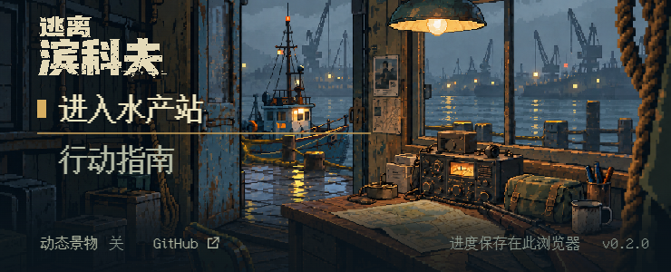

# 左侧明暗与菜单字标精修 · v4 审阅稿

2026-10-07 · [草稿 PR #21](https://github.com/xuys2025/escape-bincov/pull/21)。上一版 `91c0817` 的 [完整 CI 已通过](https://github.com/xuys2025/escape-bincov/actions/runs/37523807892)，Pages 部署按 PR 规则跳过。本轮在同一分支继续，整体美术仍待用户认可。

[概念／v3／v4 同画幅对照](compare.html)。图片来自正式打包后的离线 HTML，未重绘、修饰或合成 UI。

## 视觉检查后的修改

- **左侧暗部**：v3 的额外遮罩覆盖了原画已有阴影，墙板、箱子和地板接近一片黑。本轮减弱桌面遮罩，保留原图的冷影、材质与暖色边光；没有把整幅画统一调亮。
- **字标**：原概念的上下行比例更紧凑，旧资产缩小后破损过密。本轮用内置 ImageGen 生成两个候选，在 288／432 px 显示尺寸比较；采用保留适量磨损的轮廓，使用已有准备流程转为单色旧白和二值透明，去掉原始输出中的浮雕颜色与柔边。新运行图为 144×72，仍以整数倍显示。
- **菜单**：同一 Bincov Text 字体加一像素实边，增强字重；选中标记略增大。大桌面增加标题下留白，中小桌面保持紧凑。去掉横穿椅子和桌台的整页底栏分隔线。
- **短横屏**：视觉检查发现保存提示压在明亮地图上，单独增强该尺寸的底部遮罩。已复拍 740×300，保存说明、动态开关与 GitHub 链接可读。

原始字标不能直接冒充合格运行资产。候选差异、选择理由和两个实际提示词见 [wordmark-v4-prompts.md](../../../assets/title/sources/wordmark-v4-prompts.md)；所选源图是 [wordmark-industrial-v4.png](../../../assets/title/sources/wordmark-industrial-v4.png)。旧资产保留。

## 保留的空间关系

室内地板、门槛、室外湿码头、桌台、椅子、绳索、船及灯的 PNG 和布局位置未变，仍采用 [v3 同母版分层](../master-v3/README.md)。本轮重新捕捉四角视差，核对门槛与前景遮挡。A01–A08、A10 沿用 v3 的可见结果与待确认项；A09 增加字标和菜单精修，仍不标记用户审美验收通过。

## 验证

Windows / Node 24.19.0 / pnpm 11.25.0 / Chrome 154；CI 固定 pnpm 11.19.0。

| 检查 | 本轮结果 |
| --- | --- |
| `pnpm test` | 196/196 通过 |
| `pnpm package` | 类型检查、两份 HTML、两个 ZIP 与发布清单通过 |
| `pnpm test:title` | 最后一次短横屏修复后重跑：13 视口、输入、焦点、动态、20 次场景往返通过 |
| `node scripts/title-depth-review.mjs` | 最终打包图的中心及四角视差检查通过 |
| `pnpm test:portable` | 最终 ZIP 解压后的普通离线入口 6 流程通过 |
| `pnpm test:browser`、`pnpm test:ui` | 24 流程、38 场景通过；在最后一项仅影响低高度横屏的遮罩修复前运行，所测 720／1080 高桌面规则未再改变 |

最终 HTML SHA-256：`dd309ffec9ec574558e921cc2ebd71a9cd615e076b94c7e7eb486e9fae049636`。独立便携 ZIP 4,115,037 字节。报告保存在本目录。最终提交完整 CI 以 PR 检查为准；上一提交的 CI 不用于代替本轮结果。

目视检查包含 1920×1080、1280×720、390×844、740×300 与视差极限。手机是浏览器仿真，非真机验收。字体样式、船形和部分纹理与原概念仍有差异。没有新增字体或依赖，也没有修改存档、玩法规则、场景运动；PR 保持草稿，未合并或上线。
