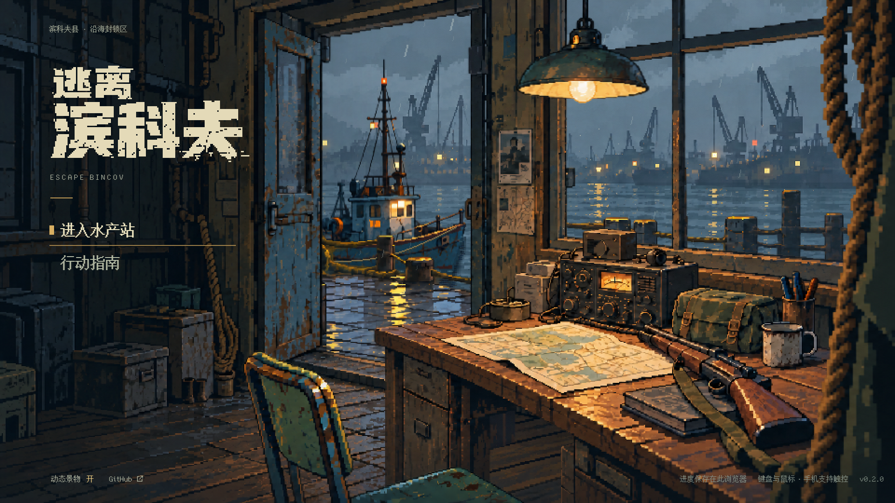

# 主菜单动态舒适度与水面渲染修复 · v5

2026-10-07，继续 [草稿 PR #21](https://github.com/xuys2025/escape-bincov/pull/21)。用户实际体验反馈：动态像整个房间晃动，并伴随掉帧。前序静态截图和 CI 通过不能证明动态舒适；本轮专门修正运动与渲染成本，保留 v4 的像素画面。

## 行为变化

- 修复真正的台阶感：取消 `layerOffset` 的位置取整和标题场景相机的 `roundPixels`，移动的像素图层使用连续采样。源 PNG、像素造型和 HTML 字标未重绘；变化的是图层平移时允许中间位置。退出标题时恢复纹理设置，局内相机与整数缩放不变。
- 取消自动漂移、六秒后的自动回中与纵向镜头位移。地平线、远港和室外码头固定；指针离开、进入菜单按钮或弹出指南时保留当前姿态。
- 前景最大水平位移从 ±24 降到 ±4 个逻辑像素。在 1920×1080 下，左右极限的总行程由约 96 px 降到 16 px；室内为 ±1、桌台 ±2、椅子 ±3。保留轻微景深提示，镜头没有旋转或缩放。
- 灯摆使用中央原画围绕固定悬点连续微摆（±0.006 弧度、14 秒周期）；船使用 ±0.7 逻辑像素的连续起伏。取消这两者的整数位置／有限姿态跳变。灯光、电台、雾、水纹和雨仍独立变化。
- 船影改为稳定的破碎条带缓慢变化，取消每 120 ms 更换缺口图案的闪动。
- 水面原有约 1.4 万条 Graphics 指令会在每次显示帧重放。改为两张有界的像素缓存，只在水面需要变化时更新；船影和反光颜色底图在进入场景时生成一次。缓存随场景退出释放，没有扩充贴图动画全集或新增依赖。

## 实际运行证据

[连续操作录屏](calm-motion.webm)：真实鼠标横向扫过、纵向移动、停住七秒、进入菜单、关闭和恢复动态。录屏使用隔离的空白浏览器配置，测试接口只读取位置；不修改玩家存档，没有加速播放或后期修饰。

已逐图检查中心、左右极限与停留后画面。门槛仍分隔室内外，前景与桌台遮挡保持；上下移动鼠标时所有分层的 y 位移为零，停住后分组位置一致。连续检查报告见 [motion-report.json](motion-report.json)。

实际渲染回归：让室内层仅移动 0.1 逻辑像素，截取不受雨、灯光或 UI 影响的地板区域，确认图像发生变化；这可防止“只有浮点坐标变化、显示仍被取整”的回归。90 帧连续采样同时验证船和灯拥有超过 60 个不同姿态。[亚像素前](subpixel-floor-a.png)、[亚像素后](subpixel-floor-b.png)均为直接截图。

## 性能测量的边界

独立 Chrome 154、Windows、RTX 3070、1920×1080；每组至少 8 秒和 360 帧，前后顺序运行，测量时不录视频。测量脚本仅在显式测试入口统计标题 update 和 renderer.render 的 CPU 调用耗时，不包含异步 GPU 执行，也不是用户内置预览环境或物理低端手机的认证。

四倍 CPU 降速模拟：

| 动态开启 | 修改前 ef8b3db | 本轮 |
| --- | ---: | ---: |
| 常规渲染 CPU 中位数 | 1.1 ms | 0.5 ms |
| 更新＋渲染 CPU 中位数 | 1.2 ms | 0.6 ms |
| 更新＋渲染 CPU P95 | 1.8 ms | 1.6 ms |
| 更新＋渲染 CPU P99 | 2.3 ms | 2.0 ms |
| 样本中超过 33.4 ms 的 RAF 间隔 | 0 | 0 |

报告：[修改前](before-slowdown.json)、[本轮](after-slowdown.json)。一次较早的缓存尝试造成更新尖峰，已继续缓存船影底图后再测，表中使用最终结果。这里确认的是 CPU 开销降低；独立 Chrome 没有复现用户的明显掉帧，不能宣称所有设备或内置预览中的掉帧已消失。

另外强制关闭 WebGL，确认 Phaser 实际使用 Canvas 回退（renderer type=1）。同样至少 8 秒的动态样本中，更新＋渲染 CPU 中位数 1.3→0.6 ms，P95 2.2→1.1 ms，未出现页面异常；该环境前后也没有超过 33.4 ms 的 RAF 间隔。[回退修改前](before-canvas.json)、[回退本轮](after-canvas.json)。这是独立 Chrome 的模拟路径，不是推断用户预览必然采用 Canvas。

可用 `node scripts/title-performance.mjs <离线HTML绝对路径> <报告路径> [CPU降速倍数]` 重测。禁用 WebGL 的回退路径用环境变量 `BINCOV_CHROME_ARGS='["--disable-webgl"]'` 单独测试。不要与其他浏览器负载或录屏并行测量。

## 回归与交付

- 196 项单元测试、重新打包通过。
- `pnpm test:title`：13 视口、轻微横向视差／固定地平线／无自动漂移、菜单悬停、动态开关、失焦、触控和 20 次场景往返通过；水面缓存纹理、对象和监听器数量稳定。
- 连续真实鼠标录屏检查通过，未出现页面异常或外部请求。
- `pnpm test:title-water`：关闭雨后的水域和船影仍有可见变化，动态关闭保留姿态；具体像素计数见 water-report.json。
- `pnpm test:browser` 24 流程、`pnpm test:ui` 38 场景、`pnpm test:portable` 6 流程通过。

HTML SHA-256：`07aa021df474b16cdf73f034339b3d88d12db1450ba84a04aff16ac70a20a1b3`；便携 ZIP 4,115,661 字节。最终提交完整 CI 以 PR 最新 head 检查为准，不能用前序通过代替。

原 PR 保持草稿，整体美术和实际用户环境下的动态体验仍待审阅。没有更改存档、战斗、交易或全局游戏帧率设置。页面已打开时需要刷新才会载入新文件。
