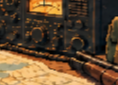
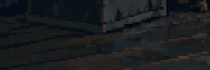
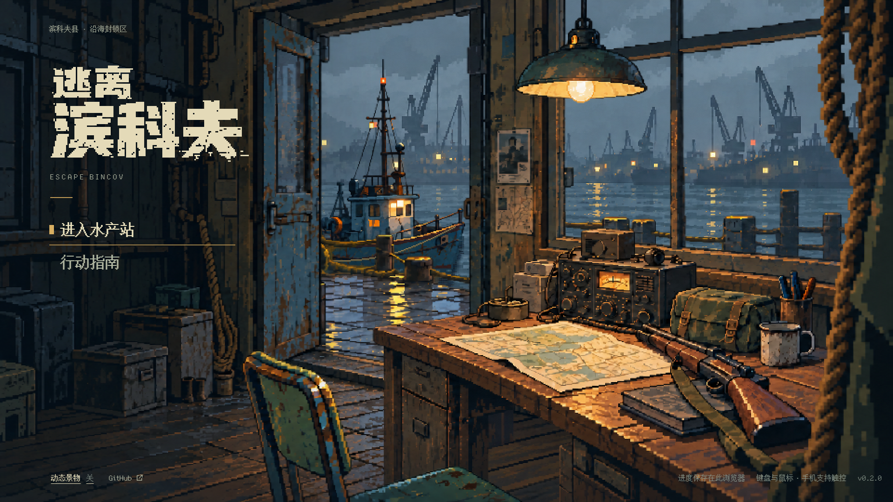

# v6：鼠标移动时的糊边与双层观感

2026-10-07，继续 PR #21。用户确认 v5 已不再卡顿，但物体边缘发糊、像叠了两层；明确不是鼠标停住后的跟随滞后。本轮仅修正渲染，保留连续位移、视差范围、相机跟随和原素材。

## 原因和修改

v5 在 960×540 画布上直接对原始像素纹理做线性插值，再放大到屏幕。相邻原图像素先混色，混色带又随画布放大；例如 1080p 下电台旋钮和桌沿呈现宽糊边。渲染器正常清屏，没有使用上一帧叠加或运动模糊。

- 主菜单按显示尺寸选择更密的渲染画布，最高 1920×1080；逻辑坐标仍为 960×540。离开主菜单恢复原画布和相机，行动的整数像素缩放不受影响。
- 八类移动纹理先以最近邻扩为 2 倍，在原有像素块内部复制颜色；再在细边界上做线性采样。原 PNG、哈希、构图和像素造型没有重绘。派生纹理只缓存一套，反复进入不累积。
- 船、灯与视差继续使用连续坐标，不重新取整。1080p 下插值带缩为约一个屏幕像素，避免把一整块像素混成双边。
- 高 DPI / 大屏最多使用 1080p 渲染目标；大于该尺寸的屏幕仍会放大，这是成本上限，不声称所有屏幕都达到原生分辨率。

## 真实画面

同一鼠标位置，桌台偏移 −0.5 逻辑像素，使用游戏内动态开关冻结后直接截图。截图没有后期锐化、合成或重绘；两次环境动画停下的时刻不同，不用于比较船、水纹或光池。

| v5 原采样 | v6 细边界采样 |
| --- | --- |
|  |  |
|  |  |

## 验证与测量

`scripts/title-edge-check.mjs` 使用实际电台纹理在黑底上做受控渲染探针。这是测试夹具，不冒充游戏截图：四分之一像素位移后，将选中像素与原素材的黑底颜色比较。v5 最大 RGB 通道误差 37，新版为 0；WebGL 和 Canvas 结果一致。连续两帧相同，探针随后销毁。此测试与实际地板 0.1 像素位移截图检查并存，同时防止“清晰但又跳格”和“流畅但整块混色”。

- [WebGL 前后与画布恢复](report.json)、[Canvas 前后与画布恢复](canvas-report.json)。
- [主菜单回归](title-report.json)：13 视口、连续画面变化、环境动画、动态开关／焦点／系统偏好、20 次场景往返和旋转。
- 196 项单元和重新打包通过；其他本轮实际结果见 PR 验证表。
- [4 倍 CPU 降速 WebGL 测量](performance.json)：更新＋渲染 CPU 中位数 0.6 ms，P95 1.6 ms，和 v5 相当。
- [Canvas 回退测量](performance-canvas.json)：中位数 0.7 ms，P95 1.1 ms。两种模式采样均无超过 33.4 ms 的 RAF 间隔。

测量使用独立离线 Chrome 154、1920×1080、RTX 3070，各状态至少 8 秒，未并行录屏。CPU 调用时间不包含异步 GPU 执行；结果不代替用户内置预览、物理低端设备、手机与功耗验证。更多像素带来渲染目标和纹理内存开销，因此设置上限并检查复用。

最终 HTML SHA-256：`951394924c27b42a4339564a6795d6f07e4fb0543f8659c222c3ac88df5ea4c2`。上一提交 `12b9762` 的完整 CI 已通过；本轮 CI 必须查看 PR 当前 head。PR 保持草稿，整体美术和本次用户实际边缘体验仍待确认，未合并或部署 Pages。
